# DATA STRUCTURE & ALGORITHMS (In Java)


## ----------------- Contents ------------------
- [DATA STRUCTURE](#DATASTRUCTURE(DS)&Algorithm(Algo))
## -------------- End Of Contents --------------


- Popular Algorithm Library [JGraphT]
    - Shortest path algorithms (Dijkstra, Bellman-Ford, A*)
    - Minimum spanning tree algorithms (Prim, Kruskal)
    - Maximum flow algorithms (Ford-Fulkerson, Edmonds-Karp)
    - Graph traversal algorithms (BFS, DFS)
    - Clustering algorithms
    - Cycle detection
    - Vertex and edge coloring
    - 
    - Other Graph Algorithms Library are : JGAlgo, Google Guava, ValueGraph, Network
    - https://github.com/google/guava/wiki
- For Tree Algorithms
    - Scalified/tree
    - 
- For Machine Learning Algorithms
    - Weka
    - Deeplearning4j (DL4J)
    - Smile (Statistical Machine Intelligence and Learning Engine)
    - Java-ML
    - Apache Mahout
- For Numerical Algorithms
    - nAG Library
    - IMSL Java Library
    - java.math.numerical.library


Skiplist: a common in-memory index type. Used in Redis
Hash index: a very common implementation of the "Map" data structure (or "Collection")
SSTable: immutable on-disk "Map" implementation
LSM tree: Skiplist + SSTable. High write throughput
B-tree: disk-based solution. Consistent read/write performance
Inverted index: used for document indexing. Used in Lucene
Suffix tree: for string pattern search
R-tree: multi-dimension search, such as finding the nearest neighbor

- 
- 
- 
- 
- Probabilistic DS
    - Bloom Filter: Checks if an item belongs to a set
    - Cuckoo Filter: Checks if an item belongs to a set & offers better performance
    - HyperLogLog: Finds number of unique elements in a set
    - Count-Min Sketch: Finds frequency of items in a large data stream
    - MinHash: Finds similarity between sets
    - SkipList: It efficiently searches inserts & delets items from a sorted list
    - 


<h1 id="DATASTRUCTURE(DS)&Algorithm(Algo)"> DATA STRUCTURE (DS) & Algorithm (Algo) </h1>

- What is a data structure ?
    - It's how your data is structured. It could be structured in a list (List of items) or set (set of records) or map (key -> value)
    - You can think it as a small inmemory structured database

- What is an Algorithm ?
    - How fast we process the "structured data" !!
    - A CRUD operation
    - Create/insert     Retrive/Search      Update      Delete


```
                              Object
                            /       \
                        Arrays  Collections


                            Iterable
                                |
                            Collection
                            /   |  \
                        List  Queue Set


List -- ArrayList, LinkedList (LinkedList can do basic queue tasks through peek, pool, offer)
Queue -- PriorityQueue, ArrayDequeue (ArrayDequeue also implements Deque interface)
Set -- HashSet, LinkedHashSet, TreeSet (Similiar structure to Map)

List provides - Vector: just synchronized version
                    
                                 Map
                                /   \
                        HashMap     SortedMap
                            |           |
                    LinkedHashMap   NavigableMap
                                        |
                                    TreeMap

Map provides - HashTable: just synchronized version
```

- A DS can be ordered - by insertion or last access
- A DS can be sorted - i.e. their insertion order doesn't mater - their sorting order does


- Array : Insertion fast, Access(unless idx known) : But deletion is complex
- Stack & Queue : Slow access to other items
- LinkedList: Fast insertion & deletion : But slow search

- Binary tree : Fast search, insertion : But deletion complex (unless tree is balanced)
- Red-black & 2-3-4 : Fast search, insertion & always balanced -> complex
- Hash table : Fast insertion & fast access if key known : But Slow deletion & inefficient memory usage
- Heap : Fast insertion, deletion, access to largest item : But Slow access to other item
- Graph: Some algo are slow & complex


## Array DS
- For "A" Searching takes an average of N/2 steps
- For Insertion takes 1step
- For deletion, there is no holes allowed - occupied cells must be arranged contiguously: no holes
- A deletion requires searching through an average of N/2 elements & then moving the remaining elements (an average of N/2 moves) to fill up the resulting hole => Total N steps in all

- Array can be used to handle both primitive & objects mainly 

- The Duplicates Issue
    - Searching : with Duplicates N steps - without Duplicates N/2 steps
    - Insertion : with Duplicates 1 steps - Without duplicates Search N steps But 1 Steps
    - Deletion : with Duplicates N step comparisons, more than N/2 moves - Without duplication N/2 comparisons, N/2 moves


- OOP -&- DS

- Also think of scinario, when you query a idx from one thread & deleted another element from another thread !! how bad that would be !!

- Binary search in an ordered collection

- Being ordered insertion took times but search / deletion was fast
So useful for a scianrio where search is more frequent

Although Deletions are slow in both ordered and unordered arrays because items must be moved down to fill the hole left by the deleted item.


```
In a Binary search of a ordered collection the equation devides "HALF"
For 128 numbers it devides like - 128 64 32 16 8 4 2 1 which ranges from 2^7 .. 2^6 ...... 2^0
which is a function of - 2
    so for 128 the equation is 2^7
Or in the reverse way
    the equarion is log-base2-(128) = 6.sth = 7

________________________________________________________,
log-base(a)of(b) = log-base(c)of(b) / log-base(c)of(a)  |
________________________________________________________|

```

```
-----------------------
The "Big O" notation
-----------------------
A rough measure of algorithms performance
Comparison of algorithms that tells how an algorithm's speed is related to the number of items
As you seen for 64 items it took 6 steps for double it's items i.e. 128 items it just took 1 more step


BIG N - Denotes number of items
BIG T - Times it take


For unsorted array
No matter how big the "N" is (the number of items)
The time taken "T" to iNsErT an item is always constant K


For a Linear SeArCh, Of "N" items it takes N/2 steps at an average
The TIME will be T = K * N / 2      \\k is the constant time for 1 item


However for a binary SeArCh, Of "N" items it takes log2(N) steps at an average
considering the below formula
________________________________________________________,
log-base(a)of(b) = log-base(c)of(b) / log-base(c)of(a)  |
________________________________________________________|
Considering c = 10, We can take log-base2-(10) = 3.322 [the divisor] as constant K
The TIME will be T = K * log2(N)         \\k is the constant time for 1 item & multiplied by 3.322


Big O notation just dispenses the constant K
Just we want to compare is how T changes for different values of N

Big O - Order of


For linear search into an un/ordered array takes O(N) time
For binary search into an ordered array takes O(log N) time


For Insertion into an unordered array takes O(1) time
For Insertion into an ordered array takes O(N) time

Deletion in unordered array O(N) time - searching is N/2 an average & moving is N/2 an average
Deletion in ordered array O(N) time


O(1) is excellent
O(log N) is good
O(N) is fair
O(N2) is poor (Bubble sort)
```

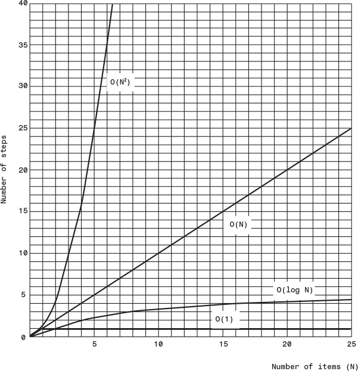


## Simple Sorting
- Sorting is So essential (for example in binary search) there exists a lots of algorithms
    - Bubble Sort
    - Selection Sort
    - Insertion Sort

The insertion sort, is preferable to quicksort for small files & for almost-sorted files
In fact, an insertion sort is commonly used as a part of a quicksort implementation

### Bubble Sort
- Taking two (A, B) at a time : return value is : -ve 0 +ve
    -ve : A < B
    0 : A = B
    +ve : A > B
Keep doing this to push the largest one to extreme right : you made N-1 comparisions & around N-1 swaps
once done this

```
    in - index 0
    nElems - no of elements
    out - nElems-1

    -------------------------------------------------------------------
    BubbleSort.java
    -------------------------------------------------------------------
    public class HelloWorld {
        public static int a[] = {3,4,2,1};

        public static void main(String []args) {
            bubbleSort();
            for (int b : a)
                System.out.println(b);
        }

        public static void bubbleSort() {
            for(int lengthAsIdx = a.length - 1; lengthAsIdx > 0;lengthAsIdx--) // 3 2 1
                for(int in=0; in<lengthAsIdx; in++)  // MAX-2   MIN-1   (lengthAsIdx)
                    if(a[in] > a[in+1])      // SWAP 2 - 3
                        swap(in, in+1);
        }

        private static void swap(int one, int two) {
            long temp = a[one];
            a[one] = a[two];
            a[two] = (int)temp;
        }
    }

    THINKING IT REVERSE
    We are swapping -- swap(in, in+1); <-- Hence we must make 1 short so we can do in+1 operation
    We have to Preserve the RightMost(1st)/NextRight(subsequent) elements for each iteration
    Bcz the RightMost(1st)/NextRight(subsequent) are very sorted

    THE KEY POINT IN THIS ALGORITHM IS - swap(in, in+1);
    /** swapping index & index+1 basedon comparision & Preserving the Right side */


    `````````````````````````````````````````````
    `   // @TODO - To report erreta on book     `
    `````````````````````````````````````````````


    -------------------------------------------
    The bubbleSort() method
    -------------------------------------------
    Considering 4 elements
    For outer Loop out=3
    The inner Loop in=0->1->2
    Seeing swap(in, in+1); --> the final


```

-  There are conditions that remain unchanged as the algorithm proceeds. These conditions are called invariants
- you can repeatedly check that the invariant is true, and signal an error if it isn't

- Thus, the algorithm makes about
```
(N-1) + (N-2) + (N-3) + ... + 1 = N*(N-1)/2
N*(N-1)/2
N2/2 comparisons
```
- There are fewer swaps than there are comparisons because two numbers are swapped only if they need to be
- If the data is random, a swap is necessary about half the time, so there will be about N^2/4
- Both swaps and comparisons are proportional to N2. Because constants don't count in Big O notation, we can ignore the 2 and the 4 and say that the bubble sort runs in O(N2) time

- The outer loop executes N times, and the inner loop executes N => N*N = N^2

### Selection Sort
- The selection sort improves on the bubble sort by reducing the number of swaps necessary from O(N2) to O(N). Unfortunately, the number of comparisons remains O(N2). However, the selection sort can still offer a significant improvement for large records that must be physically moved around in memory

- The Shrtest will be remembered & moves to the extreme left (Not 2 at a time will be compared)
```
public void selectionSort() {
    int out, in, min;
    for(out=0; out<nElems-1; out++) { // outer loop
        min = out;                     // minimum
        for(in=out+1; in<nElems; in++) // inner loop
            if(a[in] < a[min])  min = in;
        swap(out, min);
    }
}
```

### Insertion Sort
- Works when A collection is "PARTIALLY SORTED" [IMP]
- From the other unsorted list, it finds minimum & try to fill in the partially sorted
- The algorithm starts by ""assuming the very first element (at index 0) is already a sorted"" sub-list on its own
- On the first pass/item, it compares a maximum of one item (with 0th idx item)
- On the second pass, it's a maximum of two items (with 0th & 1st idx) & so on, up to a maximum of N-1 comparisons on the last pass

- What it does
- Let's say it founds a item towds right & it shifts to left before the marker (,)
- What empty space created, It push the items to fill the empty items
- Before ||,||||
- After  ||,||_| & temp=|
- After  ||_,||| & temp=|
- After  |||,||| NO temp

- To move this small item to its proper place on the left, all the intervening items (between the place where it is and where it should be) must be shifted one space right
- This step takes close to N copies, just for one item.
- Not all the items must be moved a full N spaces, But the average item must be moved N/2 spaces
- Which takes N times N/2 shifts for a total of N^2/2 copies
- Performance = O(N^2)

```
1 + 2 + 3 + ... + N-1 = N*(N-1)/2
```
However, because on each pass an average of only half of the maximum number of items are actually compared before the insertion point is found, we can divide by 2, which gives
```
N*(N-1)/4
```

- The number of copies is approximately the same as the number of comparisons. However, a copy isn't as time-consuming as a swap, so for random data this algorithm runs twice as fast as the bubble sort and faster than the selection sort
- O(N^2) time for random data
- Space Complexity: O(1) - It's an in-place sorting algorithm, meaning it requires only a constant amount of extra memory space 

```
public static void sort(int[] arr) {
    int n = arr.length;
    // Start from the second element (index 1)
    // The first element (index 0) is considered the initial sorted subarray
    for (int i = 1; i < n; ++i) {
        int key = arr[i]; // The element to be inserted into the sorted portion
        int j = i - 1;    // Index of the last element in the sorted portion

        /* Move elements of arr[0..i-1] that are greater than key,
            one position ahead of their current position */
        while (j >= 0 && arr[j] > key) {
            arr[j + 1] = arr[j]; // Shift the larger element to the right
            j = j - 1;          // Move to the previous element
        }
        // Place the key (original arr[i]) in its correct sorted position
        arr[j + 1] = key;
    }
}
```


- Stability
- A sorting algorithms retain the preveous sorting order are said to be stable.


## Stacks & Queue & Priority Queue

### Stacks
- Only one item can be read or removed at a given time (unless you cheat)
- Methods : push() pop() peek() [readonly]
- The push/pop is efficient = constant O(1) time
- Using stack wrapper - make certain type of algorithms (LIFO) less error prone

### Queues
- Methods: put or add       delete or get       peek    remove()
- Circular Queue - As queue removed from 1st & added from last, there are "spaces around the front"
    - The Front & Rear arrows wrap around to the beginning of the array
    - The result is a circular queue (sometimes called a ring buffer)
    - In a circular Queue for a scinario - the front & rear at the same idx i.e. 0 => empty / full @ same time
    - This problem can be solved by making the array one cell larger than the maximum number of items that will be placed in it
    - So even if rear @ 0th idx the front is sm where @ 9th idx
- The efficiency of Queue is still O(1) time

### Deques
- Insert items at either end & delete them from either end
- insertLeft()/insertRight() & removeLeft()/removeRight()
- THis is a more versatile data structure than either a stack or a queue and is sometimes used in container class libraries to serve both purposes.
- However, it's not used as often as stacks and queues


### Priority Queues
- items are ordered by key value so that the item with the lowest key (or in some implementations the highest key) is always at the front
- ues case: preemptive multitasking operating system
- priority queues are, as we noted earlier, often implemented with a data structure called a heap
- In an underlying array implement,
    - The [minimum] value is always at [front] & [largest] item is always at reaer [index-0]
    - When you put a value in between the item will be shifted to make room for the current value
    - The rear arrow always at 0 idx,, items at front are removed only
    - Here insertion is costly but the deletion is not (deletion reqd search & then fill the empty space)
- For larger numbers of items, or when speed is critical, the heap is a better choice, then array
- insertion runs in O(N) (devided by 2!!) time, while deletion takes O(1) time


## Linked Lists
- LinkedList most commonly used after array
- LL is more preferred over an array unless you need frequent random access to individual items using an index
- [Philosophy]
    - When you do an implementation with help of array, its quite fantastic
    - But, when you arrange items without an array
    - The best approach would be to have one object holds address of another !
    - Unlike array you can't directly go to 6th or 7th index, rather you would start from 1st element
    - & from there you will make progress till 6th or 7th

### [Approach-1-Unsorted] (You can insert links anywhere in the list)
- A Link object contains a reference to the next link in the list
    ```
        class Link {
            public int iData;
            public double dData;
            public Link next;
        }
    ```
    - When you search it looks for the "LINK" scanning one by one
    - When you try to Delete, It tries to find the LINK, once link found it deletes that link
    - & connects the arrow from the previous link straight across to the following link


#### A Simple Linked List
    - insertFirst()     deleteFirst()   displayList()
    - find() : checks in every item starting from the first
    - delete() : is similar to find() in the way it searches for the link to be deleted
    - insertAfter() : finds a link with a specified key value & insert a new link following it

#### Double-Ended Lists (FirstLastList)
- The 1st element has link to 2nd & the last element
- With having reference to the last link
- You can insert a new link directly at the end of the list as well as at the beginning of the list
- Repeated insertions at the front of the list reverse the order of the items, while repeated insertions at the end preserve the order
- This have a new method : insertLast()

```

    class FirstLastList {
        private Link first;
        private Link last;
    }

    new FirstLastList().insertFirst()
    Or
    new FirstLastList().insertLast()

```

- The insertion & deletion routines are similar to those in a single-ended list
- However, both insertion routines must watch out for the special case
- When the list is empty prior to the insertion - If isEmpty() is true
    - Then insertFirst() must set [last] to the new link
    - The insertLast() must set [first] to the new link
    - Deleting from the start of the list is also a special case if it's the last item on the list: last must be set to point to null in this case
- Insertion and deletion at the beginning of a linked list are very fast O(1)
- Finding, deleting, or inserting next to a specific item requires searching through, on the average, half the items in the list. This requires O(N)
- One advantages over array is that, There is [NO SIZE LIMITATION]

```
!!!
- Unfortunately, making a list double-ended doesn't help you to delete the last link because there is still no reference to the next-to-last link, whose next field would need to be changed to null if the last link were deleted. To conveniently delete the last link, you would need a doubly linked list
```

#### Abstract Data Types (ADTs)
- You can implement a STACK / QUEUE with linkedlist (instead of an array)
- ADT are data types - that hides actual implementation from user of it & only exposes the API

- By decoupling the specification of the ADT from the implementation details, you can simplify the design process
- once the ADT has been designed, the underlying data structure must be carefully chosen to make the specified operations as efficient as possible. If you need random access to element N, for example, the linked-list representation isn't so good because random access isn't an efficient operation for a linked list. You'd be better off with an array
- If u r designing an ADT u should be clear what should be a basic data structure or which would be an ADT


### [Approach-2-Sorted-Lists]
- In a sorted list, the items are arranged in sorted order by key value
- Deletion is often limited to the smallest (or the largest) item in the list, which is at the start of the list
- although sometimes find() & delete() methods, which search through the list for specified links, are used as well
- The advantages of a sorted list over a sorted array are speed of insertion (because elements don't need to be moved)
- A sorted list can also be used to implement a priority queue, although a heap
- Insertion
    - Keep checking with while loop
    - Till the link currently being examined (current.dData) is no longer smaller than the key of the link being inserted (key)
    - while loop also terminates if current is null
    - or the list may be empty;  previous will be null; so we set first to the new link
- Delete
    - Removal always from the front (The lowest one)

- Efficiency
    - Insertion and deletion of arbitrary items in the sorted linked list require O(N) comparisons (N/2 on the average)
    - The minimum value can be found, or deleted, in O(1) time

- If an application frequently accesses the "minimum item" & fast insertion isn't critical, then a sorted linked list is an effective choice
- A priority queue might be implemented by a sorted linked list, for example


- List Insertion Sort
    - To sort an array of unsorted data items you can use Sorted list - first addd to sorted list & then remove from it
    - This type of sort turns out to be substantially more efficient than the more usual insertion sort within an array, described in Chapter 3, "Simple Sorting," because fewer copies are necessary. It's still an O(N2) process because inserting each item into the sorted list involves comparing a new item with an average of half the items already in the list, and there are N items to insert, resulting in about N2/4 comparisons. However, each item is copied only twice: once from the array to the list and once from the list to the array. N*2 copies compares favorably with the insertion sort within an array, where there are about N2 copies
    - The downside of the list insertion sort, compared with an array-based insertion sort, is that it takes somewhat more than twice as much memory: The array and linked list must be in memory at the same time

### Doubly Linked Lists
- NOT TO BE CONFUSED WITH,  double-ended list
- A potential problem with ordinary linked lists is that it's difficult to traverse backward along the list (Always NEXT)

 - Doubly Linked List as Basis for Deques :: In a deque you can insert/delete at either end, & the doubly linked list provides this capability


## Iterators
- ommonly called iterators or sometimes, as in certain Java classes, enumerators
- Its a separate object , than Link
- It points to Link
- There can be multiple iterator on same List
```
class ListIterator() {
   private LinkList ourList;   // reference to "parent" list

   private Link current;
   private Link previous;

   public void nextLink() {
    previous = current;
    current = current.next;
   }
}

LinkList theList = new LinkList();
ListIterator iter1 = theList.getIterator();
```

- reset() - Sets the iterator to the start of the list
- nextLink() - Moves the iterator to the next link
- getCurrent() - Returns the link at the iterator
- atEnd() - Returns true if the iterator is at the end of the list
- insertAfter() - Inserts a new link after the iterator
- insertBefore() - Inserts a new link before the iterator
- deleteCurrent() - Deletes the link at the iterator

- Deciding which tasks should be carried out by an iterator and which by the list itself is not always easy
- An insertBefore() method works best in the iterator, but an insertFirst() routine that always inserts at the beginning of the list might be more appropriate in the list class


## Recursion
### Triangular Numbers
- 1, 3, 6, 10, 15, 21...... i.e. (+1, +2, +3, +4, +5 ......)
- @3rd Position => 3 + 2 + 1
- @5th Position => 5 + 4 + 3 + 2 + 1
- @nth Position => n + n-1 + ...

- total += n;   n--;
- Or you can apply recursion
- Or nth triangular number = (n^2+n)/2

- Calling a method involves certain overhead. Control must be transferred from the location of the call to the beginning of the method
- In addition, the arguments to the method and the address to which the method should return must be pushed onto an internal stack so that the method can access the argument values and know where to return

- Another inefficiency is that memory is used to store all the intermediate arguments and return values on the system's internal stack. This may cause problems if there is a large amount of data, leading to stack overflow.
- Recursion is usually used because it simplifies a problem conceptually, not because it’s inherently more efficient.
- mathematical induction
```
tri(n) = 1                 if n = 1
tri(n) = n + tri(n-1)      if n > 1
```
### Factorials
- Factorials are similar in concept to triangular numbers, except that multiplication is used instead of addition
- 5*4*3*2*1
- The factorial of 0 is defined to be 1.
- if(n==0) return 1;
- arious other numerological entities lend themselves to calculation using recursion in a similar way, such as finding the greatest common denominator of two numbers (which is used to reduce a fraction to lowest terms), raising a number to a power, and so on.
- Again, while these calculations are interesting for demonstrating recursion, they probably wouldn't be used in practice because a loop-based approach is more efficient.
### Anagrams
- A permutation is an arrangement of things in a definite order
- cat => cat cta atc act tca tac
- For 3 letters there are 6 possible words;
- for 4 letters there are 24 words;
- for 5 letters, 120; and so on
- One way of thinking : keep the first letter & rotate next 2
- For more than 3 lettter ? doing a horizeontal recurssion helps !!

```

@TODO

```

### A Recursive Binary Search
-

```
public int find(long searchKey)
   {
   int lowerBound = 0;
   int upperBound = nElems-1;
   int curIn;

   while(true)
      {
      curIn = (lowerBound + upperBound ) / 2;
      if(a[curIn]==searchKey)
         return curIn;              // found it
      else if(lowerBound > upperBound)
         return nElems;             // can't find it
      else                          // divide range
         {
         if(a[curIn] < searchKey)
            lowerBound = curIn + 1; // it's in upper half
         else
            upperBound = curIn - 1; // it's in lower half
         }  // end else divide range
      }  // end while
   }  // end find()
```

- Recursive approach
```
  private int recFind(long searchKey, int lowerBound, int upperBound) {
   int curIn;

   curIn = (lowerBound + upperBound ) / 2;
   if(a[curIn]==searchKey)
      return curIn;              // found it
   else if(lowerBound > upperBound)
      return nElems;             // can't find it
   else                          // divide range
      {
      if(a[curIn] < searchKey)   // it's in upper half
         return recFind(searchKey, curIn+1, upperBound);
      else                       // it's in lower half
         return recFind(searchKey, lowerBound, curIn-1);
      }  // end else divide range
   }
```

### Divide-and-Conquer Algorithms
- binary search is an example of the divide-and-conquer approach
- Just that its not solved with concurrent approach


### The Towers of Hanoi
- All the disks start out on column A. The object of the puzzle is to transfer all the disks from column A to column C. Only one disk can be moved at a time, and no disk can be placed on a disk that’s smaller than itself.
- Thinking from the opposite/i.e. from reverse
- Imagine you have only one largest disk at Source tree & all other are in Intermediate tree
- So now you can move from Source to destination & then folowed by all the subsequent disks
```
public static void main(String[] args) {
    doTowers(nDisks, 'A', 'B', 'C');
}

public static void doTowers(int topN, char from, char inter, char to) {
    if(topN==1)
        System.out.println("Disk 1 from " + from + " to "+ to);
    else {
        doTowers(topN-1, from, to, inter);  // from-->inter
        System.out.println("Disk " + topN + " from " + from + " to "+ to);
        doTowers(topN-1, inter, from, to);  // inter-->to
    }
}

S - Source (A)
I - Intermediate (B)
D - Destination (C)

Enter (3 disks): s=A, i=B, d=C
   Enter (2 disks): s=A, i=C, d=B
      Enter (1 disk): s=A, i=B, d=C
         Base case: move disk 1 from A to C
      Return (1 disk)
      Move bottom disk 2 from A to B
      Enter (1 disk): s=C, i=A, d=B
         Base case: move disk 1 from C to B
      Return (1 disk)
   Return (2 disks)
   Move bottom disk 3 from A to C
   Enter (2 disks): s=B, i=A, d=C
      Enter (1 disk): s=B, i=C, d=A
         Base case: move disk 1 from B to A
      Return (1 disk)
      Move bottom disk 2 from B to C
      Enter (1 disk): s=A, i=B, d=C
         Base case: move disk 1 from A to C
      Return (1 disk)
   Return (2 disks)
Return (3 disks)

```

### mergesort
- The heart of the mergesort algorithm is the merging of two already-sorted arrays
- It requires an additional array in memory (Downside)
- However, if you have enough space, it's a good choice
- If you have a array of size 8 devide it 4A - 4B
    - For 4A devide it to 2AA & 2AA & while devide insrt it in order    => 4AA
    - Do the same Process for 4B - 2BB & 2BB                            => 4BB
    - Then comapre the 0th idx from 4AA & oth idx from 4BB & merge them into a destination arrray 4DD
- Speed/Time mergesort is O(N*logN)

- There are 24 copies necessary to sort 8 items [2+2+4] & [2+2+4] & merging them => + 8 = 24
- The log-base(2)of(8) = 3
- So 8*log-base(2)-of-8 = 24
- 
- & multiplying *2 bcz they are also getting copied back to origional array
- 
- 
- 
- As we break the array into subarray of 2 it becomes the function of 2 (i.e *2 => ^2)
- I.e. For 2 items 4 (2^2) copies reqd
- For 4 items 8 (2^3) copies reqd
- For 8 items 24 (2^4) copies reqd

- It's conceptually easier than quicksort and the Shell short


### Eliminating Recursion
- Sometimes recursive triangle() & factorial() methods can be implemented more efficiently using a simple loop
- However, various divide-and-conquer algorithms, such as mergesort, work very well as recursive routines

```

## @TODO - Eliminating Recursion

```

### The Knapsack Problem
- For example, suppose you want your knapsack to weigh exactly 20 pounds
- And you have five items, with weights of 11, 8, 7, 6, and 5 pounds
- A solution can be 8+7+5

    - Start by selecting the first item
    - Try, one by one, each of the possible combinations of the remaining items.
    - If none of the combinations work, discard the first item, and start the whole process again with the second item.

### Combinations: Picking a Team
- combination is a selection of things in which their order doesn't matter
- A, B, C, D, E


## Advanced Sorting
- We discussed simple sorts : "bubble", "selection" & "insertion" sorts,, They are easy to implement but are rather slow
-  The "mergesort" runs much faster than the simple sorts but requires twice as much space as the original array
- 
- 
- The "Shellsort" in about O(N*(logN)2) time & "quicksort" in O(N*logN) time
- Neither of these sorts requires a large amount of extra space
- 
- The "Shellsort" is almost as easy to implement as mergesort
- While "quicksort" [partitioning] is the fastest of all the 'general-purpose' sorts
- 
- The "Radix sort", an unusual and interesting approach to sorting
- 

### Shellsort
- This is good for medium-sized arrays, perhaps up to a few thousand items
- Some experts (see Sedgewick) recommend starting with a Shellsort for almost any sorting project & changing to a more advanced sort, like quicksort, only if Shellsort proves too slow in practice
- 
- 
- In the INSERTION SORT
- To move this small item to its proper place on the left, all the intervening items (between the place where it is and where it should be) must be shifted one space right
- This step takes close to N copies, just for one item.
- Not all the items must be moved a full N spaces, But the average item must be moved N/2 spaces
- Which takes N times N/2 shifts for a total of N^2/2 copies
- Thus, the performance of insertion sort is O(N^2)
- 
- 
- This performance could be improved if we could somehow move a smaller item many spaces to the left "without shifting all the intermediate items individually"
- 
- 
##### How it works
```
If you have 10 unsorted items, it breaks from half (5-sort)
If you have 11 unsorted items, it breaks from half (5-sort)
it sawp 5-0, 6-1 ... 9-4, [10-5 & 5-0]

It first does 5 then for each 5 it does 2 & for each 2 it does 1

[Check ShellSortWithInterval.java]
```


##### N-Sorting
- The Shellsort achieves these large shifts by insertion-sorting widely spaced elements
- After they are sorted, it sorts somewhat less widely spaced elements & so on
- The spacing between elements for these sorts is called the increment
- and is traditionally represented by the letter "h"
- 
- For example we can take "4-Sorting"
- In 1st index we will take [0, 4 & 8]          =>  (0,4,8)
- In next iteration we will take [1, 5 & 9]     =>  (1,5,9)
- process continues until all the elements have been 4-sorted
- Then the item will be sorted like - (0,4,8) (1,5,9) (2,6) & (3,7)
- So array being "almost" sorted
- Now we can do Insertion sort - i.e. Shell sort of "1-Sorting"
- 
- This Diminishing Gaps for larger array should be effectively managed
- For instance, an array of 1,000 items might be
- 364-sorted, then 121-sorted, then 40-sorted, then 13-sorted, then 4-sorted & finally 1-sorted
- Knuth's Interval Sequence
```
The h=h*3+1 applied to generate sequence 1, 4, 13, 40, 121, 364 ...

For a 1,000-element array, the seventh number in the sequence, 1,093, is too large
Thus, we begin the sorting process with the sixth-largest number - i.e. creating a 364-sort


Then, each time through the outer loop of the sorting routine,
we "reduce the interval" using the inverse of the formula previously given:
h = (h-1) / 3


    h = 3*h+1     (h-1)/3
    1     4
    4     13      1
    13    40      4
    40    121     13
    121   364     40
    364   1093    121

```

```
    -----------------------------------------------------------------
    Java code
    -----------------------------------------------------------------
    public void shellSort() {
        int inner, outer;
        long temp;
        int h = 1;                                      /** find initial value of h */
        while(h <= nElems/3)
            h = h*3 + 1;                                /** (1, 4, 13, 40, 121, ...) */
            while(h>0) {                                /** decreasing h, until h=1 */
                for(outer=h; outer<nElems; outer++) {   /** H-sort */
                    temp = theArray[outer];
                    inner = outer;                      /** one subpass (eg 0, 4, 8) */
                    while(inner > h-1 && theArray[inner-h] >=  temp) {
                        theArray[inner] = theArray[inner-h];
                        inner -= h;
                    }
                    theArray[inner] = temp;
                }
                h = (h-1) / 3;                          /** decrease h */
            }
    }

    A=20 89 6 42 55 59 41 69 75 66
    A=6 20 41 42 55 59 66 69 75 89
```
- Shellsort so much faster than the insertion sort because
- When h is large, the number of items per pass is small, and items move long distances
- This is very efficient. As h grows smaller, the number of items per pass increases, but the items are already closer to their final sorted positions, which is more efficient for the insertion sort
- 
- 
- Notice that later sorts (small values of h) don't undo the work of earlier sorts (large values of h)
- An array that has been 40-sorted remains 40-sorted after a 13-sort, for example. If this wasn't so, the Shellsort couldn't work
- It might seem more obvious for the algorithm to 4-sort each complete subarray first-(0,4), (0,4,8), (1,5), (1,5,9), (2,6), (3,7)-but the algorithm handles the array indices more efficiently using the first scheme.

- The Shellsort is actually NOT very efficient with only 10 items, making almost as many swaps and comparisons as the insertion sort. However, with 100 bars the improvement becomes significant.


- Picking an interval sequence is a bit of a black art. Our discussion so far used the formula h=h*3+1 to generate the interval sequence, but other interval sequences have been used with varying degrees of success. The only absolute requirement is that the diminishing sequence ends with 1, so the last pass is a normal insertion sort.

- In Shell's original paper, he suggested an initial gap of N/2, which was simply divided in half for each pass. Thus, the descending sequence for N=100 is 50, 25, 12, 6, 3, 1. This approach has the advantage that you don't need to calculate the sequence before the sort begins to find the initial gap; you just divide N by 2. However, this turns out not to be the best sequence. Although it's still better than the insertion sort for most data, it sometimes degenerates to O(N2) running time, which is no better than the insertion sort.
- A variation of this approach is to divide each interval by 2.2 instead of 2. For n=100 this leads to 45, 20, 9, 4, 1. This is considerably better than dividing by 2, as it avoids some worst-case circumstances that lead to O(N2) behavior. Some extra code is needed to ensure that the last value in the sequence is 1, no matter what N is. This gives results comparable to Knuth's sequence shown in the listing.

- Another possibility for a descending sequence (from Flamig;)
It's generally considered important that the numbers in the interval sequence are relatively prime; that is, they have no common divisors except 1. This constraint makes it more likely that each pass will intermingle all the items sorted on the previous pass. The inefficiency of Shell's original N/2 sequence is due to its failure to adhere to this rule.
- You may be able to invent a gap sequence of your own that does just as well (or possibly even better) than those shown. Whatever it is, it should be quick to calculate so as not to slow down the algorithm
```
if(h < 5)
   h = 1;
else
   h = (5*h-1) / 11;
```
- 
- 
- Efficiency of the Shellsort
No one so far has been able to analyze the Shellsort's efficiency theoretically, except in special cases. Based on experiments, there are various estimates, which range from 0(N3/2) down to O(N7/6).


- shows some of these estimated O() values, compared with the slower insertion sort and the faster quicksort. The theoretical times corresponding to various values of N are shown. Note that Nx/y means the yth root of N raised to the x power. Thus, if N is 100, N3/2 is the square root of 1003, which is 1,000. Also, (logN)2 means the log of N, squared. This is often written log2N, but that’s easy to confuse with log2N, the logarithm to the base 2 of N.

```
Estimates of Shellsort Running Time

O() Value       Type of Sort        10 Items        100 Items       1,000 Items     10,000 Items
--------------------------------------------------------------------------------------------------
N^2             Insertion, etc.     100             10,000          1,000,000       100,000,000
N^3/2           Shellsort           32              1,000           32,000          1,000,000
N*(logN)2       Shellsort           10              400             9,000           160,000
N5/4            Shellsort           18              316             5,600           100,000
N7/6            Shellsort           14              215             3,200           46,000
N*logN          Quicksort, etc.     10              200             3,000           40,000

- For most data, the higher estimates, such as N3/2, are probably more realistic.

```
-  ...........................
- | TO KNOW MORE REFER BOOK   |
-  ...........................

### Partitioning
- Partitioning is the underlying mechanism of quicksort
- It takes an approximate/average/pivot point & number that are <= fall in Left & > fall in Right
- You can wisely choose any value you want for the pivot value

- The two pointers start at opposite ends of the array and move toward each other at a more or less constant rate, stopping and swapping as they go. When they meet, the partition is complete.

    - When leftPtr encounters a data item smaller than the pivot value, it keeps going because that item is already on the correct side of the array. However, when it encounters an item larger than the pivot value, it stops.

    - Similarly, when rightPtr encounters an item larger than the pivot, it keeps going, but when it finds a smaller item, it also stops.
```
public int partitionIt(int left, int right, long pivot) {
    int leftPtr = left - 1;           // right of first elem
    int rightPtr = right + 1;         // left of pivot
    
    while(true) {
        while(leftPtr < right && [[[[theArray[++leftPtr] < pivot]]]] )
                ;  // find bigger item (nop - no operation)
        while(rightPtr > left && [[[[theArray[--rightPtr] > pivot]]]] )
                ; // find smaller item (nop)


        if(leftPtr >= rightPtr)        // if pointers cross,
            break;                      //    partition done        - Break INFINITY
        else                           // not crossed, so
            swap(leftPtr, rightPtr);    //    swap elements
    }  // end while(true)

    return leftPtr;                   // return partition
}

---

main() {
    long pivot = 99;              // pivot value - choose wisely !!
    System.out.print("Pivot is " + pivot);
    int size = arr.size();      // partition array
    int partDex = arr.partitionIt(0, size-1, pivot);
}

```
- EDGE CASES
    - 

- Efficiency of the Partition Algorithm
    - Running time is proportional to N     ->      O(N) time
    - More specifically, for each partition there will be N+1 or N+2 comparisons
    - the pointers overshoot each other before they find out they've "crossed" or gone beyond each other, so there are one or two extra comparisons before the partition is complete.
    - The number of swaps, however, does depend on how the data is arranged. (MAX ~ N/2 swaps)


- Lomuto Partition Scheme
    - This scheme maintains an index i that points to the end of the "less than pivot" section. It iterates through the subarray, and whenever it encounters an element less than or equal to the pivot, it swaps that element with the element at index i and increments i. Finally, it swaps the pivot with the element at index i.
- Hoare Partition Scheme
    - This scheme uses two pointers, one starting from the left and one from the right of the subarray. The left pointer moves right until it finds an element greater than or equal to the pivot, and the right pointer moves left until it finds an element less than or equal to the pivot. These two elements are then swapped. The process continues until the pointers cross.


- Also see, Partitioning in Data Mining & Machine Learning 
    - Clustering Algorithms (K-Means)
    - Data Preprocessing


### quicksort
- A simple steps
```
public void recQuickSort(int left, int right) {
   if(right-left <= 0)        // if size is 1,
       return;                //    it's already sorted
   else {                       // size is 2 or larger partition range
      int partition = partitionIt(left, right);
      recQuickSort(left, partition-1);   // sort left side
      recQuickSort(partition+1, right);  // sort right side
    }
}
```
- A pivot value partition the array into 2 sub-array
- Which results     [subarray-1    --  The pivot value     -- subarray-2]
    - subarray-1: 0 to partition-1
    - subarray-2: partition+1 to right
- the pivot value is allready sorted
- The other 2 subarray calls themselves reccursively to sort
- It often choose from the rightmost element & try to fit starting from left
(Provided no smaller element not onto the right)

- to sort 100 inversely sorted bars, you'll see that the algorithm runs much more slowly
- problem is in the selection of the pivot. Ideally, the pivot should be the median of the items being sorted. That is, half the items should be larger than the pivot, and half smaller
- The worst situation results when a subarray with N elements is divided into one subarray with 1 element and the other with N-1 elements.
- If this 1 and N-1 division happens with every partition, then every element requires a separate partition step. This is in fact what takes place with inversely sorted data: In all the subarrays, the pivot is the smallest item, so every partition results in N-1 elements in one subarray and only the pivot in the other.
- performance of the algorithm degenerates to O(N^2)
- 
- Median-of-Three Partitioning
    - To find a good pivot, we used to find the median of the first, last, and middle elements of the array, and use this for the pivot. Picking the median of the first, last, and middle elements is called the median-of-three approach
    - The number 3 in this case is called a cutoff point
- Another option for dealing with small partitions is to use the "insertion sort"
    - When you do this, you aren't restricted to a cutoff of 3. You can set the cutoff to 10, 20, or any other number
    - Knuth recommends a cutoff of 9
    - However, the optimum number depends on your computer, operating system, compiler (or interpreter), and so on.


- Insertion Sort Following Quicksort
    - When quicksort is finished, the array will be almost sorted.
    - You then apply the insertion sort to the entire array.
    - The insertion sort is supposed to operate efficiently on almost-sorted arrays,
    - Also note, The insertion sort appears to be happier doing a lot of small sorts than one big one

- Removing Recursion
    - Another embellishment recommended by many writers is removing recursion from the quicksort algorithm.
    - This involves rewriting the algorithm to store deferred subarray bounds (left and right) on a stack, and using a loop instead
    - The idea in doing this is to speed up the program by removing method calls.
    - However, this idea arose with older compilers and computer architectures, which imposed a large time penalty for each method call.
    - It's not clear that removing recursion is much of an improvement for modern systems, which handle method calls more efficiently.


- Efficiency of Quicksort
    - quicksort operates in the divide-and-conquer algorithms, in which a recursive method divides a range of items into two groups and then calls itself to handle each group
    - n this situation the logarithm actually has a base of 2: The running time is proportional to N*log(2)N
    - Swaps fewer than N/2*log(2)N


### Radix Sort
- Ten 10 is the radix of the decimal system
- Two 2 is the radix of the binary system
- Radix Sort is a non-comparative integer sorting algorithm
- It works by processing digits of each number from least significant to most significant.


- The sort involves examining each digit of the key separately, starting with the 1s (least significant) digit
    - All the data items are divided into 10 groups, according to the value of their 1s digit.
    - These 10 groups are then reassembled: All the keys ending with 0 go first, followed by all the keys ending in 1, and so on up to 9. We'll call these steps a sub-sort.
    - In the second sub-sort, all data is divided into 10 groups again, but this time according to the value of their 10s digit. This must be done without changing the order of the previous sort. That is, within each of the 10 groups, the ordering of the items remains the same as it was after step 2; the sub-sorts must be stable.
    - Again the 10 groups are recombined, those with a 10s digit of 0 first, then those with a 10s digit of 1, and so on up to 9
    - This process is repeated for the remaining digits. If some keys have fewer digits than others, their higher-order digits are considered to be 0.


```
It have 10 buckets
For every pass - it arranges unit digit, ten digit, 100th digit & so on...
0th bucket-
1 bucket-
2 bucket-
3 bucket-
.
.
.
8th bucket-
9th bucket-

In first pass it only consider the unit digit
Preserve the order
In Second pass it only consider the 10th digit
preserve the order
& so on..

```

- Efficiency of the Radix Sort
    - In Radix sort, All you do is copy the original data from the array to the lists & back again
    - If there are 10 data items, this is 20 copies
    - You repeat this procedure once for each digit
    - If you assume, say, """""5-digit""""" numbers, then you'll have 20*5 equals 100 copies
    - If you have 100 data items, there are 200*5 equals 1,000 copies
    - The number of copies is proportional to the number of data items, which is O(N) [most efficient]
    - 
    - 
    - Unfortunately, it's generally true that if you have more data items, you'll need longer keys.
    - If you have 10 times as much data, you may need to add another digit to the key
    - The number of copies is proportional to the number of data items **tim*es** the number of """"digits"""" in the key
    - The number of digits is the log of the key values, so in most situations we’re back to O(N*logN) efficiency, the same as quicksort

    - 
    - 
    - 
    - There are no comparisons, although it takes time to extract each digit from the number
    - It may be, however, that a given computer can do the digit-extraction in binary more quickly than it can do a comparison
    - like mergesort, the radix sort uses about twice as much memory as quicksort


## Binary Trees
- Combines advantages of 2 other structures: (i) An ordered array (ii) A linked list
    - You can search a tree quickly, as you can an "ordered array"
        - An ordered array is a good choice for search, bcz elements are ordered,
        It does search for the half if not found, it search for 2nd half & so on O(logN)
        - Insertion is bad, bcz if you have to insert an item smome where, You need to move rest of the element towards Right
    - you can also insert & delete items quickly, as you can with a "linked list"
        - insert & delete is just mater of O(1) time, just have to cahnge link
        - But search is average of N/2 item which is slow - requireing O(N) time
        - There's no way to access a given element without following the chain

- A "Tree" consists of "NODES" (Entity, Object, Student, Employee, Car) connected by "EDGES" (lines) (link or reference or Has-A)
- Trees have been studied extensively as abstract mathematical entities
- A tree is actually an instance of a more general category called a graph
- The only way to get from node to node is to follow a path along the lines.
- Generally, you are restricted to going in "one direction" along edges: from the root downward.
- 
- A tree can have more than 2 child is reffered as 'multiway trees'
- A binary tree have 2 child & a node have 1 immidiate parent
- A node that has no children is called a leaf node or simply a leaf
- A node is visited when program control arrives at the node
- Merely passing over a node on the path from one node to another is not considered to be visiting the node.
- But carrying out some operation on the node, such as checking the value of one of its data fields or displaying it is considered
- Traversing means to visit all the nodes in some specified order.
- The Lavel starts at 0 zero (From ROOT node)
- Key value is used to search for the item or perform other operations on it
- Two children of each node in a binary tree are called: left child & right child

### binary search tree
- A node's left child must have a key less than its parent, and a node's right child must have a key greater than or equal to its parent
- Example: hierarchical file structure in a computer system (Not Exactly Similiar)
- It diifers In a way, That the file structure, subdirectories contain no data; they contain only references to other subdirectories or to files. Only files contain data. In a tree, every node contains data

```
Folder
/   \
    Folder & Files
        |
    Folder & Files
```

- subtrees may also be unbalanced, they have most of their nodes on one side of the root or the other
- Trees become unbalanced because of the order in which the data items are inserted. If these key values are inserted randomly, the tree will be more or less balanced. However, if an ascending sequence (like 11, 18, 33, 42, 65, and so on) or a descending sequence is generated, all the values will be right children (if ascending) or left children (if descending) and the tree will be unbalanced.
- When this happens, tree efficiency can be seriously degraded

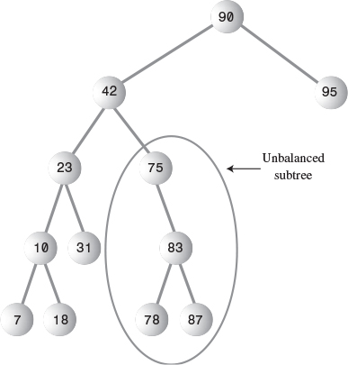

- 
- 
- The Node Class
```
class Node {
    int iData;          /** used as key value */
    double fData;       /** other data */
    node leftChild;
    node rightChild;

    public void displayNode() {}
}
Some programmers also include a reference to the node’s parent. This simplifies some operations but complicates others
```
- 
- The Tree Class
```
class Tree {
    private Node root;
    public void find(int key) { }
    public void insert(int id, double dd) { }
    public void delete(int id) { }
}
```
- Finding a Node
```
public Node find(int key) {
    Node current = root;
    while(current.iData != key) {
        if(key < current.iData)          /** go left? */
            current = current.leftChild;
        else
            current = current.rightChild; /** or go right? */
        if(current == null)              /** if no child - reached dead end */
            return null;
    }
    return current; /** return node so you can access any of the node's data */
}
```

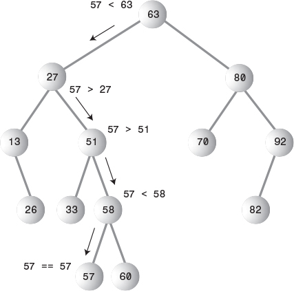

- The time required to find a node depends on how many levels down it is situated.
- In the above there can be up to 31 nodes, but no more than five levels
- So you can find any node using a maximum of only five comparisons. This is O(log2N) time
- 
- Inserting a Node
    - We start from the root node then reach the node whose left/right is [[[null]]]
    - We add the value there
- 
- Traversing the Tree
    - visiting each node in a specified order
    - Three simple ways to traverse a tree: "preorder", "inorder" & "postorder"
    - The most commonly used for binary search trees is "inorder"
    - Inorder Traversal
        

        - Will visit the nodes in ascending order, based on their key values
        - If you want to create a sorted list of the data in a binary tree, this is one way to do it
        - A recursive method to traverse the entire tree is called with a node as an argument
            - Call itself to traverse the node's left subtree
            - Visit the node
            - Call itself to traverse the node's right subtree

            ```
            private void inOrder(node localRoot) {
                if(localRoot != null) {
                    inOrder(localRoot.leftChild);
                    System.out.print(localRoot.iData + " ");
                    inOrder(localRoot.rightChild);
                }
            }
            ```
    - Preorder & Postorder Traversals
        - A binary tree (NOT a binary search tree) can be used to represent an algebraic expression that involves the binary arithmetic operators +, -, /, *.
        - The root node holds an operator,and the other nodes hold either a variable name (like A, B, or C), or another operator.
        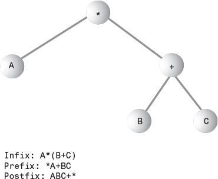
        - preorder (prefix notation) would generate the expression
        - Starting on the left, each operator is applied to the next two things in the expression
        - postorder, contains the three steps   "ABC+*"
            - Call itself to traverse the node's left subtree
            - Call itself to traverse the node's right subtree
            - Visit the node
        - apply the last operator in the expression, *, to the first and second things.” The first thing is A, and the second thing is BC+
        - Result "*A+BC"
        - Which then converted to (B+C)
        - Which then converted to A*(B+C)
- Finding Maximum and Minimum Values
    - Max = Rightmost child
    - Min = Left most child or if doesn't have a left child then the last node itself
    ```
    public Node minimum()     // returns node with minimum key value {
        Node current, last;
        current = root;                   // start at root
        while(current != null) {        // until the bottom,
            last = current;                // remember node
            current = current.leftChild;   // go to left child
        }
        return last;
    }

    For Max: Go to right child
        current = current.rightChild;
    ```


- Deleting a Node
    - various cases
        - 1. The node to be deleted is a leaf (has no children)
        - 2. The node to be deleted has one child
        - 3. The node to be deleted has two children
        - 
    - 1. The node to be deleted is a leaf (has no children)
        - simply change the appropriate child field in the node's parent to point to null
        ```
        public boolean delete(int key) { // delete node with given key (assumes non-empty list)
            Node current = root;
            Node parent = root;
            boolean isLeftChild = true;
            while(current.iData != key) {        // search for node
                parent = current;
                if(key < current.iData) { // go left?
                    isLeftChild = true;
                    current = current.leftChild;
                } else {    // or go right?
                    isLeftChild = false;
                    current = current.rightChild;
                }
                if(current == null)             // end of the line, didn't find it
                    return false;
            }  // end while

            if(current.leftChild==null && current.rightChild==null) { // found node to delete
                if(current == root)             // if root,
                    root = null;                 // tree is empty
                else if(isLeftChild)
                    parent.leftChild = null;     // disconnect from parent
                else
                    parent.rightChild = null;
            }
        }
        ```
    - 2. The node to be deleted has one child
        - The one child of the node, to be deleted,, may be either a left or right child
        - There is also a specialized situation: the node to be deleted may be the root, in which case it has no parent and is simply replaced by the appropriate subtree.

        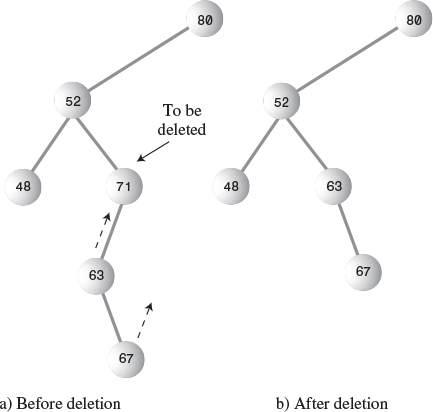

        ```
        // if no right child, replace with left subtree
        else if(current.rightChild==null)
            if(current == root)
                root = current.leftChild;
            else if(isLeftChild)           // left child of parent
                parent.leftChild = current.leftChild;
            else                           // right child of parent
                parent.rightChild = current.leftChild;
                
            // if no left child, replace with right subtree
        else if(current.leftChild==null)
            if(current == root)
                root = current.rightChild;
            else if(isLeftChild)           // left child of parent
                parent.leftChild = current.rightChild;
            else                           // right child of parent
                parent.rightChild = current.rightChild;
        ```
        - [IMPORTANT] you don't need to worry about moving them individually. In fact, they "move" only in the sense of being conceptually in different positions relative to the other nodes. As far as the program is concerned, only the reference to the root of the subtree has changed.
    - 3. The node to be deleted has two children
        - In the below picture we will try to delete 25
        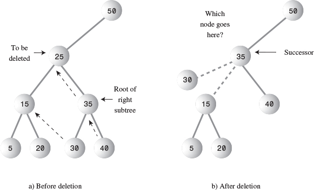
        - replace the node with its inorder successor
        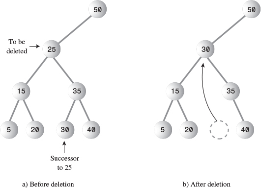
    - Finding the Successor
        - First, the program goes to the original node's right child, which must have a key larger than the node
        - Then it goes to this right child's left child (if it has one), and to this left child's left child, and so on, following down the path of left children
        - The last left child in this path is the successor of the original node
        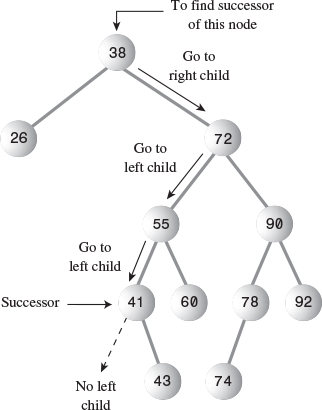
        - Because, you can find the minimum value in a subtree by following the path down all the left children
        - Thus, this algorithm finds the minimum value that is greater than the original node; this is what we mean by its successor
        - If the right child of the original node has no left children, this right child is itself the successor
        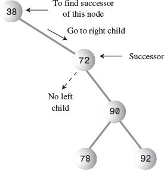

        ```
        private node getSuccessor(node delNode) {
            Node successorParent = delNode;
            Node successor = delNode;
            Node current = delNode.rightChild;
            while(current != null) { // go to right child until no more left children,
                successorParent = successor;
                successor = current;
                current = current.leftChild; // go to left child
            }
            if(successor != delNode.rightChild) { // if successor not right child, make connections
                successorParent.leftChild = successor.rightChild;
                successor.rightChild = delNode.rightChild;
            }
            return successor;
        }
        ```

        ```
        else { // two children, so replace with inorder successor
            // get successor of node to delete (current)
            Node successor = getSuccessor(current);
            
            // connect parent of current to successor instead
            if(current == root)
                root = successor;
            else if(isLeftChild)
                parent.leftChild = successor;
            else
                parent.rightChild = successor;
            // connect successor to current's left child
            successor.leftChild = current.leftChild;
        }  // end else two children
        // (successor cannot have a left child)
        return true;
        ```
        - The code handles the below special cases
        - The successor can be current's ["right child"], or it can be one of this ["right child's"] """left descendants"""
        - Successor Is Right Child of delNode
            - Things are simplified somewhat because we can simply move the subtree of which successor is the root & plug it in where the deleted node was
            - Unplug current from the rightChild field of its parent
            - Unplug current's left child from current, and plug it into the leftChild field of successor
            ```
            parent.rightChild = successor;
            successor.leftChild = current.leftChild;
            ```
            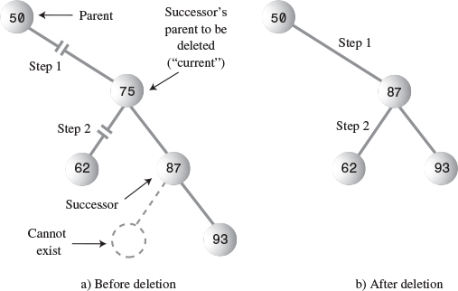
            -  Step 1: If the node to be deleted, current, is the root, it has no parent so we merely set the root to the successor. Otherwise, the node to be deleted can be either a left or right child (Figure 8.19 shows it as a right child), so we set the appropriate field in its parent to point to successor. When delete() returns and current goes out of scope, the node referred to by current will have no references to it, so it will be discarded during Java's next garbage collection.
            - Step 2: We set the left child of successor to point to current's left child.
            What happens if the successor has children of its own? First of all, a successor node is guaranteed not to have a left child. This is true whether the successor is the right child of the node to be deleted or one of this right child's left children. How do we know this?

            - Well, remember that the algorithm we use to determine the successor goes to the right child first and then to any left children of that right child. It stops when it gets to a node with no left child, so the algorithm itself determines that the successor can't have any left children. If it did, that left child would be the successor instead.
            - You can check this out. No matter how many trees you make, you'll never find a situation in which a node's successor has a left child (assuming the original node has two children, which is the situation that leads to all this trouble in the first place).
            - On the other hand, the successor may very well have a right child. This isn't much of a problem when the successor is the right child of the node to be deleted. When we move the successor, its right subtree simply follows along with it. There's no conflict with the right child of the node being deleted because the successor is this right child.

        - Successor Is Left Descendant of Right Child of delNode
            - 1. Plug the right child of successor into the leftChild field of the successor's parent
            - 2. Plug the right child of the node to be deleted into the rightChild field of successor
            - 3. Unplug current from the rightChild field of its parent, and set this field to point to successor
            - 4. Unplug current's left child from current, and plug it into the leftChild field of successor.
            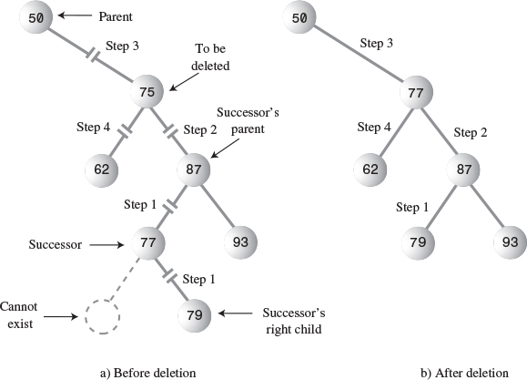
            - Steps 1 and 2 are handled in the getSuccessor() routine, while 3 and 4 are carried out in delete().
            ```
            1. successorParent.leftChild = successor.rightChild;
            2. successor.rightChild = delNode.rightChild;
            3. parent.rightChild = successor;
            4. successor.leftChild = current.leftChild;
            ```
            - (Step 3 could also refer to the left child of its parent.) The numbers in Figure show the connections affected by the four steps. Step 1 in effect replaces the successor with its right subtree. Step 2 keeps the right child of the deleted node in its proper place (this happens automatically when the successor is the right child of the deleted node). Steps 1 and 2 are carried out in the if statement that ends the getSuccessor() method shown earlier.
            ```
            if(successor != delNode.rightChild) { // if successor not right child, make connections
                successorParent.leftChild = successor.rightChild;
                successor.rightChild = delNode.rightChild;
            }
            ```
            - These steps are more convenient to perform here than in delete(), because in getSuccessor() we can easily figure out where the successor's parent is while we're descending the tree to find the successor.
            - Steps 3 and 4 we've seen already; they're the same as steps 1 and 2 in the case where the successor is the right child of the node to be deleted, and the code is in the if statement at the end of delete()

- Is Deletion Necessary?
- Some programmers try to sidestep it altogether. They add a new Boolean field to the node class, called something like isDeleted. To delete a node, they simply set this field to true.
- This approach is a bit of a cop-out, but it may be appropriate where there won't be many deletions in a tree.

- The Efficiency of Binary Trees
    - In a full tree, about half the nodes are on the bottom level.
    - Thus, about half of all searches or insertions or deletions require finding a node on the lowest level.
    - During a search we need to visit one node on each level
    ```
    Number of Nodes         Number of Levels
        1                           1
        3                           2
        7                           3
        15                          4
        31                          5
        ...                         ...
        1,023                       10
        ...                         ...
        32,767                      15
        1,048,575                   20
        33,554,432                  25
        1,073,741,824               30
    ```
    - The number of comparisons for a binary search was approximately equal to the base 2 logarithm of the number of cells in the array
    - if we call the number of nodes in the first column N,
    - and the number of levels in the second column L,
    - we can say that N is 1 less than 2 raised to the power L, or N = 2^L - 1
    - Adding 1 to both sides of the equation, we have N + 1 = 2^L
    - This is equivalent to L = log(base 2)of(N + 1)
    - In Big O notation we say such operations take O(logN) time.
    - Thus, a tree provides high efficiency for all the common data storage operations.
    - Traversing is not as fast as the other operations. However, traversals are probably not very commonly carried out in a typical large database. They're more appropriate when a tree is used as an aid to parsing algebraic or similar expressions, which are probably not too long anyway.

### Trees Represented as Arrays
- In the array approach, the nodes are stored in an array and are not linked by references. The position of the node in the array corresponds to its position in the tree. The node at index 0 is the root, the node at index 1 is the root's left child, and so on,
- Progressing from left to right along each level of the tree
- Every position in the tree, whether it represents an existing node or not, corresponds to a cell in the array. Adding a node at a given position in the tree means inserting the node into the equivalent cell in the array. Cells representing tree positions with no nodes are filled with 0 or null.
- With this scheme, a node's children and parent can be found by applying some simple arithmetic to the node's index number in the array.
- If a node's index number is index, this node's left child is
2*index + 1

its right child is
2*index + 2

and its parent is
(index-1) / 2
- In most situations, representing a tree with an array isn't very efficient. Unfilled nodes and deleted nodes leave holes in the array, wasting memory. Even worse, when deletion of a node involves moving subtrees, every node in the subtree must be moved to its new location in the array, which is time-consuming in large trees.
- However, if deletions aren't allowed, the array representation may be useful, especially if obtaining memory for each node dynamically is, for some reason, too time-consuming. The array rep


### Duplicate Keys
- a node with a duplicate key will be inserted as the right child of its twin
- The problem is that the find() routine will find only the first of two (or more) duplicate nodes. The find() routine could be modified to check an additional data item, to distinguish data items even when the keys were the same, but this would be (at least somewhat) time-consuming.
- One option is to simply forbid duplicate keys. When duplicate keys are excluded by the nature of the data (employee ID numbers, for example), there's no problem. Otherwise, you need to modify the insert() routine to check for equality during the insertion process, and abort the insertion if a duplicate is found.


### The Huffman Code
- Is an "Algorithm" that uses a binary tree in a surprising way to "compress data"
- In English, E is often the most common letter & On the other hand, Z is seldom used


- There are several approaches to compressing data
- For text, the most common approach is
- To reduce the number of bits that represent the most-used characters & using a large number of bits for less commonly used character


- We must be careful that NOOO character is represented by the same bit combination
- That appears at the beginning of an another longer code used for some other character
- For example, if E is 01, and X is 01011000, then anyone decoding 01011000 wouldn't know if the initial 01 represented an E or the beginning of an X
- RULE: NO CODE CAN BE THE PREFIX OF ANY OTHER CODE


- Example: How "a b c d" coded & decoded using Huffman coding
- How this works
    - [STEP-1] Generate & Store the code table
    - [STEP-2] Build Huffman Tree ['0' to the left branch and '1' to the right (arbitarily)]
    - [STEP-3] Encoded the Sequence
    - [STEP-4] Decoded the Sequence


- Assume the frequency of these characters in a larger hypothetical text is as
    ```
        'a': 5 times
        ' ': 4 (space) times
        'b': 2 times
        'c': 2 times
        'd': 1 times
    ```


- Step 1: Build the Huffman Tree

    Initial Nodes: Create a leaf node for each character and its frequency:
    'a' (5 times)
    ' ' (4 times)
    'b' (2 times)
    'c' (2 times)
    'd' (1 times)

- Merge Lowest Frequencies
    - Merge 'c' (2 times) & 'd' (1 times) into a new node with frequency 3.
    Let's arbitrarily assign '0' to the left branch and '1' to the right.

    - Merge 'b' (2 times) and the 'cd' node (3) into a new node with frequency 5. Again,
    assign '0' to the left ('b') and '1' to the right ('cd').

    - Merge ' ' (4 times) and the 'bcd' node (5) into a new node with frequency 9.
    Assign '0' to the left (' ') and '1' to the right ('bcd').

    - Finally, merge 'a' (5 times) and the ' bcd' node (9) into the root node with frequency 14.
    Assign '0' to the left ('a') and '1' to the right (' bcd').

    - The Resulting Huffman Tree (Conceptual)
         ```
              14
             /  \
            0(a) 1( bcd)
               /    \
              0(' ')  1(bcd)
                    /   \
                   0(b) 1(cd)
                         /  \
                        0(c) 1(d)
        ```


- Assign Huffman Codes
- Now, we traverse the tree from the root to each leaf node to determine the code:

    ```
    FROM ROOT

    'a': 0      [Only 1st Left]
    ' ': 10     [1st Right + 1st Left]
    'b': 110    [1st Right + 2nd Right + 1st Left]
    'c': 1110   [1st Right + 2nd Right + 3rd Right + 1st Left]
    'd': 1111   [1st Right + 2nd Right + 3rd Right + 4th Right]
    ```

- Encode "a b c d"
    - So, the encoded sequence for "a b c d" would be: "010110101110101111"
    - So, the encoded sequence for "a b c d" would be: "0-10-110-10-1110-10-1111"


- Decode the Encoded Sequence "010110101110101111"
- To decode, we start from the beginning of the encoded sequence & traverse the Huffman tree based on the bits:
```
'0': Start at the root. Read '0', go left. We reach the leaf node 'a'. So, the first character is 'a'


'1': Go right from the root
'0': Go left. We reach the leaf node ' '. So, the second character is ' '


'1': Go right from the root.
'1': Go right.
'0': Go left. We reach the leaf node 'b'. So, the third character is 'b'.


'1': Go right from the root.
'0': Go left. We reach the leaf node ' '. So, the fourth character is ' '.


'1': Go right from the root.
'1': Go right.
'1': Go right.
'0': Go left. We reach the leaf node 'c'. So, the fifth character is 'c'.


'1': Go right from the root.
'0': Go left. We reach the leaf node ' '. So, the sixth character is ' '.


'1': Go right from the root.
'1': Go right.
'1': Go right.
'1': Go right. We reach the leaf node 'd'. So, the seventh character is 'd'.


By decoding the bit sequence, we successfully reconstruct the original sequence: "a b c d".
```


## Red-Black Trees
- The binary tree become much slower if data is inserted in already-sorted order (17, 21, 28, 36,...) or inversely sorted order (36, 28, 21, 17,...)
- When the values to be inserted are already ordered, a binary tree becomes unbalanced
- With an unbalanced tree, the ability to quickly find (or insert or delete) a given element is lost
- There are other ways to ensure that trees are balanced
- 
- The red-black tree, is a binary search tree with some added features
- 
### Insertion
- Top-Down Insertion
- The approach to insertion that we'll discuss is called top-down insertion
- This means that some ""structural changes may be made"" to the tree as the search routine descends the tree looking for the place to insert the node
- 
- Another approach is bottom-up insertion
- This involves "finding the place to insert the node" ~&&~ "then working back up through the tree making structural changes"
- Bottom-up insertion is less efficient because two passes must be made through the tree
- 
### Balanced & Unbalanced Trees
- Unbalanced Trees
    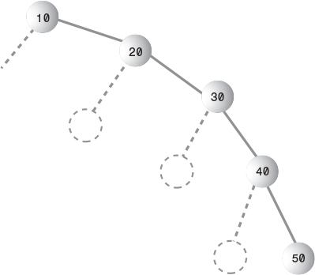

- When we insert a series of nodes whose keys are in either ascending or descending order
- The nodes arrange themselves in a line with no branches. Because each node is larger than the previously inserted one, every node is a right child, so all the nodes are on one side of the root. The tree is maximally unbalanced. If you inserted items in descending order, every node would be the left child of its parent, and the tree would be unbalanced on the other side
- Degenerates to O(N)
    - It becomes a linked list (1D)
    - you must now search through (on the average) half the items to find the one you're looking for :: the speed of searching is reduced to O(N), instead of O(logN)
    - Searching through 10,000 items in such an unbalanced tree would require an average of 5,000 comparisons
    - With a realistic amount of random data, it's not likely a tree would become seriously unbalanced. However, there may be runs of sorted data that will partially unbalance a tree. Searching partially unbalanced trees will take time somewhere between O(N) and O(logN), depending on how badly the tree is unbalanced.

- Balance to the Rescue
    - In a ""red-black tree"", balance is achieved during insertion (and also deletion)
    - As an item is being inserted, the insertion routine checks that certain characteristics of the tree are not violated. If they are, it takes corrective action, restructuring the tree as necessary
    - By maintaining these characteristics, the tree is kept balanced


### Red-Black Tree Characteristics
- The nodes are colored
- During insertion and deletion, rules are followed that preserve various arrangements of these colors

### Colored Nodes (HUMANIZED)
- In a red-black tree, The rules are
    - 1. Every node is either red or black
    - 2. The root is always black
    - 3. If a node is red, its children must be black (although the converse isn't necessarily true) (black root can follow black child)
    - 4. Every path from the root to a leaf, or to a null child, must contain the same number of black nodes.
    - 
    - The """"null child"""" referred to in Rule 4 is a place where a child could be attached to a non-leaf node.
    - In other words, it's the potential left child of a node with a right child, or the potential right child of a node with a left child.
    - This will make more sense as we go along.
    - 
    - The number of black nodes on a path from root to leaf is called the black height. Another way to state Rule 4 is that the black height must be the same for all paths from the root to a leaf.
- What actions you can take to fix things if one of the red-black rules is broken.
    - Duplicate Keys
        - What happens if there's more than one data item with the same key? This presents a slight problem in red-black trees. It's important that nodes with the same key are distributed on both sides of other nodes with the same key. That is, if keys arrive in the order 50, 50, 50, you want the second 50 to go to the right of the first one, and the third 50 to go to the left of the first one. Otherwise, the tree becomes unbalanced.
        - Distributing nodes with equal keys could be handled by some kind of randomizing process in the insertion algorithm. However, the search process then becomes more complicated if all items with the same key must be found.
        - It's simpler to outlaw items with the same key
        - In this discussion we'll assume duplicates aren't allowed
    - Fixing Rule Violations
        - There are two, and only two, possible actions you can take:
        - You can change the colors of nodes.
        - You can perform rotations
            - A rotation is a rearrangement of the nodes that, one hopes, leaves the tree more balanced
            - Rotation Left (ROL) & Rotation Right (LOR)
            - In a binary search tree the left children of any node have key values less than the node, while its right children have key values greater than or equal to the node
            - If the rotation didn't maintain a valid binary search tree, it wouldn't be of much use, because the search algorithm, as we saw in the preceding chapter, relies on the search-tree arrangement.
            - Note that color rules and node color changes are used only to help decide when to perform a rotation.
            - Fiddling with the colors doesn't accomplish anything by itself; IT'S THE ROTATION THATS'S THE HEAVY HITTER
        - For example if you have a balance tree
            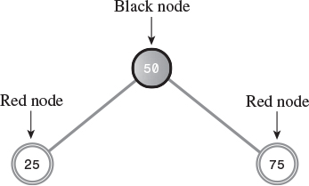
        - Do a Right Rotation
            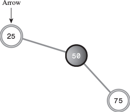
            Now the tree become Unbalance
            Keeping pointer at 25 & doing an ROL rotation will fix the tree
        - Now ading further node to the earlier balance tree ,, requires a color flip
        - & it will violates the 4th rule
            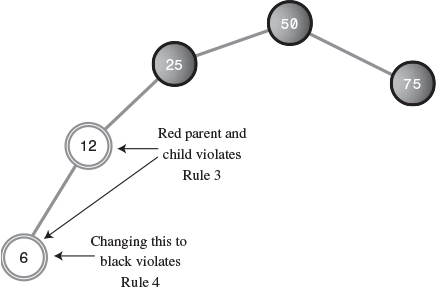
            Changing RED to Balck will cause :: Error: Black heights differ
        - The term black height is used to describe the number of black nodes from the root to a given node. In the below Figure the black height of 50 is 1, of 25 is still 1, of 12 is 2 & so on
        - 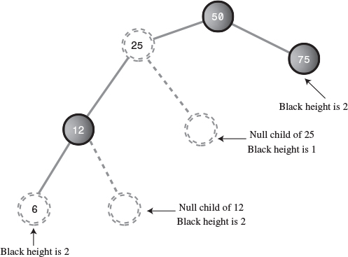
        - As Rule 4 specifies all paths,, go from the root "to any leaf" o/r "to any null children" must have the same number of black nodes
        - 
        - Rotations must do two things at once:
            - Raise some nodes and lower others to help balance the tree.
            - Ensure that the characteristics of a binary search tree are not violated
        - 
    - [1] Simple Rotations
        - The nodes themselves aren't rotated; it's the relationship between them that changes
        - If we're doing a right rotation (CLOCK WISE), this "top" node will move down and to the right, into the position of its right child. Its left child will move up to take its place
        - 
        - One node is chosen as the "top" of the rotation
        - Remember that the top node isn't the "center" of the rotation
        - 
        - any node can be the top node in a rotation, provided it has the appropriate child
        - If you're doing a right rotation (CLOCK WISE), the top node has a left child. Otherwise, there's nothing to rotate into the top spot
        - If you're doing a left rotation (ANTI CLOCK WISE), the top node must have a right child
        - 
    - The Weird Crossover Node
        - 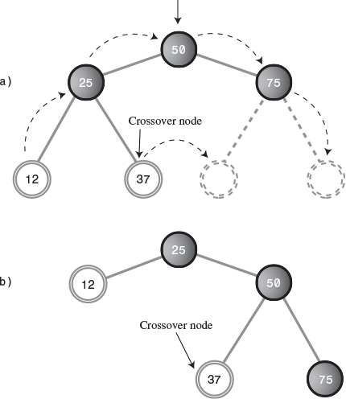
        - In the origional position
            - The inside grandchild of the top node, 50
            - The 12 is an outside grandchild
        - Place the arrow on 50 & the right rotation will cause 37 moves across,, The rotation has caused a violation of Rule 4
        - left child of the top node in a right rotation) is always disconnected from its parent and reconnected to its former grandparent. It's like becoming your own uncle
        -  
    - Subtrees on the Move
        - 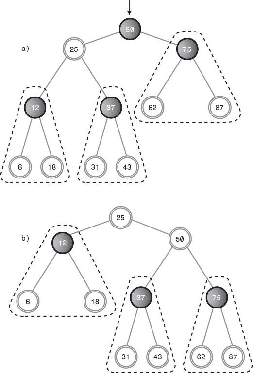
        - Position the arrow on the root, 50. Now press RoR
        - A lot of nodes have changed position
        - You'll see the Error: root must be black
    - 
### Inserting a New Node (COMPUTERIZED)
- red-black tree's insertion routine uses rotations and the color rules to maintain the tree's balance.
- Variable X, P, and G 
    - X is a node that has caused a rule violation
    - Sometimes X refers to a newly inserted node,
    - and sometimes to the child node when a parent and child have a red-red conflict
    - X is a particular node.
    - 
    - P is the parent of X
    - G is the grandparent of X (the parent of P)
```
To find the insertion point

You perform a color flip whenever you find a black node with two red children (a violation of Rule 2)

Sometimes the flip causes a red-red conflict (a violation of Rule 3)
Call the red child X and the red parent P
The conflict can be fixed with a single rotation or a double rotation,
depending on whether X is an outside or inside grandchild of G


After you've inserted the new node X,
if P is black, you simply attach the new red node
If P is red, there are two possibilities:
    1] X can be an outside or inside grandchild of G
        You perform two color changes 
    2] If X is an outside grandchild,
        You perform one rotation, and if it's an inside grandchild, you perform two
        This restores the tree to a balanced state.
```
- So it drawns 3 points
    - 1. Color flips on the way down
    - 2. Rotations after the node is inserted
    - 3. Rotations on the way down

- [1.] Color Flips on the Way Down
    - @TODO


## 2-3-4 Trees and External Storage
- In a Binary-Tree, if we allow more data items and children per node, the result is a multiway tree
- 
- An 2-3-4 Tree is a multiway trees
- can have up to four children & three data items per node
- 
- An B-tree is another kind of multiway tree that's particularly useful for organizing data in external storage (disk drive)
- A node in a B-tree can have dozens or hundreds of children
- 
- 
- 

### 2-3-4 Trees
- 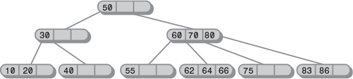</img>
- They're balanced trees like red-black trees
- They're slightly less efficient than red-black trees but easier to program
- In a 2-3-4 tree all the leaf nodes are always on the same level
- 
- node with 1 data item always has 2 children
- node with 2 data item always has 3 children
- node with 3 data item always has 4 children
- child links is L = data item D + 1
- 
- A leaf node, by contrast, has no children, but it can nevertheless contain 1, 2, or 3 data items
- Empty nodes are not allowed
- In a 2-3-4 tree, on the other hand, nodes with a single link are not permitted
- 
- A node with two links is called a 2-node, a node with three links is a 3-node, but there is no such thing as a 1-node
- 
- If a 234 tree have 4 levels then it will have a total of = 1 + 4 + 16 + 64 nodes
- 
- 2-3-4 Tree Organization
- The data items in a node are arranged in ascending key order
-  All children in the subtree """rooted at child 0""" have key values < key-0
- children in the subtree ""rooted at child 1""" have key values > key-0 < key-1
- Subtree """rooted at child 2""" have key values > key 1 < key-2
- children in the subtree """rooted at child 3""" have key values > key-2
    - 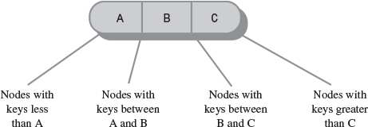</img>
    - </img>
- Upper-level nodes are often not full; that is, they may contain only one or two data items instead of three
- Also, notice that the tree is balanced. It retains its balance even if you insert a sequence of data in ascending (or descending) order. The 2-3-4 tree’s self-balancing capability results from the way new data items are inserted
- 
- Searching
- You start at the root and, unless the search key is found there, select the link that leads to the subtree with the appropriate range of values.
- 
- Insertion
- New data items are always inserted in leaves, which are on the bottom row of the tree. If items were inserted in nodes with children, the number of children would need to be changed to maintain the structure of the tree, which stipulates that there should be one more child than data items in a node.
- Insertion into a 2-3-4 tree is sometimes quite easy and sometimes rather complicated. In any case the process begins by searching for the appropriate leaf node.
- If no full nodes are encountered during the search, insertion is easy. When the appropriate leaf node is reached, the new data item is simply inserted into it.
- 
    - 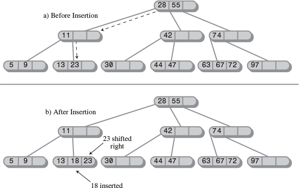</img>
- Insertion may involve moving one or two other items in a node so the keys will be in the correct order after the new item is inserted. In this example the 23 had to be shifted right to make room for the 18.
- 
- Node Splits
    - Insertion becomes more complicated if a full node is encountered on the path down to the insertion point. When this happens, the node must be split. It's this splitting process that keeps the tree balanced
    - We assume the node being split is not the root; we'll examine splitting the root later
    - </img>
    - Let's name the data items in the node that's about to be split A, B, and C
    - A new, empty node is created. It's a sibling of the node being split, and is placed to its right.
    - Data item C is moved into the new node.
    - Data item B is moved into the parent of the node being split.
    - Data item A remains where it is.
    - The rightmost two children are disconnected from the node being split and connected to the new node.
    - 
    - Notice that the effect of the node split is to move data up and to the right. It is this rearrangement that keeps the tree balanced.
    - 
    - Here the insertion required only one node split, but more than one full node may be encountered on the path to the insertion point. When this is the case, there will be multiple splits.
    - 
- Splitting the Root
    - When a full root is encountered at the beginning of the search for the insertion point, the resulting split is slightly more complicated:
        - A new root is created. It becomes the parent of the node being split.
        - A second new node is created. It becomes a sibling of the node being split.
        - Data item C is moved into the new sibling.
        - Data item B is moved into the new root.
        - Data item A remains where it is.
        - The two rightmost children of the node being split are disconnected from it and connected to the new right-hand node.
        - 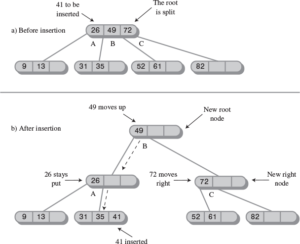</img>
    - 
- Splitting on the Way Down
    - Notice that, because all full nodes are split on the way down, a split can't cause an effect that ripples back up through the tree. The parent of any node that's being split is guaranteed not to be full and can therefore accept data item B without itself needing to be split. Of course, if this parent already had two children when its child was split, it will become full. However, that just means that it will be split when the next search encounters it.
    - 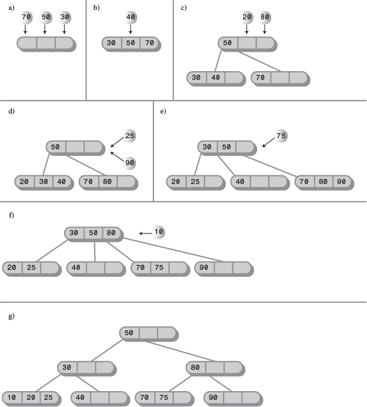</img>
    - 
- Java Code for a 2-3-4 Tree
    - There are 3 classes: "DataItem", "Node", "Tree234"
    - DataItem Class
        - represent the data items stored in nodes
        - In a real-world program it's an object : "Person", "Book" etc.
    - Node Class
        - contains two arrays: childArray and itemArray.
        - first is four cells long & holds references to whatever children the node might have
        - The second is three cells long & holds references to objects of type DataItem contained in the node
        - data items in itemArray comprise an """ordered array"""
        - We can chosen to store the number of items currently in the node ~ & ~ the node's parent
        - ordered array >>> findItem(), insertItem(), and removeItem()
    - Tree234 Class
        - Has only one field: root, of type Node. All operations start at the root, so that's all a tree needs to remember
        - Searching
            -  It starts at the root and at each node calls that node's findItem() routine to see whether the item is there. If so, it returns the index of the item within the node's item array.
            - If it can't find the item in the current node, and the current node isn't a leaf, find() calls the getNextChild() method
            - If find() is at a leaf and can't find the item, the search has failed, so it returns -1.
            - 
        - Inserting
            - The insert() method starts with code similar to find(), except that it splits a full node if it finds one. Also, it assumes it can't fail; it keeps looking, going to deeper and deeper levels, until it finds a leaf node.
        - Splitting
            - The split() method is the most complicated in this program. It is passed the node that will be split as an argument. First, the two rightmost data items are removed from the node and stored. Then the two rightmost children are disconnected; their references are also stored.
            - A new node, called newRight, is created. It will be placed to the right of the node being split. If the node being split is the root, an additional new node is created: a new root.
            - Next, appropriate connections are made to the parent of the node being split. It may be a pre-existing parent,
            - or if the root is being split, it will be the newly created root node.
            - 
            - Assume the three data items in the node being split are called A, B, and C. Item B is inserted in this parent node. If necessary, the parent's existing children are disconnected and reconnected one position to the right to make room for the new data item and new connections. The newRight node is connected to this parent
            - 
            - Now the focus shifts to the newRight node. Data Item C is inserted in it, and child 2 and child 3, which were previously disconnected from the node being split, are connected to it. The split is now complete, and the split() routine returns.
        - 
#### 2-3-4 Trees and Red-Black Trees
- The 2-3-4 trees and red-black trees are equivalent
- One can be transformed into the other by the application of a few simple rules
- and even the operations needed to keep them balanced are equivalent. Mathematicians would say they were isomorphic.
- Historically, the 2-3-4 tree was developed first; later the red-black tree evolved from it.
- 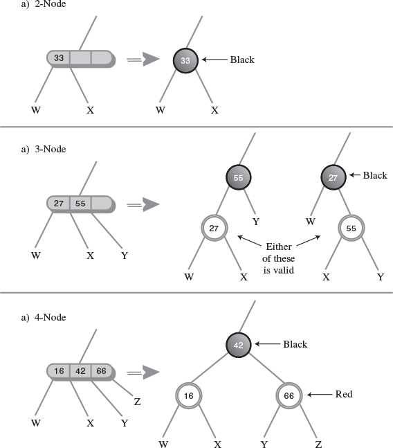</img>
    - Transform any 2-node in the 2-3-4 tree into a black node in the red-black tree
    - 
    - Transform any 3-node into a child node and a parent node.
    - The child node has two children of its own: either W and X or X and Y. The parent has one other child: either Y or W. It doesn't matter which item becomes the child and which the parent. The child is colored red and the parent is colored black.
    - 
    - Transform any 4-node into a parent and two children
    - The first child has its own children W and X; the second child has children Y and Z. As before, the children are colored red and the parent is black.
    - 
- 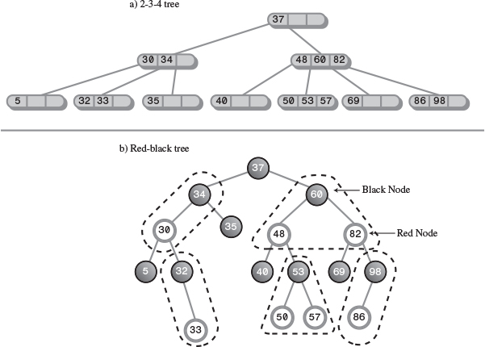</img>
    - shows a 2-3-4 tree and the corresponding red-black tree obtained by applying these transformations. Dotted lines surround the subtrees that were made from 3-nodes and 4-nodes
    - The red-black rules are automatically satisfied by the transformation. Check that this is so: Two red nodes are never connected, and there is the same number of black nodes on every path from root to leaf (or null child).
    - 
    - You can say that a 3-node in a 2-3-4 tree is equivalent to a parent with a red child in a red-black tree, and a 4-node is equivalent to a parent with two red children.
    - It follows that a black parent with a black child in a red-black tree does not represent a 3-node in a 2-3-4 tree; it simply represents a 2-node with another 2-node child.
    - Similarly, a black parent with two black children does not represent a 4-node.

- Operational Equivalence
    - 4-Node Splits and Color Flips
        - As you descend a 2-3-4 tree searching for the insertion point for a new node, you split each 4-node into two 2-nodes. In a red-black tree you perform color flips.
        - How are these operations equivalent?
        - 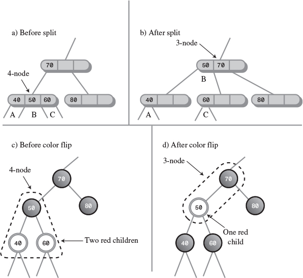</img>
        - The dotted line surrounds the equivalent of the 4-node. A color flip results in the red-black tree of
        - Now nodes 40 and 60 are black and 50 is red
        - Thus, 50 and its parent form the equivalent of a 3-node, as shown by the dotted line. This is the same 3-node formed by the node split
        - Thus, we see that splitting a 4-node during the insertion process in a 2-3-4 tree is equivalent to performing color flips during the insertion process in a red-black tree.
    - 3-Node Splits and Rotations
        - When a 3-node in a 2-3-4 tree is transformed into its red-black equivalent, two arrangements are possible,
        - Either of the two data items can become the parent.
        - Depending on which one is chosen, the child will be either a left child or a right child, and the slant of the line connecting parent and child will be either left or right.
        - 
        - Both arrangements are valid; however, they may not contribute equally to balancing the tree. Let's look at the situation in a slightly larger context.
        - 
        - 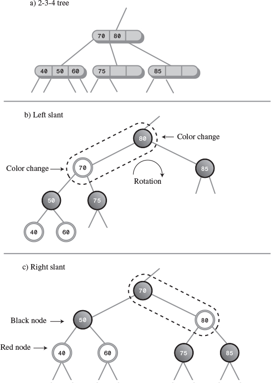</img>
        - Picture 'a' shows a 2-3-4 tree,
        - 'b' and 'c' show two equivalent red-black trees derived from the 2-3-4 tree by applying the transformation rules.
        - The difference between them is the choice of which of the two data items in the 3-node to make the parent: in b) 80 is the parent; in c) it's 70.
        - 
        - Although these arrangements are equally valid, you can see that the tree in b) is not balanced, while that in c) is. Given the red-black tree in b), we would want to rotate it to the right (and perform two color changes) to balance it. Amazingly, this rotation results in the exact same tree shown in c).
        - 
        - Thus, we see an equivalence between rotations in red-black trees and the choice of which node to make the parent when transforming 2-3-4 trees to red-black trees. Although we don't show it, a similar equivalence can be seen for the double rotation necessary for inside grandchildren.
        - 
- Efficiency of 2-3-4 Trees
    - It's harder to analyze the efficiency of a 2-3-4 tree than a red-black tree, but the equivalence of red-black trees and 2-3-4 trees gives us a starting point.
    - Speed
        - in a red-black tree one node on each level must be visited during a search, whether to find an existing node or insert a new one. The number of levels in a red-black tree (a balanced binary tree) is about log2(N+1), so search times are proportional to this.
        - 
        - One node must be visited at each level in a 2-3-4 tree as well, but the 2-3-4 tree is shorter (has fewer levels) than a red-black tree with the same number of data items.
        - where the 2-3-4 tree has three levels and the red-black tree has five.
        - More specifically, in 2-3-4 trees there are up to four children per node. If every node were full, the height of the tree would be proportional to log4N. Logarithms to the base 2 and to the base 4 differ by a constant factor of 2. Thus, the height of a 2-3-4 tree would be about half that of a red-black tree, provided that all the nodes were full. Since they aren’t all full, the height of the 2-3-4 tree is somewhere between log2(N+1) and log2(N+1)/2. The reduced height of the 2-3-4 tree decreases search times slightly compared with red-black trees.
        - On the other hand, there are more items to examine in each node, which increases the search time. Because the data items in the node are examined using a linear search, this multiplies the search times by an amount proportional to M, the average number of items per node. The result is a search time proportional to M*log4N.
        - Some nodes contain one item, some two, and some three. If we estimate that the average is two, search times will be proportional to 2*log4N. This is a small constant number that can be ignored in Big O notation.
        - Thus, for 2-3-4 trees the increased number of items per node tends to cancel out the decreased height of the tree. The search times for a 2-3-4 tree and for a balanced binary tree such as a red-black tree are approximately equal, and are both O(logN).
        - 
    - Storage Requirements
        - Each node in a 2-3-4 tree contains storage for three references to data items and four references to its children. This space may be in the form of arrays, as shown in tree234.java, or of individual variables. Not all this storage is used. A node with only one data item will waste 2/3 of the space for data and 1/2 the space for children. A node with two data items will waste 1/3 of the space for data and 1/4 of the space for children; or put another way, it will use 5/7 of the available space.
        - 
        - If we take two data items per node as the average utilization, about 2/7 of the available storage is wasted.
        - 
        - You might imagine using linked lists instead of arrays to hold the child and data references, but the overhead of the linked list compared with an array, for only three or four items, would probably not make this a worthwhile approach.
        - 
        - Because they're balanced, red-black trees contain few nodes that have only one child, so almost all the storage for child references is used. Also, every node contains the maximum number of data items, which is one. This makes red-black trees more efficient than 2-3-4 trees in terms of memory usage.
        - 
        - In Java, which stores references to objects instead of the objects themselves, this difference in storage between 2-3-4 trees and red-black trees may not be important, and the programming is certainly simpler for 2-3-4 trees. However, in languages that don’t use references this way, the difference in storage efficiency between red-black trees and 2-3-4 trees may be significant.
        - 

### 2-3 Trees
- We'll discuss 2-3 trees briefly here because they are historically important and because they are still used in many applications. Also, some of the techniques used with 2-3 trees are applicable to B-trees, which we'll examine in the next section. Finally, it's interesting to see how a small change in the number of children per node can cause a large change in the tree's algorithms.
- 2-3 trees are similar to 2-3-4 trees except that, as you might have guessed from the name, they hold one less data item and have one less child
- B-trees (of which the 2-3-4 tree is a special case)
- In many respects the operation of 2-3 trees is similar to that of 2-3-4 trees. Nodes can hold one or two data items and can have zero, one, two, or three children. Otherwise, the arrangement of the key values of the parent and its children is the same. Inserting a data item into a node is potentially simplified because fewer comparisons and moves are potentially necessary. As in 2-3-4 trees, all insertions are made into leaf nodes, and all leaf nodes are on the bottom level.
- 
- Node Splits
    - Here insertion isn't similar to a 2-3-4 tree, there is a surprising difference in the way splits are handled
    - In either kind of tree (2-3-4 or 2-3) a node split requires "three data items":
        - one to be kept in the node being split,
        - one to move right into the new node, and 
        - one to move up to the parent node.
        - A full node in a 2-3-4 tree has three data items, which are moved to these three destinations.
        - However, a full node in a 2-3 tree has only two data items.
        - Where can we get a third item? We must use the new item: the one being inserted in the tree
        - In a 2-3-4 tree the new item is inserted after all the splits have taken place. In the 2-3 tree it must participate in the split. It must be inserted in a leaf, so no splits are possible on the way down. If the leaf node where the new item should be inserted is not full, the new item can be inserted immediately, but if the leaf node is full, it must be split. Its two items and the new item are distributed among these three nodes: the existing node, the new node, and the parent node. If the parent is not full, the operation is complete (after connecting the new node)
        - 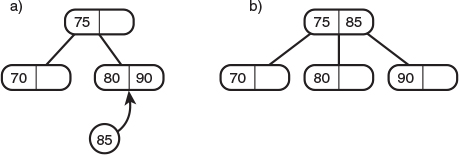</img>
        - However, if the parent is full, it too must be split. Its two items and the item passed up from its recently split child must be distributed among the parent, a new sibling of the parent, and the parent's parent.
        - 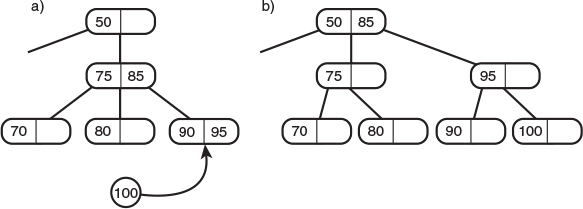</img>
        - If the parent’s parent (the grandparent of the leaf node) is full, it too must be split. The splitting process ripples upward until either a non-full parent or the root is encountered. If the root is full, a new root is created that is the parent of the old root,
        - 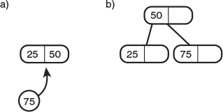</img>
        - Below picture shows a node split that ripples up through a tree until it reaches the root.
        - 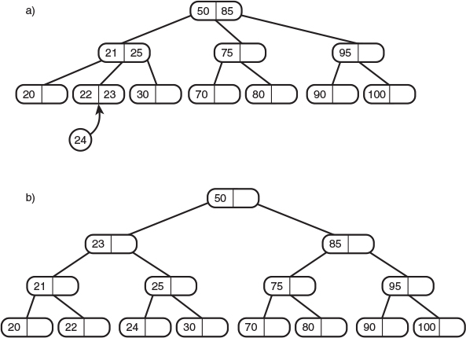</img>
        - 

- Implementation In Java
    - The insertion routine doesn't care if the nodes it encounters are full or not. It searches down through the tree until it finds the appropriate leaf. If the leaf is not full, it inserts the new value. However, if the leaf is full, it must rearrange the tree to make room. To do this, it calls a split() method
    - Arguments to this method can be the full leaf node and the new item. It will be the responsibility of split() to make the split and insert the new node in the new leaf.
    - If split() finds that the leaf's parent is full, it calls itself recursively to split the parent. It keeps calling itself until a non-full leaf or the root is found. The return value of split() is the new right node, which can be used by the previous incarnation of split().
    - Coding the splitting process is complicated by several factors. In a 2-3-4 tree the three items to be distributed are already sorted, but in the 2-3 tree the new item's key must be compared with the two items in the leaf; the three are then distributed according to the results of the comparison.
    - Also, splitting a parent creates a second parent, so now we have a left (the original) parent and a new right parent. We need to change the connections from a single parent with three children to two parents with two children each. There are three cases, depending on which child (0, 1, or 2) is being split. This situation is shown in Figure
    - the new nodes created as the result of a split are shaded, and new connections are shown as wiggly lines
    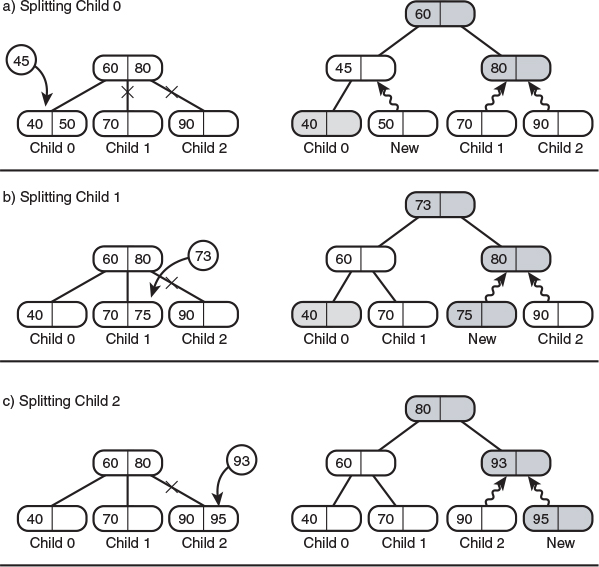</img>
    - 
### External Storage
- 2-3-4 trees are examples of multiway trees, which have more than two children and more than one data item. Another kind of multiway tree, the B-tree, is useful when data resides in external storage. External storage typically refers to some kind of disk system, such as the hard disk found in most desktop computers or servers.
- #external file handling. #organizing external data: sequential ordering #indexing
- we'll begin by describing various aspects of external file handling. We'll talk about a simple approach to organizing external data: sequential ordering. Finally, we'll discuss B-trees and explain why they work so well with disk files. We'll finish with another approach to external storage, indexing, which can be used alone or with a B-tree.
- We'll also touch on other aspects of external storage, such as searching techniques. In the next chapter we'll mention a different approach to external storage: hashing
- Accessing External Data
    - in many situations the amount of data to be processed is too large to fit in main memory all at once. In this case a different kind of storage is necessary. Disk files generally have a much larger capacity than main memory; this is made possible by their lower cost per byte of storage.
    - Disk files can retain data indefinitely with the power off
    - 
    - Disk files can be much slower than main memory
    - To access a particular piece of data on a disk drive, the read-write head must first be moved to the correct track. This is done with a stepping motor or similar device; it's a mechanical activity that requires several milliseconds (thousandths of a second).
    - Once the correct track is found, the read-write head must wait for the data to rotate into position. On the average, this takes half a revolution. Even if the disk is spinning at 10,000 revolutions per minute, about 3 more milliseconds pass before the data can be read.
    - Thus, disk access times of around 10 milliseconds are common. This is something like 10,000 times slower than main memory.
    - 
    - One Block at a Time
    - When the read-write head is correctly positioned and the reading (or writing) process begins, the drive can transfer a large amount of data to main memory fairly quickly
    - For this reason, and to simplify the drive control mechanism, data is stored on the disk in chunks called blocks, pages, allocation units, or some other name, depending on the system. We'll call them blocks.
    - 
    - The disk drive always reads or writes a minimum of one block of data at a time.
    - Block size varies, depending on the operating system, the size of the disk drive, and other factors, but it is usually a power of 2.
    - Let's assume a block size of (2^13) = 8,192 bytes
    - 
    - For example a phone book for a medium-sized city-perhaps 500,000 entries
    - Let's say an entry is stored as a record requiring 512 bytes
    - The result is a file size of 500,000 * 512, which is 256,000,000 bytes or 256 megabytes.
    - 
    - Thus, our phone book database will require 256,000,000 bytes divided by 8,192 bytes per block, which is 31,250 blocks.
    - Your software is most efficient when it specifies a read or write operation that's a multiple of the block size.
    - If you ask to read 100 bytes, the system will read one block, 8,192 bytes, and throw away all but 100.
    - If you ask to read 8,200 bytes, it will read two blocks, or 16,384 bytes, and throw away almost half of them
    - By organizing your software so that it works with a block of data at a time, you can optimize its performance.
    - 
    - Assuming our each phone book record size of 512 bytes, you can store 8192/512 = 16 records in a block
    - Thus, for maximum efficiency it's important to read 16 records at a time (or multiples of this number)
    - Notice that it's also useful to make your record size a multiple of 2. That way, an integral number of them will always fit in a block.
    - It follows that the larger the block, the more efficiently you can read or write a single record (assuming you use all the records in the block).
    - .
     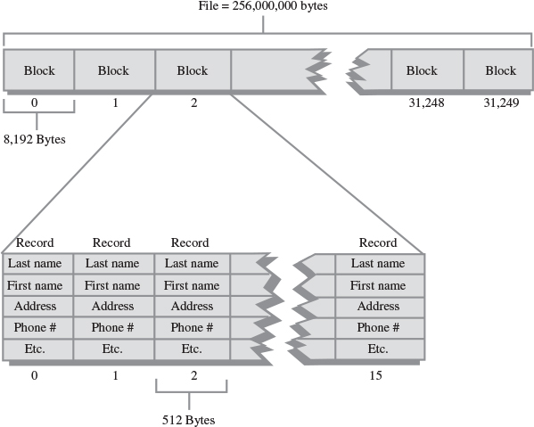</img>
    - 
- Sequential Ordering
    - One way to arrange the phone book data in the disk file would be to order all the records according to some key, say alphabetically by last name.
- Searching
    - To search a sequentially ordered file for a particular last name such as Smith, you could use a binary search. You would start by reading a block of records from the middle of the file (S is expected somewhere in middle)
    - The 16 records in the block are all read at once into an 8,192-byte buffer in main memory

    - If the keys of these records are too early in the alphabet (Keller, for example), you would go to the 3/4 point in the file (Prince) and read a block there; if the keys were too late, you'd go to the 1/4 point (DeLeon). By continually dividing the range in half, you would eventually find the record you were looking for.

    - As we saw in Chapter 2, a binary search in main memory takes log-base-2-of(N) comparisons
    - which for 500,000 items would be about 19.
    - If every comparison took, say 10 microseconds, this would be 190 microseconds, OR ~ 2/10,000 of a SECOND

    - 
    - 
    - 

    - However, we're now dealing with data stored on a disk. Because each disk access is so time-consuming
    - It's more important to focus on how many disk accesses are necessary than on how many individual records there are
    - The time to read a block of records will be very much larger than the time to search the 16 records in the block once they're in in-memory

    - Disk accesses are much slower than memory accesses, but on the other hand we access a block at a time, and there are far fewer blocks than records. In our example there are 31,250 blocks.
    - Log2 of 31,250 is about 15, so in theory we'll need about 15 disk accesses to find the record we want.
    
    - In practice this number is reduced somewhat because we read 16 records at once. In the beginning stages of a binary search, it doesn't help to have multiple records in memory because the next access will be in a distant part of the file.
    - However, when we get close to the desired record, the next record we want may already be in memory because it's part of the same block of 16
    - This "MAY" reduce the number of comparisons by two or so. Thus, we'll need about 13 disk accesses (15-2), which at 10 milliseconds per access requires about 130 milliseconds, or 1/7 second
    - This is much slower than in-memory access, but still not too bad.

- Insertion
    - Unfortunately, the picture is much worse if we want to insert (or delete) an item from a sequentially ordered file. Because the data is ordered, both operations require moving half the records on the average, and therefore about half the blocks.

    - Moving each block requires two disk accesses: one read and one write. When the insertion point is found, the block containing it is read into a memory buffer.
    - The last record in the block is saved, and the appropriate number of records are shifted up to make room for the new one, which is inserted. Then the buffer contents are written back to the disk file.

    - Next, the second block is read into the buffer. Its last record is saved, all the other records are shifted up, and the last record from the previous block is inserted at the beginning of the buffer. Then the buffer contents are again written back to disk. This process continues until all the blocks beyond the insertion point have been rewritten.

    - Assuming there are 31,250 blocks, we must read and write (on the average) 15,625 of them, which at 10 milliseconds per read and write requires more than 5 minutes to insert a single entry. This won't be satisfactory if you have thousands of new names to add to the phone book.

    - Another problem with the sequential ordering is that it works quickly for only one key. Our file is arranged by last names. But suppose you wanted to search for a particular phone number. You can't use a binary search because the data is ordered by name. You would need to go through the entire file, block by block, using sequential access. This search would require reading an average of half the blocks, which would require about 2.5 minutes, very poor performance for a simple search. It would be nice to have a more efficient way to store disk data.

### B-Trees
- used for external data than for in-memory data
- a multiway tree somewhat like a 2-3-4 tree, but with many more data items per node

- One Block Per Node
    - It makes sense then to store an entire block of data in each node of the tree. This way, reading a node accesses a maximum amount of data in the shortest time.
    - When we simply stored the 512-byte data records for our phone book example, we could fit 16 into an 8,192-byte block.
    - In a tree, however, we also need to store the links to other nodes
    - For a tree stored in a disk file, the links are block numbers in a file (from 0 to 31,249, in our phone book example)
    - For block numbers we can use a field of type int, a 4-byte type, which can point to more than 2 billion possible blocks, which is probably enough for most files.
    - Now we can no longer squeeze 16 512-byte records into a block because we need room for the links to child nodes. We could reduce the number of records to 15 to make room for the links, but it's most efficient to have an even number of records per node, so (after appropriate negotiation with management) we reduce the record size to 507 bytes. There will be 17 child links (one more than the number of data items) so the links will require 68 bytes (17 * 4). This leaves room for 16 507-byte records with 12 bytes left over (507 * 16 + 68 = 8,180). A block in such a tree, and the corresponding node representation
    - A node in a B-tree of order 17.
    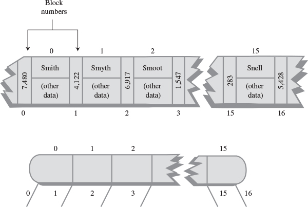</img>
    - Within each node the data is ordered sequentially by key, as in a 2-3-4 tree. In fact, the structure of a B-tree is similar to that of a 2-3-4 tree, except that there are more data items per node and more links to children. The order of a B-tree is the number of children each node can potentially have. In our example this is 17, so the tree is an order 17 """"B-tree"""" !!!!!

- Searching
    - A search for a record with a specified key is carried out in much the same way it is in an in-memory 2-3-4 tree. First, the block containing the root is read into memory. The search algorithm then starts examining each of the 15 records (or, if it's not full, as many as the node actually holds), starting at 0. When it finds a record with a greater key, it knows to go to the child whose link lies between this record and the preceding one.
    - This process continues until the correct node is found. If a leaf is reached without finding the specified key, the search is unsuccessful.
- Insertion
    - The insertion process in a B-tree is more like an insertion in a 2-3 tree than in a 2-3-4 tree.
    - in a 2-3-4 tree many nodes are not full, and in fact contain only one data item. In particular, a node split always produces two nodes with one item in each. This is not an optimum approach in a B-tree.
    - In a B-tree it's important to keep the nodes as full as possible so that each disk access, which reads an entire node, can acquire the maximum amount of data. To help achieve this end, the insertion process differs from that of 2-3-4 trees in three ways:
        - A node split divides the data items equally: Half go to the newly created node, and half remain in the old one.
        - Node splits are performed from the bottom up, as in a 2-3 tree, rather than from the top down.
        - Again, as in a 2-3 tree, it's not the middle item in a node that's promoted upward, but the middle item in the sequence formed from the items in the node plus the new item.
        - Example of order 5 B-tree
            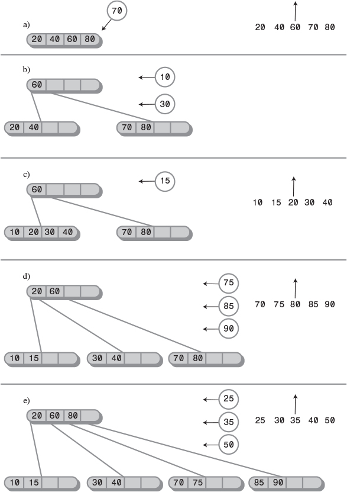</img>
        - shows a root node that's already full; items with keys 20, 40, 60, and 80 have already been inserted into the tree. A new data item with a key of 70 is inserted, resulting in a node split. Here's how the split is accomplished. Because it's the root that's being split, two new nodes are created (as in a 2-3-4 tree): a new root and a new node to the right of the one being split.
        - To decide where the data items go, the insertion algorithm arranges their five keys in order, in an internal buffer. Four of these keys are from the node being split, and the fifth is from the new item being inserted. In Figure 10.25, these five-item sequences are shown to the side of the tree. In this first step the sequence 20, 40, 60, 70, 80 is shown.
        - The center item in this sequence, 60 in this first step, is promoted to the new root node. (In the figure, an arrow indicates that the center item will go upward.) All the items to the left of center remain in the node being split, and all the items to the right go into the new right-hand node
        - these five-item sequences are shown to the side of the tree. In this first step the sequence 20, 40, 60, 70, 80 is shown.
        - The center item in this sequence, 60 in this first step, is promoted to the new root node. (In the figure, an arrow indicates that the center item will go upward.) All the items to the left of center remain in the node being split, and all the items to the right go into the new right-hand node. The result is shown in Figure b
        - In Figure b we insert two more items, 10 and 30. They fill up the left child, as shown in Figure c. The next item to be inserted, 15, splits this left child, with the result shown in Figure d. Here the 20 has been promoted upward into the root
        - Next, three items - 75, 85, and 90 - are inserted into the tree. The first two fill up the third child, and the third splits it, causing the creation of a new node and the promotion of the middle item, 80, to the root. The result is shown in Figure e.
        - Again three items - 25, 35, and 50 - are added to the tree. The first two items fill up the second child, and the third one splits it, causing the creation of a new node and the promotion of the middle item, 35, to the root, as shown in Figure f.
        - Now the root is full. However, subsequent insertions don't necessarily cause a node split, because nodes are split only when a new item is inserted into a full node, not when a full node is encountered in the search down the tree. Thus, 22 and 27 are inserted in the second child without causing any splits, as shown in Figure g.
        - However, the next item to be inserted, 32, does cause a split; in fact it causes two of them. The second node child is full, so it's split, as shown in Figure h. However, the 27, promoted from this split, has no place to go because the root is full. Therefore, the root must be split as well, resulting in the arrangement of Figure i.
        - Notice that throughout the insertion process no node (except the root) is ever less than half full, and many are more than half full. As we noted, this promotes efficiency because a file access that reads a node always acquires a substantial amount of data.

- Efficiency of B-Trees
    - Because there are so many records per node, and so many nodes per level, operations on B-trees are very fast, considering that the data is stored on disk
    - In our phone book example there are 500,000 records.
    - All the nodes in the B-tree are at least half full, so they contain at least 8 records and 9 links to children.
    - The height of the tree is thus somewhat less than logbase9of(N) (logarithm to the base 9 of N), where N is 500,000. This is 5.972, so there will be about 6 levels in the tree.
    - Thus, using a B-tree, only six disk accesses are necessary to find any record in a file of 500,000 records. At 10 milliseconds per access, this takes about 60 milliseconds, or 6/100 of a second
    - The more records there are in a node, the fewer levels there are in the tree. We've seen that there are 6 levels in our B-tree, even though the nodes hold only 16 records. In contrast, a binary tree with 500,000 items would have about 19 levels, and a 2-3-4 tree would have 10. If we use blocks with hundreds of records, we can reduce the number of levels in the tree and further improve access times.
    - Although searching is faster in B-trees than in sequentially ordered disk files, it's for insertion and deletion that B-trees show the greatest advantage.
    - 
    - Let's first consider a B-tree insertion in which no nodes need to be split. This is the most likely scenario, because of the large number of records per node. In our phone book example, as we've seen, only 6 accesses are required to find the insertion point. Then one more access is required to write the block containing the newly inserted record back to the disk, for a total of 7 accesses.
    - 
    - Next let's see how things look if a node must be split. The node being split must be read, have half its records removed, and be written back to disk. The newly created node must be written to the disk, and the parent must be read and, following the insertion of the promoted record, written back to disk. This is 5 accesses in addition to the 6 necessary to find the insertion point, for a total of 12. This is a major improvement over the 500,000 accesses required for insertion in a sequential file.
    - 
    - In some versions of the B-tree, only leaf nodes contain records. Non-leaf nodes contain only keys and block numbers. This may result in faster operation because each block can hold many more block numbers. The resulting higher-order tree will have fewer levels, and access speed will be increased. However, programming may be complicated because there are two kinds of nodes: leaves and non-leaves.
    - 
- Indexing
    - A different approach to speeding up file access is to store records in sequential order but use a file index along with the data itself.
    - A file index is a list of key/block pairs, arranged with the keys in order.
    - Recall that in our original phone book example we had 500,000 records of 512 bytes each, stored 16 records to a block, in 31,250 blocks.
    - Assuming our search key is the last name, every entry in the index contains two items:
        - The key, like Jones.
        - The number of the block where the Jones record is located within the file. These numbers run from 0 to 31,249.
        - Let's say we use a string 28 bytes long for the key (big enough for most last names) and 4 bytes for the block number (a type int in Java). Each entry in our index thus requires 32 bytes. This is only 1/16 the amount necessary for each record.
        - The entries in the index are arranged sequentially by last name.
        - The original records on the disk can be arranged in any convenient order.
        - This usually means that new records are simply appended to the end of the file, so the records are ordered by time of insertion.
        - 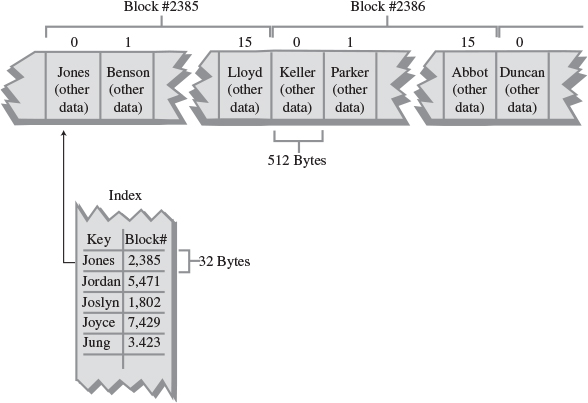</img>
        - The index is much smaller than the file containing actual records. It may even be small enough to fit entirely in main memory. In our example there are 500,000 records. Each one has a 32-byte entry in the index, so the index will be 32 * 500,000, or 1,600,000 bytes long (1.6 megabytes). In modern computers there's no problem fitting this in memory. The index can be stored on the disk but read into memory whenever the database program is started up. From then on, operations on the index can take place in memory. At the end of each day (or perhaps more frequently), the index can be written back to disk for permanent storage.
    - 
- Searching
    - The index-in-memory approach allows much faster operations on the phone book file than are possible with a file in which the records themselves are arranged sequentially. For example, a binary search requires 19 index accesses. At 20 microseconds per access, that's only about 4/10,000 of a second. Then there's (inevitably) the time to read the actual record from the file, once its block number has been found in the index. However, this is only one disk access of (say) 10 milliseconds.
- Insertion
    - To insert a new item in an indexed file, two steps are necessary. We first insert the item’s full record into the main file; then we insert an entry, consisting of the key and the block number where the new record is stored, into the index.
    - Because the index is in sequential order, to insert a new item, we need to move half the index entries, on the average. Figuring 2 microseconds to move a byte in memory, we have 250,000 times 32 times 2, or about 16 seconds to insert a new entry. This compares with 5 minutes for the unindexed sequential file. (Note that we don't need to move any records in the main file; we simply append the new record at the end of the file.)
    - Of course, you can use a more sophisticated approach to storing the index in memory. You could store it as a binary tree, 2-3-4 tree, or red-black tree, for example. Any of these would significantly reduce insertion and deletion times. In any case the index-in-memory approach is much faster than the sequential-file approach. In some cases it will also be faster than a B-tree.
    - The only actual disk accesses necessary for an insertion into an indexed file involve the new record itself. Usually, the last block in the file is read into memory, the new record is appended, and the block is written back out. This process involves only two file accesses.
- Multiple Indexes
    - An advantage of the indexed approach is that multiple indexes, each with a different key, can be created for the same file. In one index the keys can be last names; in another, telephone numbers; in another, addresses. Because the indexes are small compared with the file, this doesn’t increase the total data storage very much. Of course, it does present more of a challenge when items are deleted from the file because entries must be deleted from all the indexes

- Index Too Large for Memory
    - If the index is too large to fit in memory, it must be broken into blocks and stored on the disk. For large files storing the index itself as a B-tree may then be profitable. In the main file the records are stored in any convenient order.
    - This arrangement can be very efficient. Appending records to the end of the main file is a fast operation, and inserting the index entry for the new record is also quick because the index is a tree. The result is very fast searching and insertion for large files.
    - Note that when an index is arranged as a B-tree, each node contains n child pointers and n-1 data items. The child pointers are the block numbers of other nodes in the index. The data items consist of a key value and a pointer to a block in the main file. Don't confuse these two kinds of block pointers.
- Complex Search Criteria
    - In complex searches the only practical approach may be to read every block in a file sequentially. Suppose in our phone book example we wanted a list of all entries in the phone book with first name Frank, who lived in Springfield, and who had a phone number with three 7 digits in it. (These were perhaps clues found scrawled on a scrap of paper clutched in the hand of a victim of foul play.)
    - A file organized by last names would be no help at all. Even if there were index files ordered by first names and cities, there would be no convenient way to find which files contained both Frank and Springfield
    - In such cases (which are quite common in many kinds of databases), the fastest approach is probably to read the file sequentially, block by block, checking each record to see whether it meets the criteria !!!!!!!!!!!!!!!!!!!!!!!!!!!!
    - 
- Sorting External Files
    - Mergesort is the preferred algorithm for sorting external data. This is because, more so than most sorting techniques, disk accesses tend to occur in adjacent records rather than random parts of the file.
    - From "Recursion" we know that mergesort works recursively by calling itself to sort smaller and smaller sequences
    - Once two of the smallest sequences (one byte each in the internal-memory version) have been sorted, they are then merged into a sorted sequence twice as long. Larger and larger sequences are merged, until eventually the entire file is sorted.
    - The approach for external storage is similar. However, the smallest sequence that can be read from the disk is a block of records. Thus, a two-stage process is necessary.
        - In the first phase, a block is read, its "records are sorted internally", and the resulting sorted block is written back to disk. The next block is similarly sorted and written back to disk. This process continues until all the blocks are internally sorted.
        - In the second phase, two sorted blocks are read, merged into a two-block sequence, and written back to disk. This process continues until all pairs of blocks have been merged. Next, each pair of two-block sequences is merged into a four-block sequence. Each time, the size of the sorted sequences doubles, until the entire file is sorted.

    - 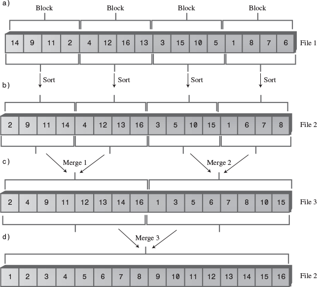</img>

    - Internal Sort of Blocks
        - In the first phase all the blocks in the file are sorted internally. This is done by reading the block into memory and sorting it with any appropriate internal sorting algorithm, such as quicksort (or for smaller numbers of records Shellsort or insertion sort).
        - A second file may be used to hold the sorted blocks, and we assume that availability of external storage is not a problem. It's often desirable to avoid modifying the original file.
    - Merging
        - In the second phase we want to merge the sorted blocks. In the first pass we merge every pair of blocks into a sorted two-block sequence. Thus, the two blocks 2-9-11-14 and 4-12-13-16 are merged into 2-4-9-11-12-13-14-16. Also, 3-5-10-15 and 1-6-7-8 are merged into 1-3-5-6-7-8-10-15.
        - In the second pass, the two 8-record sequences are merged into a 16-record sequence, which can be written back to File 2
        - Now the sort is complete. Of course, more merge steps would be required to sort larger files; the number of such steps is proportional to log2N. The merge steps can alternate between two files (File 2 and File 3)
    - Internal Arrays
        - Because the computer's internal memory has room for only three blocks, the merging process must take place in stages. Let's say there are three arrays, called arr1, arr2, and arr3, each of which can hold a block.
        - In the first merge, block 2-9-11-14 is read into arr1, and 4-12-13-16 is read into arr2. These two arrays are then mergesorted into arr3. However, because arr3 holds only one block, it becomes full before the sort is completed. When it becomes full, its contents are written to disk. The sort then continues, filling up arr3 again. This completes the sort, and arr3 is again written to disk
        - </img>
        ```
        Mergesort 1:

        1. Read 2-9-11-14 into arr1.

        2. Read 4-12-13-16 into arr2.

        3. Merge 2, 4, 9, 11 into arr3; write to disk.

        4. Merge 12, 13, 14, 16 into arr3; write to disk.

        Mergesort 2:

        1. Read 3-5-10-15 into arr1.

        2. Read 1-6-7-8 into arr2.

        3. Merge 1, 3, 5, 6 into arr3; write to disk.

        4. Merge 7, 8, 10, 15 into arr3, write to disk.

        Mergesort 3:

        1. Read 2-4-9-11 into arr1.

        2. Read 1-3-5-6 into arr2.

        3. Merge 1, 2, 3, 4 into arr3; write to disk.

        4. Merge 5, 6 into arr3 (arr2 is now empty).

        5. Read 7-8-10-15 into arr2.

        6. Merge 7, 8 into arr3; write to disk.

        7. Merge 9, 10, 11 into arr3 (arr1 is now empty).

        8. Read 12-13-14-16 into arr1.

        9. Merge 12 into arr3; write to disk.

        10. Merge 13, 14, 15, 16 into arr3; write to disk.
        ```

## Hash Table
- A hash table is a data structure that offers very fast insertion and searching.
- No matter how many data items there are, insertion and searching (and sometimes deletion) can take close to constant time: O(1) in big O notation. In practice this is just a few machine instructions.
- programs typically use hash tables when they need to look up tens of thousands of items in less than a second (as in spelling checkers). Hash tables are significantly faster than trees
- Hash tables do have several disadvantages. They're based on arrays, and arrays are difficult to expand after they've been created. For some kinds of hash tables, performance may degrade catastrophically when a table becomes too full, so the programmer needs to have a fairly accurate idea of how many data items will need to be stored (or be prepared to periodically transfer data to a larger hash table, a time-consuming process).
- Also, there's no convenient way to visit the items in a hash table in any kind of order (such as from smallest to largest).
- However, if you don't need to visit items in order, and you can predict in advance the size of your database, hash tables are unparalleled in speed and convenience.
- 
### Introduction to Hashing
- One important concept is how a range of key values is transformed into a range of array index values
- In a hash table this is accomplished with a hash function
- However, for certain kinds of keys, no hash function is necessary; the key can be used directly as array indices
- Index Numbers As Keys
    - for example [emplyee id --> employee record]
    - 
- A Dictionary
    - The [emplyee id --> employee record] is a classic example of a dictionary
    - widely used application for hash tables is in computer-language compilers, which maintain a symbol table in a hash table. The symbol table holds all the variable and function names made up by the programmer, along with the address where they can be found in memory. The program needs to access these names very quickly, so a hash table is the preferred data structure.
- Converting Words to Numbers
    - ASCII code [0 to 255]
    - Let's say
    - a is 1, b is 2, c is 3, and so on up to 26 for z (Uppercase letters aren't used in this dictionary) & a blank is 0
    - How do we combine the digits from individual letters into a number that represents an entire word
    - Adding the Digits
        - For cats c = 3, a = 1, t = 20, s = 19
        - Then we add them: 3 + 1 + 20 + 19 = 43
        - Thus, in our dictionary the word cats would be stored in the array cell with index 43
        - The last potential word in the dictionary would be zzzzzzzzzz (10 Zs) [if 10 is max leter allowed]
        - 26 + 26 + 26 + 26 + 26 + 26 + 26 + 26 + 26 + 26 = 260
        - If there are 50,000 words in the dictionary, so there aren't enough index numbers to go around. Each array element will need to hold about 192 words
        - Maybe we could put a subarray or linked list of words at each array element. Unfortunately, such an approach would seriously degrade the access speed. Accessing the array element would be quick, but searching through the 192 words to find the one we wanted would be slow.
        - 
    - Multiplying by Powers
        - Imagine if we have a "number system" where ""we have 27-base"" instead of base 10 or octal base or binary base.
        - 10 base numbers are represented as power of 10 - 887 -> 800(10^2) + 80 + 7  
        - 27 base numbers will be represented as power of 27
        - The 27 base will significantly increase the size of the array
        - If we have a 10 letter word then it will have 26*27^9+26*27^8+26*27^7.....=7,000,000,000,000
        - So there will be a uniqe place for evry single word + non word (bcz base is 27 NOT 10)
        - But we don't need that much bcz our word numbers are 50k
        - We need a squzeed range of about 0 to 100,000
        - A simple approach is to use the modulo operator (%), which finds the remainder when one number is divided by another
        - The remainders when any number is divided by 100,000 are always in the range 0 to 100,000
        - 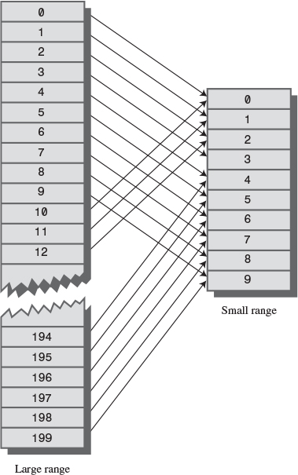</img>
        - This is an example of a hash function. It hashes (converts) a number in a large range into a number in a smaller range. This smaller range corresponds to the index numbers in an array.
        - An array into which data is inserted using a hash function is called a hash table.
        - In the huge range, each number represents a potential data item (an arrangement of letters), but few of these numbers represent actual data items (English words).
        - A hash function transforms these large numbers into the index numbers of a much smaller array. In this array """"we expect that"""", on the average, there will be one word for every two cells. Some cells will have no words; and others, more than one.
        - A practical implementation of this scheme runs into trouble because hugeNumber will probably overflow its variable size, even for type long.
        - 
    - Collisions
        - We pay a price for squeezing a large range into a small one. There's no longer a guarantee that two words won't hash to the same array index. (we are squzeeing base 27)
        - The best we can do is hope that not too many words will hash to the same index
        - It may appear that the possibility of collisions renders the hashing scheme impractical, but in fact we can work around the problem in a variety of ways
        - 
        - 
        - Remember that we've specified an array with twice as many cells as data items
        - Thus, perhaps half the cells are empty
        - One approach, when a collision occurs, is to search the array in some systematic way for an empty cell and insert the new item there, instead of at the index specified by the hash function. This approach is called """open-addressing"""
        - If cats hashes to 5,421, but this location is already occupied by parsnip, then we might try to insert cats in 5,422, for example
        - 
        - 
        - A second approach is to create an ""array that consists of linked lists"" of words instead of the words themselves
        - Then, when a collision occurs, the new item is simply inserted in the ""list"" at that index
        - This is called """separate chaining"""
        - 
        - 
#### Open Addressing
- Three methods of open addressing, which vary in the method used to find the next vacant cell
- These methods are
    - 1. linear probing
    - 2. quadratic probing
    - 3. double hashing
    - 


    - 1. linear probing
        - In linear probing we search sequentially for vacant cells
        - If 5,421 is the hash key/index & is occupied when we try to insert a data item there,
        - we go to 5,422, then 5,423, and so on, incrementing the index until we find an empty cell
        - & In the majority of cases you probably want to forbid duplicates.
        - 
        - The delete operation finds the array first
        - When the item is found, delete() writes over it with the special data item nonItem, which is predefined with a [[[key]]] of -1.
        - 
        - 
        - Expanding the Array
        - Note that You can't therefore simply copy the items from one array to the other. You'll need to go through the old array in sequence, cell by cell, inserting each item you find into the new array with the insert() method. This is called rehashing. It's a time-consuming process, but necessary if the array is to be expanded.
        - The expanded array is usually made twice the size of the original array. Actually, because the array size should be a prime number, the new array will need to be a bit more than twice as big.
        - Actually, because the array size should be a prime number, the new array will need to be a bit more than twice as big. Calculating the new array size is part of the rehashing process.
        - Here are some routines to help find the new array size (or the original array size, if you don't trust the user to pick a prime number, which is usually the case). You start off with the specified size and then look for the next prime larger than that. The getPrime() method gets the next prime larger than its argument. It calls isPrime() to check each of the numbers above the specified size.
        ```
        private int getPrime(int min) {
            for(int j = min+1; true; j++) {
                if( isPrime(j) );
                return j;
            }
        }
        private boolean isPrime(int n) {
            for(int j=2; (j*j <= n); j++)    // for all j
                if( n % j == 0)
            return false;
            return true;
        }
        /** 2, 3 , 5, 7 */
        ```
        - These routines are not the ultimate in sophistication. For example, in getPrime() you could check 2 and then odd numbers from then on, instead of every number. However, such refinements don't matter much because you usually find a prime after checking only a few numbers.
        - 
        - 
        - Java offers a class Vector that is an array-like data structure that can be expanded. However, it's not much help because of the need to rehash all data items when the table changes size.
        - 
        - 
    - 2. Quadratic Probing
        - In linear probing the bigger cluster size is a problem
        - What if we still apply the same strategy but instead of progressing linearly we will progress in Quadratic
        - x+12, x+22, x+32, x+42, x+52, and so on.
        - Quadratic probes eliminate the clustering problem
        - quadratic probes suffer from a different and more subtle clustering problem. This occurs because all the keys that hash to a particular cell follow the same sequence in trying to find a vacant space.
        - Let's say 184, 302, 420, and 544 all hash to 7 and are inserted in this order. Then 302 will require a one-step probe, 420 will require a four-step probe, and 544 will require a nine-step probe. Each additional item with a key that hashes to 7 will require a longer probe. This phenomenon is called secondary clustering.
        - 
        - Secondary clustering is not a serious problem, but quadratic probing is not often used because there's a slightly better solution.
        - 
        - 
    - 3. double hashing
        - The the quadratic probe always generates the same steps: 1, 4, 9, 16, and so on
        - we need a way to generate probe sequences that depend on the key instead of being the same for every key
        - Then numbers with different keys that hash to the same index will use different probe sequences
        - The solution is to hash the key a second time, using a different hash function, and use the result as the step size. For a given key the step size remains constant throughout a probe, but it's different for different keys.
        - this secondary hash function must have certain characteristics:
            - It must not be the same as the primary hash function.
            - It must never output a 0 (otherwise, there would be no step; every probe would land on the same cell, and the algorithm would go into an endless loop).
        - stepSize = 5 - (key % 5); /** step sizes are all in the range 1 to 5. This */
        - Having a PRIMARY DOES HELPS - AS PRIME HAVE Exactly two divisor
        - For example, suppose the array size is 15
        - that a particular key hashes to an initial index of 0 and a step size of 5. The probe sequence will be 0, 5, 10, 0, 5, 10, and so on, repeating endlessly.
        - 
        - SO WHEN IT WILL BE ROUNDED OFF :: The algorithm will generate a separate steps
        - 
        - Try finding existing keys. When one needs a probe sequence, you'll see how all the steps are the same size for a given key, but that the step size is different-between 1 and 5-for different keys.
        - 
        - 
#### Separate Chaining
- A different approach is to install a linked list at each index in the hash table. A data item’s key is hashed to the index in the usual way, and the item is inserted into the linked list at that index. Other items that hash to the same index are simply added to the linked list; there’s no need to search for empty cells in the primary array
- Load Factors
    - In separate chaining it's normal to put N or more items into an N cell array; thus, the load factor can be 1 or greater.
    - Finding the initial cell takes fast O(1) time, but searching through a list takes time proportional to M, the average number of items on the list. This is O(M) time. Thus, we don't want the lists to become too full.
    - In open addressing, performance degrades badly as the load factor increases above one-half or two-thirds
    - 
- Duplicates
    - Duplicates are allowed and may be generated in the Fill process
    - 
- deletion
    - In separate chaining, deletion poses no special problems as it does in open addressing. The algorithm hashes to the proper list and then deletes the item from the list.
    - 
- Table Size
    - With separate chaining, making the table size a prime number is not as important as it is with quadratic probes and double hashing
    - 
    - 
- Buckets
    - Another approach similar to separate chaining is to use an array at each location in the hash table, instead of a linked list. Such arrays are sometimes called buckets. This approach is not as efficient as the linked list approach, however, because of the problem of choosing the size of the buckets. If they're too small, they may overflow, and if they're too large, they waste memory
    - 
    - 
### Hash Functions
- we'll explore the issue of what makes a good hash function
- 
- A good hash function is simple, so it can be computed quickly
- A hash function with many multiplications and divisions is not a good idea
- 
- The purpose of a hash function is to take a range of key values and transform them into index values in such a way that the key values are distributed randomly across all the indices of the hash table
- 
- Keys may be completely random or not so random
- 
- A so-called perfect hash function maps every key into a different table location
- This is only possible for keys that are unusually well behaved and whose range is small enough to be used directly as array indices
- 
- Non-Random Keys
    - Data is often distributed non-randomly
    - Imagine a database that uses 'car-part-numbers' as keys
    - 033-400-03-94-05-0-535
        - Digits 0-2: Supplier number (1 to 999, currently up to 70)
        - Digits 3-5: Category code (100, 150, 200, 250, up to 850)
        - Digits 6-7: Month of introduction (1 to 12)
        - Digits 8-9: Year of introduction (00 to 99)
        - Digits 10-11: Serial number (1 to 99, but never exceeds 100)
        - Digit 12: Toxic risk flag (0 or 1)
        - Digits 13-15: """Checksum""" [[[ """ sum of other fields, modulo 100 """ ]]]
        - 
        - The above key are not randomly distributed
        - The majority of numbers from 0 to 9,999,999,999,999,999 can't actually occur
        - Since
        - Month can't contain 13-99
        - The checksum is not independent of the other numbers
        - 
        - So Rule is 
        - Don't Use Non-Data
            - The key fields should be squeezed down until every bit counts
            - the checksum should be removed because it doesn't add any additional information
            - 
        - Use All the Data
            - Every part of the key (except non-data, as just described) should contribute to the hash function
            - Don't just use the first four digits or some such expurgation. The more data that contributes to the key, the more likely it is that the keys will hash evenly into the entire range of indices
            - 
        - Use a Prime Number for the Modulo Base
            - if the keys themselves may not be randomly distributed, it's then become very important for the table size to be a prime number no matter what hashing system is used.
            - 
- Hashing Strings
    - For "CAT" we used the formule : key = 3*273 + 1*272 + 20*271 + 19*270
    ```
    public static int hashFunc1(String key) {
        int hashVal = 0;
        int pow27 = 1;                       // 1, 27, 27*27, etc
        
        for(int j=key.length()-1; j>=0; j--) { // right to left
            int letter = key.charAt(j) - 96;  // get char code
            hashVal += pow27 * letter;        // times power of 27
            pow27 *= 27;                      // next power of 27
        }
        return hashVal % arraySize;
    }
    ```
    - char4 * n4    +   char3 * n3      +   char2 * n2  +   char1 * n1      +   char0 * n0
    - can be written as
    - (((char4*n + char3)*n + char2)*n + char1)*n + char0 /** Horner's method */
    ```
    public static int hashFunc2(String key) {
        int hashVal = key.charAt(0) - 96;
        for(int j=1; j<key.length(); j++) {    // left to right
            int letter = key.charAt(j) - 96;  // get char code
            hashVal = hashVal * 27 + letter;  // multiply and add
        }
        return hashVal % arraySize;          // mod
    }
    ```
    - The above hash method unfortunately can't handle strings longer than about seven letters
    - Longer strings cause the value of hashVal to exceed the size of type int
    - (Even if we used type long, the same problem would still arise for somewhat longer strings)
    - Notice that the key we eventually end up with is always less than the array size because we apply the modulo operator.
    - It's not the final index that's too big; it's the intermediate key values.
    - It turns out that with Horner's formulation we can apply the modulo operator (%) at each step in the calculation. This gives the same result as applying the modulo operator once at the end but avoids overflow
    - So the modified version is
    ```
    public static int hashFunc3(String key) {
        int hashVal = 0;
        for(int j=0; j<key.length(); j++) {    // left to right
            int letter = key.charAt(j) - 96;  // get char code
            hashVal = (hashVal * 27 + letter) % arraySize; // mod
        }
        return hashVal;                      // no mod
    }
    ```
    - Various bit-manipulation tricks can be played as well
    - such as using a base of 32 (or a larger power of 2) instead of 27,
    - so that multiplication can be effected using the shift operator (>>), which is faster than the modulo operator (%)
    - 
- Folding
    - Another reasonable hash function involves
    - breaking the key into groups of digits and adding the groups
    - This ensures that all the digits influence the hash value
    - 
    - For example, suppose you want to hash nine-digit Social Security numbers for linear probing. If the array size is 1,000, you would divide the nine-digit number into three groups of three digits. If a particular SSN was 123-45-6789, you would calculate a key value of 123+456+789 = 1368. You can use the % operator to trim such sums so the highest index is 999. In this case, 1368%1000 = 368. If the array size is 100, you would need to break the nine-digit key into four two-digit numbers and one one-digit number: 12+34+56+78+9 = 189, and 189%100 = 89
    - 
    - It's easier to imagine how this works when the array size is a multiple of 10. However, for best results it should be a prime number, as we’ve seen for other hash functions.
    - 
### Hashing Efficiency
- We've noted that insertion and searching in hash tables can approach O(1) time. If no collision occurs, only a call to the hash function and a single array reference are necessary to insert a new item or find an existing item. This is the minimum access time.
- 
- An individual search or insertion time is proportional to the length of the probe. This is in addition to a constant time for the hash function.
- 
- The average probe length (and therefore the average access time) is dependent on the load factor (the ratio of items in the table to the size of the table). As the load factor increases, probe lengths grow longer
- 
- We'll look at the relationship between probe lengths and load factors for the various kinds of hash tables we've studied.
- 
- 
- In Open Addressing
    - The loss of efficiency with high load factors is more serious for the various open addressing schemes than for separate chaining.
    - In open addressing, unsuccessful searches generally take longer than successful searches. During a probe sequence, the algorithm can stop as soon as it finds the desired item, which is, on the average, halfway through the probe sequence
    - In Linear Probing
        - The following equations show the relationship between probe length (P) and load factor (L) for linear probing. For a successful search it's
        - P = ( 1 + 1 / (1 - L)^2 ) / 2
        - and for an unsuccessful search it's
        - P = ( 1 + 1 / (1 - L) ) / 2
        - These formulas are from Knuth and their derivation is quite complicated
        - 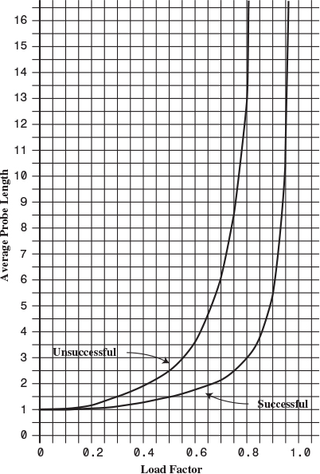</img>
        - At a load factor of 1/2, a successful search takes 1.5 comparisons and an unsuccessful search takes 2.5. At a load factor of 2/3, the numbers are 2.0 and 5.0. At higher load factors the numbers become very large.
        - The moral, as you can see, is that the load factor must be kept under 2/3 and preferably under 1/2. On the other hand, the lower the load factor, the more memory is needed for a given amount of data. The optimum load factor in a particular situation depends on the trade-off between memory efficiency, which decreases with lower load factors, and speed, which increases.
        - 
    - In Quadratic Probing and Double Hashing
        - Quadratic probing and double hashing share their performance equations. These equations indicate a modest superiority over linear probing. For a successful search, the formula (again from Knuth) is
        - log-base(2)of(1-loadFactor) / loadFactor
        - For an unsuccessful search it is
        - 1 / (1-loadFactor)
        - 
        - 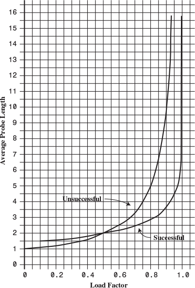</img>
        - 
        - hows graphs of these formulas. At a load factor of 0.5, successful and unsuccessful searches both require an average of two probes. At a 2/3 load factor, the numbers are 2.37 and 3.0, and at 0.8 they're 2.90 and 5.0. Thus, somewhat higher load factors can be tolerated for quadratic probing and double hashing than for linear probing.
        - 
        - 
- In Separate Chaining
    - We'll assume that the most time-consuming part of these operations is comparing the search key of the item with the keys of other items in the list
    - We'll also assume that the time required to hash to the appropriate list and to determine when the end of a list has been reached is equivalent to one key comparison. Thus, all operations require 1+nComps time, where nComps is the number of key comparisons.
    - Let's say that the hash table consists of arraySize elements, each of which holds a list, and that N data items have been inserted in the table. Then, on the average, each list will hold N divided by arraySize items:
    - 
    - AverageListLength = N / arraySize
    - 
    - This is the same as the definition of the load factor:
    - 
    - loadFactor = N / arraySize
    - 
    - so the average list length equals the load factor.
    - 
    - Searching
    - In a successful search, the algorithm hashes to the appropriate list and then searches along the list for the item. On the average, half the items must be examined before the correct one is located. Thus, the search time is
    - 
    - 1 + loadFactor / 2
    - 
    - This is true whether the lists are ordered or not. In an unsuccessful search, if the lists are unordered, all the items must be searched, so the time is
    - 1 + loadFactor
    - 
    - </img>
    - For an ordered list, only half the items must be examined in an unsuccessful search, so the time is the same as for a successful search.
    - 
    - In separate chaining it's typical to use a load factor of about 1.0 (the number of data items equals the array size). Smaller load factors don't improve performance significantly, but the time for all operations increases linearly with load factor, so going beyond 2 or so is generally a bad idea.
    - 
    - Insertion
    - If the lists are not ordered, insertion is always immediate, in the sense that no comparisons are necessary. The hash function must still be computed, so let's call the insertion time 1.
    - If the lists are ordered, then, as with an unsuccessful search, an average of half the items in each list must be examined, so the insertion time is
    - 1 + loadFactor / 2
    - 
- Open Addressing Versus Separate Chaining
    - If open addressing is to be used, double hashing seems to be the preferred system by a small margin over quadratic probing. The exception is the situation in which plenty of memory is available and the data won't expand after the table is created; in this case linear probing is somewhat simpler to implement and, if load factors below 0.5 are used, causes little performance penalty.
    - If the number of items that will be inserted in a hash table isn't known when the table is created, separate chaining is preferable to open addressing. Increasing the load factor causes major performance penalties in open addressing, but performance degrades only linearly in separate chaining.
    - When in doubt, use separate chaining. Its drawback is the need for a linked list class, but the payoff is that adding more data than you anticipated won't cause performance to slow to a crawl.
    - 
### Hashing and External Storage
- We have allready discussed using B-trees as data structures for external (disk-based) storage
- Let's look briefly at the use of hash tables for external storage.
- 
- a disk file is divided into blocks containing many records, and that the time to access a block is much larger than any internal processing on data in main memory. For these reasons the overriding consideration in devising an external storage strategy is minimizing the number of block accesses.
- 
- Table of File Pointers
- The central feature in external hashing is a hash table containing block numbers, which refer to blocks in external storage. The hash table is sometimes called an index (in the sense of a book's index).
- if it is too large, stored externally on disk, with only part of it being read into main memory at a time. Even if it fits entirely in main memory, a copy will probably be maintained on the disk and read into memory when the file is opened.
- 
- So Non-Full Blocks is a major concern
- 
- We saw earlier example in which the block size is 8,192 bytes, and a record is 512 bytes. Thus, a block can hold 16 records. Every entry in the hash table points to one of these blocks. Let's say there are 100 blocks in a particular file.
- 
- The index (hash table) in main memory holds pointers to the file blocks, which start at 0 at the beginning of the file and run up to 99.
- In external hashing it's important that blocks don't become full. Thus, we might store an average of 8 records per block. Some blocks would have more records, and some fewer. There would be about 800 records in the file. 
- 
- Full Blocks
- Even with a good hash function, a block will occasionally become full. This situation can be handled using variations of the collision-resolution schemes discussed for internal hash tables: open addressing and separate chaining. (so we can read a 2 block at a time)
- 
- In open addressing, if, during insertion, one block is found to be full, the algorithm inserts the new record in a neighboring block. In linear probing this is the next block, but it could also be selected using a quadratic probe or double hashing. In separate chaining, special overflow blocks are made available; when a primary block is found to be full, the new record is inserted in the overflow block. (MAY BE BY THE TIME THE BLOCK IS NOT CREATED !! CHECK IT AGAIN !!)
- 
- Full blocks are undesirable because an additional disk access is necessary for the second block; this doubles the access time. However, this is acceptable if it happens rarely.
- 
- 
- 
- 
- 
- 
- 
- 
- 
- 
- 
- 
- 
- 
- 


## Heaps & Vector
- Priority queues may be used for task scheduling in computers, where some programs and activities should be executed sooner than others and are therefore given a higher priority.
- 
- 
- Another example is in weapons systems, say in a navy cruiser. Numerous threats-airplanes, missiles, submarines, and so on - are detected and must be prioritized. For example, a missile that's a short distance from the cruiser is assigned a higher priority than an aircraft a long distance away so that countermeasures (surface-to-air missiles, for example) can deal with it first.
- A priority queue is an Abstract Data Type (ADT) offering methods that allow removal of the item with the maximum (or minimum) key value, insertion, and sometimes other operations.
- 
- 
- 
- A priority queue implemented as an ordered array. The trouble with that approach is that, even though removal of the largest item is accomplished in fast O(1) time, insertion requires slow O(N) time, because an average of half the items in the array must be moved to insert the new one in order.
- 
- Here we'll describe another structure that can be used to implement a priority queue: the ""heap""
- 
- HEAP = PQ + TREE
- 
- A heap is a kind of tree
- It offers both insertion & deletion in O(logN) time
- Thus, it's not quite as fast for deletion, but much faster for insertion
- It's the method of choice for implementing """priority queues""" where speed is important & there will be many insertions
- 
- Introduction to Heaps
    - A heap is a binary tree with these characteristics
    - It's complete. This means it's completely filled in, reading from left to right across each row, although the last row need not be full.
        - 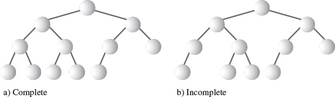</img>
    - It's (usually) implemented as an array. We allready seen how binary trees can be stored in arrays, rather than using references to connect the nodes
    - 
    - Each node in a heap satisfies the heap condition, which states that every node's key is larger than (or equal to) the keys of its children.
        - 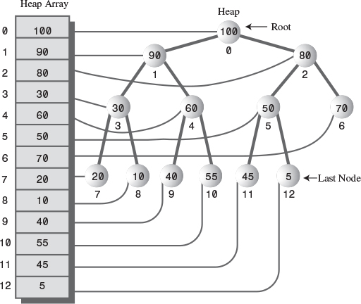</img>
    - The tree is complete and that the heap condition is satisfied for all the nodes.
    - The fact that a heap is a complete binary tree implies that there are no "holes" in the array used to represent it. Every cell is filled, from 0 to N-1
    - 
    - We'll assume in this chapter that the maximum key (rather than the minimum) is in the root. A priority queue based on such a heap is a descending-priority queue. (ascending-priority queues we already discussed)
    - 
    - There's a very close relationship between a priority queue and the heap used to implement it
    ```
    class Heap {
        private Node heapArray[];
        public void insert(Node nd) {  }
        public Node remove() {  }
    }

    class priorityQueue {
        private Heap theHeap;
        
        public void insert(Node nd){ theHeap.insert(nd); }
        public Node remove(){
            return theHeap.remove()
        }
    }

    The methods for the priorityQueue class are simply wrapped around the methods for the underlying Heap class
    ```
    - 
    - 
- Weakly Ordered
    - When a [[[node's]]] left descendants have keys "less" than all its right descendants !
    - In a "binary search tree" you can traverse the nodes in order by following a simple algorithm
    - In a heap, traversing the nodes in order is difficult because the organizing principle (the heap condition) is not as strong as the organizing principle in a tree
    - All you can say about a heap is that, along every path from the root to a leaf, the nodes are arranged in descending order.
    - As you can see in ABOVE Figure,
        - the nodes to the left or right of a given node,
        - or on higher or lower levels
        - provided they're not on the same path -- can have keys larger or smaller than the node's key
        - Except where they share the same nodes, paths are independent of each other.

    - Because heaps are weakly ordered, some operations are difficult or impossible. Besides its failure to support traversal, a heap also does not allow convenient searching for a specified key.
    - This is because there's not enough information to decide which of a node's two children to pick -- in trying to descend to a lower level during the search
    - It follows that a node with a specified key can't be deleted, at least in O(logN) time, because there's no way to find it.
    - Thus, the organization of a heap may seem dangerously close to randomness
    - Nevertheless, the ordering is just sufficient to allow fast removal of the maximum node and fast insertion of new nodes
    - These operations are all that's needed to use a heap as a priority queue

- Removal
    - Removal means removing the node with the maximum key. This node is always the root
    - once the root is gone, the tree is no longer complete; there's an empty cell. This "hole" must be filled in
    - We could shift all the elements in the array down one cell, but there's a much faster approach
    - Here are the steps for removing the maximum node
        - Move the last node into the root
        - Trickle the last node down,, until it's below a larger node --&&-- above a smaller node
    - The last node is the rightmost node in the lowest occupied level of the tree.
    - This corresponds to the "last filled cell in the array"
    - To copy this node into the root is straightforward
    ```
    heapArray[0] = heapArray[N-1];
    N--;
    ```
    - To trickle/bubble/percolate a node up or down means to move it along a path step by step, swapping it with the node ahead of it, checking at each step to see whether it's in its proper position
    - 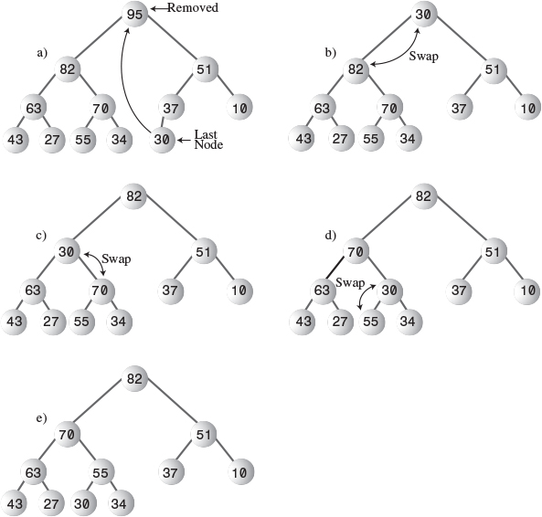</img>
    - 
- Insertion
    - Insertion uses trickle up, rather than trickle down
    - Initially, the node to be inserted is placed in the first open position at the end of the array, increasing the array size by one
    ```
    heapArray[N] = newNode;
    N++;
    ```
    - The problem is that it's likely that this will destroy the heap condition. This happens if the new node's key is larger than its newly acquired parent. Because this parent is on the bottom of the heap, it's likely to be small, so the new node is likely to be larger. Thus, the new node will usually need to be trickled upward until it's below a node with a larger key and above a node with a smaller key
    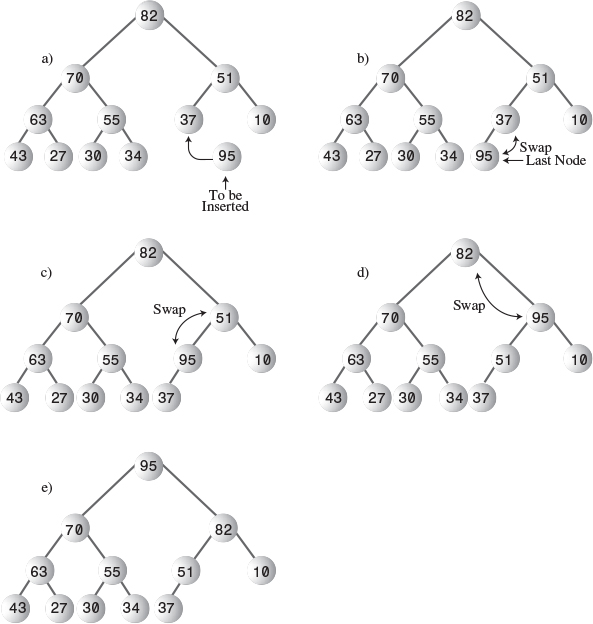</img>
- Not Really Swapped
    - REQUIRED: node A will end up in position D & nodes B, C & D will each move up one level
    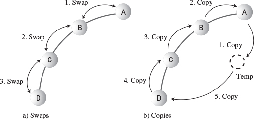</img>
    - A swap requires three copies, so the three swaps 9 coipies (figure a)
    - We can reduce the total number of copies necessary in a trickle algorithm by substituting copies for swaps
    - The (Figure b) shows how five copies do the work of three swaps. First, node A is saved temporarily. Then B is copied over A, C is copied over B, and D is copied over C. Finally, A is copied back from temporary storage onto position D. We have reduced the number of copies from nine to five
    - 
### Java Code for Heaps
- An ARRAY representing a TREE
    - For a node at index x in the array
        - Its parent is (x-1) / 2
        - Its left child is 2*x + 1
        - Its right child is 2*x + 2
    - Insertion
        ```
        public boolean insert(int key) {
            if(currentSize==maxSize)            // if array is full,
                return false;                    //    failure
            Node newNode = new Node(key);       // make a new node
            heapArray[currentSize] = newNode;   // put it at the end
            trickleUp(currentSize++);           // trickle it up
            return true;                        // success
        }
        We a node is inserted at the end of the array
        Then trickleUp() routine is called to move this node up to its proper position

        public void trickleUp(int index) {
            int parent = (index-1) / 2;
            Node bottom = heapArray[index];

            while( index > 0 && heapArray[parent].getKey() < bottom.getKey() ) {
                heapArray[index] = heapArray[parent]; // move node down
                index = parent;                       // move index up
                parent = (parent-1) / 2;        // parent <- its parent
            }  // end while
            heapArray[index] = bottom;
        }

        In trickleUp() (shown below) the argument is the index of the newly inserted item. We find the parent of this position and then save the node in a variable called bottom.

        Inside the while loop, the variable index will trickle up the path toward the root, pointing to each node in turn. The while loop runs as long as we haven't reached the root (index>0), and the key (iData) of index's parent is less than the new node

        The body of the while loop executes one step of the trickle-up process. It first copies the parent node into index, moving the node down. (This has the effect of moving the "hole" upward.) Then it moves index upward by giving it its parent's index, and giving its parent its parent's index.
        ```
    - Removal
        The removal algorithm is also not complicated if we subsume the trickle-down algorithm into its own routine. We save the node from the root, copy the last node (at index currentSize-1) into the root, and call trickleDown() to place this node in its appropriate location.
        ```
        public Node remove() {                           // (assumes non-empty list)
            Node root = heapArray[0];   // save the root
            heapArray[0] = heapArray[--currentSize];  // root <- last
            trickleDown(0);             // trickle down the root
            return root;                // return removed node
        }

        The trickleDown() routine is more complicated than trickleUp() because we must determine which of the two children is larger. First, we save the node at index in a variable called top. If trickleDown() has been called from remove(), index is the root, but, as we'll see, it can be called from other routines as well.

        The while loop will run as long as index is not on the bottom row-that is, as long as it has at least one child. Within the loop we check if there is a right child (there may be only a left), and if so, compare the children's keys, setting largerChild appropriately.

        Then we check if the key of the original node (now in top) is greater than that of largerChild; if so, the trickle-down process is complete and we exit the loop.

        public void trickleDown(int index) {
            int largerChild;
            Node top = heapArray[index];       // save root
            while(index < currentSize/2) {      // while node has at least one child,
                int leftChild = 2*index+1;
                int rightChild = leftChild+1;

                // find larger child
                if(rightChild < currentSize && heapArray[leftChild].getKey() < heapArray[rightChild].getKey()) // rightChild exists
                    largerChild = rightChild;
                else
                    largerChild = leftChild;

                // top >= largerChild?
                if(top.getKey() >= heapArray[largerChild].getKey())
                    break;

                // shift child up
                heapArray[index] = heapArray[largerChild];
                index = largerChild;            // go down
            }
            heapArray[index] = top;            // index <- root
        }
        ```
    
    - Key Change
    After we've created the trickleDown() and trickleUp() methods, we can easily implement an algorithm to change the priority (the key) of a node and then trickle it up or down to its proper position. The change() method accomplishes this:
        ```
        public boolean change(int index, int newValue) {
            if(index<0 || index>=currentSize)
                return false;
            int oldValue = heapArray[index].getKey(); // remember old
            heapArray[index].setKey(newValue);  // change to new

            if(oldValue < newValue)             // if raised,
                trickleUp(index);                // trickle it up
            else                                // if lowered,
                trickleDown(index);              // trickle it down
            return true;
        }

        This routine first checks that the index given in the first argument is valid, and if so, changes the iData field of the node at that index to the value specified as the second argument

        Then, if the priority has been raised, the node is trickled up; if it's been lowered, it's trickled down

        Actually, the difficult part of changing a node's priority is not shown in this routine: finding the node you want to change. In the change() method just shown, we supply the index as an argument, and in the Heap Workshop applet, the user simply clicks on the selected node. In a real-world application a mechanism would be needed to find the appropriate node; as we've seen, the only node to which we normally have convenient access in a heap is the one with the largest key.

        The problem can be solved in linear O(N) time by searching the array sequentially. Or, a separate data structure (perhaps a hash table) could be updated with the new index value whenever a node was moved in the priority queue. This would allow quick access to any node. Of course, keeping a second structure updated would itself be time-consuming.
        ```
    - The Array Size
        - We should note that the array size, equivalent to the number of nodes in the heap, is a vital piece of information about the heap's state and a critical field in the Heap class
        - Nodes copied from the last position aren't erased, so the only way for algorithms to know the location of the last occupied cell is to refer to the current size of the array
    - Expanding the Heap Array
        - What happens if, while a program is running, too many items are inserted for the size of the heap array? A new array can be created, and the data from the old array copied into it.
        - Unlike the situation with hash tables, changing the size of a heap doesn't require reordering the data.
        - The copying operation takes linear time, but enlarging the array size shouldn't be necessary very often, especially if the array size is increased substantially each time it's expanded (by doubling it, for example).

```
In Java, a Vector class object could be used instead of an array; vectors can be expanded dynamically.
```

- Efficiency of Heap Operations
    - For a heap with a substantial number of items, the trickle-up and trickle-down algorithms are the most time-consuming part of the operations we've seen. These algorithms spend time in a loop, repeatedly moving nodes up or down along a path. The number of copies necessary is bounded by the height of the heap; if there are five levels, four copies will carry the "hole" from the top to the bottom. (We'll ignore the two moves used to transfer the end node to and from temporary storage; they're always necessary, so they require constant time.)
    - The trickleUp() method has only one major operation in its loop: comparing the key of the new node with the node at the current location. The trickleDown() method needs two comparisons: one to find the largest child and a second to compare this child with the "last" node. They must both copy a node from top to bottom or bottom to top to complete the operation.
    - A heap is a special kind of binary tree, and as we saw earlier, the number of levels L in a binary tree equals log2(N+1), where N is the number of nodes. The trickleUp() and trickleDown() routines cycle through their loops L-1 times, so the first takes time proportional to log2N, and the second somewhat more because of the extra comparison. Thus, the heap operations we’ve talked about here all operate in O(logN) time.
- 
- 
- 
- 
- 
- 

### A Tree-based Heap
- we've just shown heaps as if they were trees because it's easier to visualize them that way, but the implementation has been based on an array. However, it's possible to use an actual tree-based implementation. The tree will be a binary tree, but it won't be a search tree because, as we've seen, the ordering principle is not that strong. It will also be a complete tree, with no missing nodes. Let's call such a tree a tree heap.
- One problem with tree heaps is finding the last node. You need to find this node to remove the maximum item, because it's the last node that's inserted in place of the deleted root (and then trickled down). You also need to find the first empty node, because that's where you insert a new node (and then trickle it up). You can't search for these nodes because you don't know their values, and anyway it's not a search tree. However, these locations are not hard to find in a complete tree if you keep track of the number of nodes in the tree.
- As we saw in the discussion of the Huffman tree, you can represent the path from root to leaf as a binary number, with the binary digits indicating the path from each parent to its child: 0 for left and 1 for right.
- It turns out there's a simple relationship between the number of nodes in the tree and the binary number that codes the path to the last node. Assume the root is numbered 1; the next row has nodes 2 and 3; the third row has nodes 4, 5, 6, and 7; and so on. Start with the node number you want to find. This will be the last node or the first null node. Convert the node number to binary. For example, say there are 29 nodes in the tree and you want to find the last node. The number 29 decimal is 11101 binary. Remove the initial 1, leaving 1101. This is the path from the root to node 29: right, right, left, right. The first available null node is 30, which (after removing the initial 1) is 1110 binary: right, right, right, left.
- To carry out the calculation, you can repeatedly use the % operator to find the remainder (0 or 1) when the node number n is divided by 2 and then use the / operator to actually divide n by 2. When n is less than 1, you're done. The sequence of remainders, which you can save in an array or string, is the binary number. (The least significant bits correspond to the lower end of the path)
    ```
    while(n >= 1) {
        path[j++] = n % 2;
        n = n / 2;
    }
    ```
- You could also use a recursive approach in which the remainders are calculated each time the function calls itself and the appropriate direction is taken each time it returns.

- After the appropriate node (or null child) is found, the heap operations are fairly straightforward. When trickling up or down, the structure of the tree doesn't change, so you don't need to move the actual nodes around. You can simply copy the data from one node to the next. This way, you don't need to connect and disconnect all the children and parents for a simple move. The Node class will need a field for the parent node because you'll need to access the parent when you trickle up. We'll leave the implementation of the tree heap as a programming project.

- The tree heap operates in O(logN) time. As in the array-based heap the time is mostly spent doing the trickle-up and trickle-down operations, which take time proportional to the height of the tree

### Heapsort
- The efficiency of the heap data structure lends itself to a surprisingly simple and very efficient sorting algorithm called heapsort.
    - The basic idea is to insert all the unordered items into a heap using the normal insert() routine.
    Repeated application of the remove() routine will then remove the items in sorted order
    ```
    for(j=0; j<size; j++)
        theHeap.insert( anArray[j] );   // from unsorted array
    for(j=0; j<size; j++)
        anArray[j] = theHeap.remove();  // to sorted array
    ```
    - Because insert() and remove() operate in O(logN) time, and each must be applied N times, the entire sort requires O(N*logN) time, which is the same as quicksort. However, it's not quite as fast as quicksort, partly because there are more operations in the inner while loop in trickleDown() than in the inner loop in quicksort.
    - However, several tricks can make heapsort more efficient. The first saves time, and the second saves memory.
    - If we insert N new items into a heap, we apply the trickleUp() method N times. However, all the items can be placed in random locations in the array and then rearranged into a heap with only N/2 applications of trickleDown(). This offers a small speed advantage.
    - Two Correct Subheaps Make a Correct Heap
        - To see how this approach works, you should know that trickleDown() will create a correct heap if, when an out-of-order item is placed at the root, both the child subheaps of this root are correct heaps. (The root can itself be the root of a subheap as well as of the entire heap.)
        </img>
        - This suggests a way to transform an unordered array into a heap. We can apply trickleDown() to the nodes on the bottom of the (potential) heap-that is, at the end of the array and work our way upward to the root at index 0. At each step the subheaps below us will already be correct heaps because we already applied trickleDown() to them. After we apply trickleDown() to the root, the unordered array will have been transformed into a heap
        - Notice, however, that the nodes on the bottom row-those with no children'are already correct heaps, because they are trees with only one node; they have no relationships to be out of order. Therefore, we don't need to apply trickleDown() to these nodes. We can start at node N/2-1, the rightmost node with children, instead of N-1, the last node. Thus, we need only half as many trickle operations as we would using insert() N times
        - Below Figure shows the order in which the trickle-down algorithm is applied, starting at node 6 in a 15-node heap.
        </img>
        - The following code fragment applies trickleDown() to all nodes, except those on the bottom row, starting at N/2-1 and working back to the root:
        ```
        for(j=size/2-1; j >=0; j--)
        theHeap.trickleDown(j);
        ```
    - A Recursive Approach
        - A recursive approach can also be used to form a heap from an array. A heapify() method is applied to the root. It calls itself for the root's two children, then for each of these children's two children, and so on. Eventually, it works its way down to the bottom row, where it returns immediately whenever it finds a node with no children.
        - After it has called itself for two child subtrees, heapify() then applies trickleDown() to the root of the subtree. This ensures that the subtree is a correct heap. Then heapify() returns and works on the subtree one level higher.
        ```
        heapify(int index) {      // transform array into heap
            if(index > N/2-1)    // if node has no children,
                return;           //    return
            heapify(index*2+2);  // turn right subtree into heap
            heapify(index*2+1);  // turn left subtree into heap
            trickleDown(index);  // apply trickle-down to this node
        }
        This recursive approach is probably not quite as efficient as the simple loop.
        ```
    - Using the Same Array
        - Our initial code fragment showed unordered data in an array. This data was then inserted into a heap, and finally removed from the heap and written back to the array in sorted order. In this procedure two size-N arrays are required: the initial array and the array used by the heap.
        - In fact, the same array can be used both for the heap and for the initial array. This cuts in half the amount of memory needed for heapsort; no memory beyond the initial array is necessary.
        - We've already seen how trickleDown() can be applied to half the elements of an array to transform them into a heap. We transform the unordered array data into a heap in place; only one array is necessary for this task. Thus, the first step in heapsort requires only one array.
        - However, the situation becomes more complicated when we apply remove() repeatedly to the heap. Where are we going to put the items that are removed?
        - Each time an item is removed from the heap, an element at the end of the heap array becomes empty; the heap shrinks by one. We can put the recently removed item in this newly freed cell. As more items are removed, the heap array becomes smaller and smaller, while the array of ordered data becomes larger and larger. Thus, with a little planning, it's possible for the ordered array and the heap array to share the same space.
        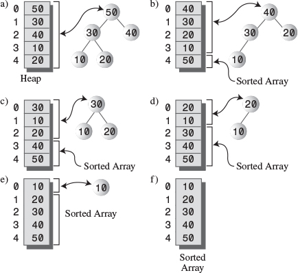</img>
        - 
- The heapSort.java Program
    - We can put these two tricks
        - applying trickleDown() without using insert(),
        - and using the same array for the initial data and the heap-together in a program that performs heapsort
    - The Efficiency of Heapsort
        - The heapsort runs in O(N*logN) time. Although it may be slightly slower than quicksort, an advantage over quicksort is that it is less sensitive to the initial distribution of data. Certain arrangements of key values can reduce quicksort to slow O(N^2) time, whereas heapsort runs in O(N*logN) time no matter how the data is distributed.


## Graphs
- In a mathematical sense, a tree is a kind of graph
- The data structures examined previously so far have an architecture dictated by the """algorithms used on them""".
    For example, a binary tree is shaped the way it is because that shape makes it easy to search for data and insert new data.
    The edges in a tree represent quick ways to get from node to node.
- 
- Graphs, on the other hand, often have a shape dictated by a physical or abstract problem.
- For example, nodes in a graph may represent cities, while edges may represent airline flight routes between the cities.
- 
- nodes are traditionally called vertices (the singular is vertex) - the sharpest angel in the line
- and the lines connecting them are edges
- The vertices are usually labeled in some way-often, as shown here, with letters of the alphabet. Each edge is bounded by the two vertices at its ends.
- It doesn't concern itself with physical distances or directions.
- 
- </img>
- 
- Also, one edge may represent several different route numbers, as in the case of the edge from I to H, which involves routes 101, 84, and 280.
- It's the connectedness (or lack of it) of one intersection to another that's important, not the actual routes.
- 
- Adjacency
    - Two vertices are said to be adjacent to one another if they are connected by a single edge
    - The vertices adjacent to a given vertex are sometimes said to be its neighbors vertices
- Paths
    - A path is a sequence of edges that connects various vertices
- Connected Graphs
    - A graph is said to be connected if there is at least one "PATH" from every vertex to every other vertex
- Directed and Weighted Graphs
    - non-directed graphs means that the edges don't have a direction; you can go either way on them
    - However, graphs are often used to model situations in which you can go in only one direction along an edge-from A to B but not from B to A, as on a one-way street. Such a graph is said to be directed
    - In some graphs, edges are given a weight, a number that can represent the physical distance between two vertices, or the time it takes to get from one vertex to another, or how much it costs to travel from vertex to vertex (on airline routes, for example). Such graphs are called weighted graphs.
    - 
- 

### Historical Note
- One of the first mathematicians to work with graphs was Leonhard Euler in the early eighteenth century. He solved a famous problem dealing with the bridges in the town of Konigsberg, Poland. This town included an island and seven bridges, as shown in Figure
- </img>
- The problem, much discussed by the townsfolk, was to find a way to walk across all seven bridges without recrossing any of them. We won't recount Euler's solution to the problem; it turns out that there is no such path. However, the key to his solution was to represent the problem as a graph, with land areas as vertices and bridges as edges.

### Representing a Graph in a Program
- In a very abstract graph program you could simply number the vertices 0 to N-1 (where N is the number of vertices).
- You wouldn't need any sort of variable to hold the vertices because their usefulness would result from their relationships with other vertices.
- Vertices (In Abstract Form)
    - In a very abstract graph program you could simply number the vertices 0 to N-1 (where N is the number of vertices). You wouldn't need any sort of variable to hold the vertices because their usefulness would result from their relationships with other vertices.
    - In most situations, however, a vertex represents some real-world object, and the object must be described using data items. If a vertex represents a city in an airline route simulation, for example, it may need to store the name of the city, its altitude, its location, and other such information. Thus, it's usually convenient to represent a vertex by an object of a vertex class.
    ```
    class Vertex {
        public char label;        // label (e.g. 'A')
        public boolean wasVisited;
        
        public Vertex(char lab) { // constructor
            label = lab;
            wasVisited = false;
        }
    }
    ```
    - Vertex objects can be placed in an array and referred to using their index number
    - The vertices might also be placed in a list or some other data structure
    - Whatever structure is used, this storage is for convenience only. It has no relevance to how the vertices are connected by edges
    - Here we'll store them in an array called vertexList

- Edges
    - Like we tried to store TREE in Array 
    - A graph, however, doesn't usually have the same kind of fixed organization as a tree
    - In a binary tree, each node has a maximum of two children, but in a graph each vertex may be connected to an arbitrary number of other vertices
    - So its impossible to find the next array index
    - To model this sort of free-form organization, a different approach to representing edges is preferable to that used for trees.
    - Two methods are commonly used for graphs: the "ADJACENCY MATRIX" & the "ADJACENCY LIST"
    - One vertex is said to be adjacent to another if they're connected by a single edge
    - 
    - [[[[[ The Adjacency Matrix ]]]]]
        - An adjacency matrix is a two-dimensional array in which the elements indicate whether an edge is present between two vertices
        - If a graph has N vertices, the adjacency matrix is an NxN array
        ```
          A B C D
        A 0 1 1 1
        B 1 0 0 1
        C 1 0 0 0
        D 1 1 0 0
        adjacency matrix for the graph in above Graph

        Here to assign the values you will take 4x4 array
        0000    0001    0010    0011    0100    0101    ....        1111
        ```
        - The vertices are used as headings for both rows and columns. An edge between two vertices is indicated by a 1; the absence of an edge is a 0
        - Note that the triangular-shaped part of the matrix above the identity diagonal is a mirror image of the part below; both triangles contain the same information.
        - <b>NOTICE IN THE ABOVE MATRIX AB is Refelction BA & AC IS Reflection of CA & so on.. It's the folded image of the array</b>
        - This redundancy may seem inefficient, but there's no convenient way to create a triangular array in most computer languages, so it's simpler to accept the redundancy
        - Consequently, when you add an edge to the graph, you must make two entries in the adjacency matrix rather than one.
        - Triangular Array (just the folding in the middle)
        ```
        Triangular array
        -
        -   -
        -   -   -
        -   -   -   -

        You can implement Triangular Array using Java's multidimensional arrays or jagged arrays
                -
            -   -
        -   -   -
            -   -
                -
        https://en.wikipedia.org/wiki/Triangular_array
        In mathematics and computing, a triangular array of numbers, polynomials, or the like, is a doubly indexed sequence
        in which each row is only as long as the row's own index
        That is, the ith row contains only i elements.
        ```
        - 
    - [[[[[ The Adjacency List ]]]]]
        - The list in adjacency list refers to a linked list
        - Actually, an adjacency list is an array of lists (or sometimes a list of lists). Each individual list shows what vertices a given vertex is adjacent to
        - <b>The adjacency list shows which vertices are adjacent to - that is, one edge away from - a given vertex, not paths from vertex to vertex </b>
        ```
          A B C D
        A 0 1 1 1
        B 1 0 0 1
        C 1 0 0 0
        D 1 1 0 0
            ||
            ||
            \/
        A   B->C->D     /** From A - Row BCD set 1 */
        B   A->D        /** From B - Row AD set 1 */
        C   A           /** From C - Row A set 1 */
        D   A->B        /** From D - Row AB set 1 */
        ```
    - Sometimes adjacency matrix approach is efficient, but sometimes the list approach is more efficient
    - 
- Adding Vertices and Edges to a Graph
    - To add a vertex to a graph,
    you make a new vertex object with new and insert it into your vertex array, 'vertexList'.
    In a real-world program a vertex might contain many data items, but for simplicity we'll assume that it contains only a single character.
    Thus, the creation of a vertex looks something like this:
    ```
    vertexList[nVerts++] = new Vertex('F');
    ```
    - How you add an edge to a graph depends on whether you're using an adjacency matrix or adjacency lists to represent the graph.
    - Let's say that you're using an adjacency matrix and want to add an edge between vertices 1 and 3. These numbers correspond to the array indices in vertexList where the vertices are stored.
    ```
    adjMat[1][3] = 1;
    adjMat[3][1] = 1;
    ```
    - If you were using an adjacency list, you would add a 1 to the list for 3, and a 3 to the list for 1.
    - 
- The Graph Class
    - Let's look at a class Graph that contains methods for creating a vertex list and an adjacency matrix, and for adding vertices and edges to a Graph object
    - To add vertices and edges to a Graph object
    ```
    class Graph {
        private final int MAX_VERTS = 20;
        private Vertex vertexList[]; // array of vertices
        private int adjMat[][];      // adjacency matrix
        private int nVerts;          // current number of vertices
        
        public Graph() {
            vertexList = new Vertex[MAX_VERTS]; // adjacency matrix
            adjMat = new int[MAX_VERTS][MAX_VERTS];
            nVerts = 0;
            for(int j=0; j<MAX_VERTS; j++)      // set adjacency
                for(int k=0; k<MAX_VERTS; k++)   //    matrix to 0
                    adjMat[j][k] = 0;
        }  // end constructor
        
        public void addVertex(char lab) { // argument is label
            vertexList[nVerts++] = new Vertex(lab);
        }
        
        public void addEdge(int start, int end) {
            adjMat[start][end] = 1;
            adjMat[end][start] = 1;
        }
        
        public void displayVertex(int v) {
            System.out.print(vertexList[v].label);
        }
    }
    ```
    - Within the Graph class, vertices are identified by their index number in vertexList.
    - The adjacency matrix (or the adjacency list) provides information that is local to a given vertex. Specifically, it tells you which vertices are connected by a single edge to a given vertex. To answer more global questions about the arrangement of the vertices, we must resort to various algorithms
    - 
- Searches
    - One of the most fundamental operations to perform on a graph is finding which vertices can be reached from a specified vertex
    - For example, imagine trying to find out how many towns in the United States can be reached by passenger train from Kansas City (assuming that you don't mind changing trains)
    - Some towns could be reached. Others couldn't be reached because they didn't have passenger rail service.
    - Possibly others couldn't be reached, even though they had rail service, because their rail system (the narrow-gauge Hayfork-Hicksville RR, for example) didn't connect with the standard-gauge line you started on or any of the lines that could be reached from your line
    - Consider a PCB,,, with pins from the ICs protruding through holes in the board.
    - The ICs are soldered in place, and their pins are electrically connected to other pins by traces
    - In a graph, each pin might be represented by a vertex, and each trace by an edge. On a circuit board there are many electrical circuits that aren't connected to each other, so the graph is by no means a connected one. During the design process, therefore, it may be genuinely useful to create a graph and use it to find which pins are connected to the same electrical circuit.
    - 
    - Now you need an algorithm that provides a systematic way to start at a specified vertex and then move along edges to other vertices in such a way that, when it's done, you are guaranteed that it has visited [DISPLAYING IT] every vertex that's connected to the starting vertex.
    - 
    - There are two common approaches to searching a graph: depth-first search (DFS) and breadth-first search (BFS)
    - The depth-first search is implemented with a stack, whereas the breadth-first search is implemented with a queue.
    - 
    - Depth-First Search (DFS)
        - The depth-first search uses a stack to remember where it should go when it reaches a dead end
        - figure show the idea behind the depth-first search & the order in which the vertices are visited
        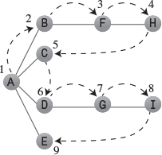</img>
        - You pick a starting point - in this case, vertex A.
        - You then do three things: visit this vertex, push it onto a stack so you can remember it & mark it so you won't visit it again
        - Next, you go to any vertex adjacent to A that hasn't yet been visited
        - We'll assume the vertices are selected in alphabetical order, so that brings up B.
        - You visit B, mark it, and push it on the stack.
        - 
        - Rule 1:: If possible, visit an adjacent unvisited vertex, mark it, and push it on the stack.
        - Rule 2:: If you can't follow Rule 1, then, if possible, pop a vertex off the stack.
        - Rule 3:: If you can't follow Rule 1 or Rule 2, you're done.
        - 
        - An analogy you might think about in relation to depth-first search is a maze
        - 
        - If you use the algorithm on an unconnected graph, it will find only those vertices that are connected to the starting vertex.
        ```
        /** RETURNS AN UNVISITED VERTEX ADJACENT TO v */
 
        public int getAdjUnvisitedVertex(int v) {
            for(int j=0; j<nVerts; j++)
                if(adjMat[v][j]==1 && vertexList[j].wasVisited==false)
                    return j;               // return first such vertex
                return -1;                  // no such vertices
        }

        This code embodies the three rules listed earlier
        It loops until the stack is empty
        Within the loop, it does four things:
            1. It examines the vertex at the top of the stack, using peek().
            2. It tries to find an unvisited neighbor of this vertex.
            3. If it doesn't find one, it pops the stack.
            4. If it finds such a vertex, it visits that vertex and pushes it onto the stack.
            
        public void dfs() { // depth-first search begin at vertex 0
            vertexList[0].wasVisited = true;  // mark it
            displayVertex(0);                 // display it
            theStack.push(0);                 // push it
            
            while( !theStack.isEmpty() ) {      // until stack empty,
                // get an unvisited vertex adjacent to stack top
                int v = getAdjUnvisitedVertex( theStack.peek() );
                if(v == -1)                    // if no such vertex,
                    theStack.pop();             //    pop a new one
                else {                           // if it exists,
                    vertexList[v].wasVisited = true;  // mark it
                    displayVertex(v);                 // display it
                    theStack.push(v);                 // push it
                }
            }
            
            // stack is empty, so we're done
            for(int j=0; j<nVerts; j++)    // reset flags
                vertexList[j].wasVisited = false;
        }
        ```
        - At the end of dfs(), we reset all the wasVisited flags so we'll be ready to run dfs() again later. The stack should already be empty, so it doesn't need to be reset.
        - 
    - Depth-First Search and Game Simulations
        - Depth-first searches are often used in simulations of games (and game-like situations in the real world). In a typical game you can choose one of several possible actions. Each choice leads to further choices, each of which leads to further choices, and so on into an ever-expanding tree-shaped graph of possibilities. A choice point corresponds to a vertex, and the specific choice taken corresponds to an edge, which leads to another choice-point vertex.
        - Imagine a game of tic-tac-toe. If you go first, you can make one of nine possible moves. Your opponent can counter with one of eight possible moves, and so on
        - Even in this simple game the number of paths is surprisingly large. If we ignore simplifications from symmetry, there are 9*8*7*6*5*4*3*2*1 paths in the nine graphs. This is 9 factorial (9!) or 362,880. In a game like chess where the number of possible moves is much greater, even the most powerful computers (like IBM's "Deep Blue") cannot "see" to the end of the game. They can only follow a path to a certain depth and then evaluate the board to see if it appears more favorable than other choices.
        - 
    - Breadth-First Search (BFS)
        - the algorithm likes to stay as close as possible to the starting point. It visits all the vertices adjacent to the starting vertex, and only then goes further afield. This kind of search is implemented using a queue instead of a stack.
        </img>
        Figure shows the same graph as above, but here the breadth-first search is used
        - Rule 1.
        Visit the next unvisited vertex (if there is one) that's adjacent to the current vertex, mark it & insert it into the queue
        - Rule 2.
        If you can't carry out Rule 1 because there are no more unvisited vertices,
        remove a vertex from the queue (if possible) and make it the current vertex
        - Rule 3.
        If you can't carry out Rule 2 because the queue is empty, you're done.
        - 
        - Thus, you first visit all the vertices adjacent to A, inserting each one into the queue as you visit it. Now you've visited A, B, C, D, and E. At this point the queue (from front to rear) contains BCDE.
        - There are no more unvisited vertices adjacent to A, so you remove B from the queue and look for vertices adjacent to it. You find F, so you insert it in the queue. There are no more unvisited vertices adjacent to B, so you remove C from the queue. It has no adjacent unvisited vertices, so you remove D and visit G. D has no more adjacent unvisited vertices, so you remove E. Now the queue is FG. You remove F and visit H, and then you remove G and visit I
        ```
        public void bfs() {                   // breadth-first search begin at vertex 0
            vertexList[0].wasVisited = true; // mark it
            displayVertex(0);                // display it
            theQueue.insert(0);              // insert at tail
            int v2;
            
            while( !theQueue.isEmpty() ) {     // until queue empty, remove vertex at head
                int v1 = theQueue.remove();
                // until it has no unvisited neighbors
                while( (v2=getAdjUnvisitedVertex(v1)) != -1 ) { // get one,
                    vertexList[v2].wasVisited = true;  // mark it
                    displayVertex(v2);                 // display it
                    theQueue.insert(v2);               // insert it
                }   // end while(unvisited neighbors)
            }  // end while(queue not empty)
            // queue is empty, so we're done
            for(int j=0; j<nVerts; j++)             // reset flags
                vertexList[j].wasVisited = false;
            }
        ```
        - The breadth-first search has an interesting property: It first finds all the vertices that are one edge away from the starting point, then all the vertices that are two edges away, and so on. This is useful if you're trying to find the shortest path from the starting vertex to a given vertex. You start a BFS, and when you find the specified vertex, you know the path you've traced so far is the shortest path to the node. If there were a shorter path, the BFS would have found it already.
        - 
- Minimum Spanning "Trees" (Min No Of Edges Connecting Vertices)
    - Suppose that you've designed a printed circuit board and you want to be sure you've used the minimum number of traces
    - That is, you don't want any extra connections between pins; such extra connections would take up extra room and make other circuits more difficult to lay out.
    - It would be nice to have an algorithm that, for any connected set of pins and traces (vertices and edges, in graph terminology), would remove any extra traces. The result would be a graph with the minimum number of edges necessary to connect the vertices.
    - It would be nice to have an algorithm that, for any connected set of pins and traces (vertices and edges, in graph terminology), would remove any extra traces.
    - The result would be a graph with the minimum number of edges necessary to connect the vertices.
    - For example, In below Figure a shows five vertices with an excessive number of edges, while Figure b shows the same vertices with the minimum number of edges necessary to connect them. This constitutes a minimum spanning tree (MST).
    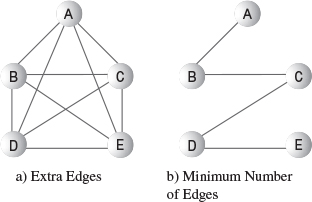</img>
    - Remember that we’re not worried here about the length of the edges. We're not trying to find a minimum physical length, just the minimum number of edges.
    - There are many possible minimum spanning trees for a given set of vertices. Figure 13.10b shows edges AB, BC, CD, and DE, but edges AC, CE, ED, and DB would do just as well.
    - The arithmetically inclined will note that the number of edges E in a minimum spanning tree is always one less than the number of vertices V:
    ```
    E = V - 1
    ```
    - 
    - The algorithm for creating the minimum spanning tree is almost identical to that used for searching. It can be based on either the depth-first search or the breadth-first search. In our example we'll use the depth-first search.
    - 
    - Perhaps surprisingly, by executing the depth-first search and recording the edges you've traveled to make the search, you automatically create a minimum spanning tree. The only difference between the minimum spanning tree method mst(), which we'll see in a moment, and the depth-first search method dfs(), which we saw earlier, is that mst() must somehow record the edges traveled.
    ```
    INSIDE MST

    while( !theStack.isEmpty() ) {      // until stack empty get stack top
        int currentVertex = theStack.peek();
        // get next unvisited neighbor
        int v = getAdjUnvisitedVertex(currentVertex);
        if(v == -1)                     // if no more neighbors
            theStack.pop();              //    pop it away
        else {                            // got a neighbor
            vertexList[v].wasVisited = true;  // mark it
            theStack.push(v);                 // push it display edge
            displayVertex(currentVertex);     // from currentV
            displayVertex(v);                 // to v
            System.out.print(" ");
        }
    }  // end while(stack not empty)

    // stack is empty, so we're done
    for(int j=0; j<nVerts; j++)          // reset flags
        vertexList[j].wasVisited = false;
    
    END OF MST

    this code is very similar to dfs().
    In the else statement, however, the "current vertex" & its "next unvisited neighbor" are displayed.
    
    These two vertices define the edge that the algorithm is currently traveling to get to a new vertex & it's these edges that make up the minimum spanning tree

    Minimum spanning tree: AB BC CD DE
    ```
    - The minimum spanning tree is easily derived from the depth-first search because the DFS visits all the nodes, but only once. It never goes to a node that has already been visited. When it looks down an edge that has a visited node at the end, it doesn't follow that edge. It never travels any edges that aren't necessary. Thus, the path of the DFS algorithm through the graph must be a minimum spanning tree.
    - 
    - 
    - 

- Topological Sorting with Directed Graphs
    - Topological sorting is another operation that can be modeled with graphs
    - It's useful in situations in which items or events must be arranged in a specific order.
    - 
    - Directed Graphs
        - 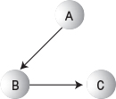</img>
        - The edges need to have a direction. When this is the case, the graph is called a directed graph. In a directed graph you can proceed only one way along an edge. The arrows in the figure show the direction of the edges.
        - In a program, the difference between a non-directed graph and a directed graph is that an edge in a directed graph has only one entry in the adjacency matrix.
        - 
        - Each edge is represented by a single 1. The row labels show where the edge starts, and the column labels show where it ends. Thus, the edge from A to B is represented by a single 1 at row A column B. If the directed edge were reversed so that it went from B to A, there would be a 1 at row B column A instead.
        ```
          A B C
        A 0 1 0
        B 0 0 1
        C 0 0 0
        ```
        - For a non-directed graph, as we noted earlier, half of the adjacency matrix mirrors the other half, so half the cells are redundant. However, for a weighted graph, every cell in the adjacency matrix conveys unique information. The halves are not mirror images.
        - For a directed graph, the method that adds an edge thus needs only a single statement
        ```
        public void addEdge(int start, int end) { // directed graph
            adjMat[start][end] = 1;
        }
        ```
        - 
        - If you use the adjacency-list approach to represent your graph, then A has B in its list but - unlike a non-directed graph-B does not have A in its list.
        - 
    - Topological Sorting
        - 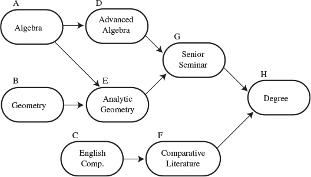</img>
        - Imagine that you make a list of all the courses necessary for your degree
        - You then arrange the courses in the order you need to take them. Obtaining your degree is the last item on the list, which might look like: BAEDGCFH
        - Arranged this way, the graph is said to be topologically sorted. Any course you must take before some other course occurs before it in the list.
        - Actually, many possible orderings would satisfy the course prerequisites. You could take the English courses C and F first, for example: CFBAEDGH
        - Job scheduling is an important example. If you're building a car, you want to arrange things so that brakes are installed before the wheels, and the engine is assembled before it's bolted onto the chassis. Car manufacturers use graphs to model the thousands of operations in the manufacturing process, to ensure that everything is done in the proper order.
        - Modeling job schedules with graphs is called critical path analysis.
        - a weighted graph (discussed in the next chapter) can be used, which allows the graph to include the time necessary to complete different tasks in a project. The graph can then tell you such things as the minimum time necessary to complete the entire project.
        - The idea behind the topological sorting algorithm is unusual but simple. Two steps are necessary
            - 1. Find a vertex that has no successors.
            The successors to a vertex are those vertices that are directly "downstream" from it - that is, connected to it by an edge that points in their direction. If there is an edge pointing from A to B, then B is a successor to A. 
            - 2. Delete this vertex from the graph, and insert its label at the beginning of a list.
            - Steps 1 and 2 are repeated until all the vertices are gone. At this point, the list shows the vertices arranged in topological order.
            - The topological sorting algorithm works on unconnected graphs as well as connected graphs.
            - 
        - Cycles and Trees
            - One kind of graph the topological-sort algorithm cannot handle is a graph with cycles. What's a cycle? It's a path that ends up where it started.
            - </img>
            - A graph with no cycles is called a tree. The binary and multiway trees we saw earlier in this book are trees in this sense. However, the trees that arise in graphs are more general than binary and multiway trees, which have a fixed maximum number of child nodes. In a graph, a vertex in a tree can be connected to any number of other vertices, provided that no cycles are created.
            - It's easy to figure out if a non-directed graph has cycles. If a graph with N nodes has more than N-1 edges, it must have cycles. You can make this clear to yourself by trying to draw a graph with N nodes and N edges that does not have any cycles.
            - A topological sort must be carried out on a directed graph with no cycles. Such a graph is called a directed acyclic graph, often abbreviated DAG.
            ```
            public void topo() {            // topological sort
                int orig_nVerts = nVerts;  // remember how many verts
                while(nVerts > 0) {          // while vertices remain,
                    // get a vertex with no successors, or -1
                    int currentVertex = noSuccessors();
                    if(currentVertex == -1) {       // must be a cycle
                        System.out.println("ERROR: Graph has cycles");
                        return;
                    }
                    // insert vertex label in sorted array (start at end)
                    sortedArray[nVerts-1] = vertexList[currentVertex].label;
                    deleteVertex(currentVertex);  // delete vertex
                }
                
                // vertices all gone; display sortedArray
                System.out.print("Topologically sorted order: ");
                for(int j=0; j<orig_nVerts; j++)
                    System.out.print( sortedArray[j] );
                System.out.println("");
            }
            ```
            - The work is done in the while loop, which continues until the number of vertices is reduced to 0. Here are the steps involved:
                - 1. Call noSuccessors() to find any vertex with no successors.
                - 2. If such a vertex is found, put the vertex label at the end of sortedArray[] and delete the vertex from graph.
                - 3. If an appropriate vertex isn't found, the graph must have a cycle.
            - The last vertex to be removed appears first on the list, so the vertex label is placed in sortedArray starting at the end and working toward the beginning, as nVerts (the number of vertices in the graph) gets smaller.
            - If vertices remain in the graph but all of them have successors, the graph must have a cycle, and the algorithm displays a message and quits. If there are no cycles, the while loop exits, and the list from sortedArray is displayed, with the vertices in topologically sorted order.
            - The noSuccessors() method uses the adjacency matrix to find a vertex with no successors. In the outer for loop, it goes down the rows, looking at each vertex. For each vertex, it scans across the columns in the inner for loop, looking for a 1. If it finds one, it knows that that vertex has a successor, because there's an edge from that vertex to another one. When it finds a 1, it bails out of the inner loop so that the next vertex can be investigated.
            - Only if an entire row is found with no 1s do we know we have a vertex with no successors; in this case, its row number is returned. If no such vertex is found, -1 is returned. Here's the noSuccessors() method
            ```
            public int noSuccessors() {  // returns vert with no successors (or -1 if no such verts)
                boolean isEdge;  // edge from row to column in adjMat
                for(int row=0; row<nVerts; row++) {  // for each vertex,
                    isEdge = false;                 // check edges
                    for(int col=0; col<nVerts; col++) {
                        if( adjMat[row][col] > 0 ) {   // if edge to another,
                            isEdge = true;
                            break;                    // this vertex
                        }                         //    has a successor
                    }                            //    try another
                    if( !isEdge )                   // if no edges,
                        return row;                  //    has no successors
                }
                return -1;                         // no such vertex
            }
            ```
            - Deleting a vertex is straightforward except for a few details. The vertex is removed from the vertexList[] array, and the vertices above it are moved down to fill up the vacant position. Likewise, the row and column for the vertex are removed from the adjacency matrix, and the rows and columns above and to the right are moved down and to the left to fill the vacancies. These tasks are carried out by the deleteVertex(), moveRowUp(), and moveColLeft() methods, which you can examine in the complete listing for topo.java
    - 

- Connectivity in Directed Graphs
    - When we try to find all the connected vertices in a directed graph, things get more complicated. You can't just start from a randomly selected vertex and expect to reach all the other connected vertices.
    - 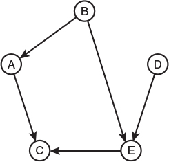</img>
    - If you start on A, you can get to C but not to any of the other vertices. If you start on B, you can't get to D, and if you start on C, you can't get anywhere. The meaningful question about connectivity is: What vertices can you reach if you start on a particular vertex
    - 
    - The Connectivity Table
        - You can easily modify the dfs.java program to start the search on each vertex in turn.
        - For the graph of above Figure the output will look something like
        ```
        A   ->  AC
        B   ->  BACE
        C   ->  C
        D   ->  DEC
        E   ->  EC
        ```
        - The first letter is the starting vertex and subsequent letters show the vertices that can be reached (either directly or via other vertices) from the starting vertex.
        - 
    - 
    - Warshall's Algorithm
        - In some applications it's important to find out quickly whether one vertex is reachable from another vertex.
        - You could examine the connectivity table, but then you would need to look through all the entries on a given row, which would take O(N) time (where N is the average number of vertices reachable from a given vertex). But you're in a hurry; is there a faster way?
        - It's possible to construct a table that will tell you instantly (that is, in O(1) time) whether one vertex is reachable from another. Such a table can be obtained by systematically modifying a graph's adjacency matrix. The graph represented by this revised adjacency matrix is called the <b>"""transitive closure"""</b> of the original graph.
        - Remember that in an ordinary adjacency matrix
            - the row number indicates where an edge starts and the column number indicates where it ends. (This is similar to the arrangement in the connectivity table.) 
            - IF 1 at the intersection of row C and column D means there's an edge from vertex C to vertex D. (ROW->COLUMN)
            - You can get from one vertex to the other in one step. (Of course, in a directed graph it does not follow that you can go the other way, from D to C.)
        ```
          A B C D E
        A 0 0 1 0 0
        B 1 0 0 0 1
        C 0 0 0 0 0
        D 0 0 0 0 1
        E 0 0 1 0 0
        ```
        - We can use Warshall's algorithm to change the adjacency matrix into the transitive closure of the graph. This algorithm does a lot in a few lines of code. It's based on a simple idea:
        - If you can get from vertex L to vertex M, and you can get from M to N, then you can get from L to N.
        - We've derived a two-step path from two one-step paths. The adjacency matrix shows all possible one-step paths, so it's a good starting place to apply this rule.
        - You might wonder if this algorithm can find paths of more than two edges. After all, the rule only talks about combining two one-edge paths into one two-edge path. As it turns out, the algorithm will build on previously discovered multi-edge paths to create paths of arbitrary length. The implementation we will describe guarantees this result
        - Here's how it works
        - We're going to examine every cell in the adjacency matrix, one row at a time.
        - 
        - Row A
            - We start with row A. There's nothing in columns A and B, but there's a 1 at column C, so we stop there.
            - Now the 1 at this location says there is a path from A to C. If we knew there was a path from some vertex X to A, then we would know there was a path from X to C. Where are the edges (if any) that end at A? They're in column A. So we examine all the cells in column A
            - In Table 13.6 there's only one 1 in column A: at row B. It says there's an edge from B to A. So we know there's an edge from B to A, and another (the one we started with) from A to C. From this we infer that we can get from B to C in two steps. You can verify this is true by looking at the graph
            - To record this result, we put a 1 at the intersection of row B and column C. The result is shown in Figure a. The remaining cells of row A are blank.
            - 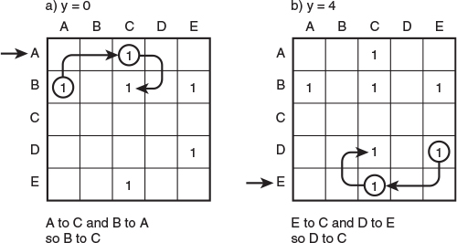</img>
        - Rows B, C, and D
            - We go to row B. The first cell, at column A, has a 1, indicating an edge from B to A. Are there any edges that end at B? We look in column B, but it's empty, so we know that none of the 1s we find in row B will result in finding longer paths because no edges end at B.
            - Row C has no 1s at all, so we go to row D. Here we find an edge from D to E. However, column D is empty, so there are no edges that end on D.
        - Row E
            - In row E we see there's an edge from E to C. Looking in column E we see the first entry is for the edge B to E, so with B to E and E to C we infer there's a path from B to C. However, it's already been discovered, as indicated by the 1 at that location.
            - There's another 1 in column E, at row D. This edge from D to E plus the one from E to C imply a path from D to C, so we insert a 1 in that cell. The result is shown in Figure 13.16b.
        - Warshall's algorithm is now complete. We've added two 1s to the adjacency matrix, which now shows which nodes are reachable from another node in any number of steps. If we drew a graph based on this new matrix, it would be the transitive closure of the graph
    - Implementation of Warshall's Algorithm
        - One way to implement Warshall's algorithm is with three nested loops (as suggested by Sedgewick. 
        - The outer loop looks at each row; let's call its variable y. The loop inside that looks at each cell in the row; it uses variable x. If a 1 is found in cell (x, y), there's an edge from y to x, and the third (innermost) loop is activated; it uses variable z.
        - The third loop examines the cells in column y, looking for an edge that ends at y. (Note that y is used for rows in the first loop but for the column in the third loop.) If there's a 1 in column y at row z, then there's an edge from z to y. With one edge from z to y and another from y to x, it follows that there's a path from z to x, so you can put a 1 at (x, z). We'll leave the details as an exercise.
        - 
    - 
- 
- 
- 

## Weighted Graphs
- Similiar to graph's - EDGE can have DIRECTION,, ""EDGE"" can also have WEIGHT
- For example, if vertices in a weighted graph represent cities, the weight of the edges might represent distances between the cities, or costs to fly between them
- <b>So minimum spanning tree for a weighted graph could be the shortest (or cheapest) distance from one vertex to another</b>
- Creating such a tree is a bit more complicated with a weighted graph than with an un-weighted one
- When all edges are the same weight, it's fairly straightforward - as we saw, "Graphs" - for the algorithm to choose one to add to the minimum spanning tree.
- But when edges can have different weights, some arithmetic is needed to choose the right one.
- The Graph
    - 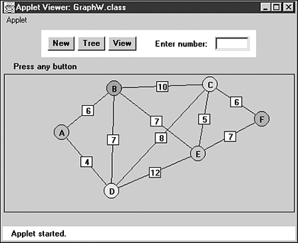</img>
    - 
    ```
    Ajo - A
    Brodo - B
    etc.
    ```
- The converted minimum spanning tree
    - 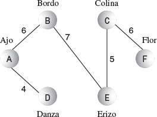</img>
    - While creating Minimum Spanning Tree These are the Key Pointers
    ```
    Once you start from Ajo (A) either you can go to B or D
    Seems D have less cost = 4
    Now Once A&D connected

    CAT 1. Towns that have offices and are linked by cable (Till Now A & D)
    CAT 2. Towns that ARE NOT LINKED YET, but known - the cost to link them to at least one town which is allready linked ["fringe"]
    CAT 3. Towns you don't know anything about

    Then apply rule  1. Find all the """[EDGES]""" from the """[newest VERTEX]""" to other vertices that aren't in the tree. Put these """[EDGES]""" in the priority queue.

    Doing So we will now connect to A To B

    Now,,
    A is Connected to D}
                       } - The Frige vertices will be C & E, We compare their ALL POSSIBLE ""EDGES"" Doing So, we connect B To E
    A is Connected to B}
    ```
- 
- 
- The Priority Queue
    - As we saw in the above we are always selcting the minimum number between the edges to the connecting vertices
    - A priority queue would be an appropriate data structure, and in fact this turns out to be an efficient way to handle the minimum spanning tree problem. Instead of a list or array, we use a priority queue.
    - In a serious program this priority queue might be based on a heap. This would speed up operations on large priority queues.
    - 
    - Outline of the Algorithm
        - Start with a vertex, and put it in a new tree.
        - Then repeat the below 1 & 2:
        - 1. Find all the """[EDGES]""" from the """[newest VERTEX]""" to other vertices that aren't in the tree. Put these """[EDGES]""" in the priority queue.
        - 2. Pick the edge with the lowest weight, and add this edge and its destination vertex to the earlier new tree.
        - 
        - Repeat these steps until all the vertices are in the tree. At that point, you're done.
        - In step 1, newest means most recently installed in the last new tree. The edges for this step can be found in the adjacency matrix. After step 1, the list will contain all the edges from vertices in the tree to vertices on the fringe.
        - 
        - 
- The Extraneous Edges (Irrelevant/Creates redundancy/Creates Noise)
    - In maintaining the list of links,
        - We went to some trouble to remove links that led to a vertices that had recently become connected. If we didn't do this, we would have ended up installing unnecessary links.
    - We must make sure that we don't have any edges in the priority queue that lead to vertices that are already in the tree.
    - We could go through the queue looking for and removing any such edges each time we added a new vertex to the tree.
    - 
    - As it turns out, it is easier ""to keep only one edge from the tree to a given [fringe-vertex]"" in the "PRIORITY QUEUE" at any given time. That is, the queue should contain only one edge to each category 2 vertex.
        - Cat-2 towns are known but not connected
    - 
- Looking for Duplicates in the Priority Queue
    - How do we make sure there is only one edge per category 2 vertex?
    - Each time we add an edge to the queue, we make sure there's no other edge going to the same destination. If there is, we keep only the one with the smallest weight (By using Priority Queue)
    - This necessitates looking through the priority queue item by item, to see if there's such a duplicate edge.
    - Priority queues are not designed for random access, so this is not an efficient activity. However, violating the spirit of the priority queue is necessary in this situation.
    - 
- The method that creates the minimum spanning tree for a weighted graph, mstw()
    - Java program
    ```
    public void mstw() {           // minimum spanning tree
        currentVert = 0;          // start at 0
        while(nTree < nVerts-1) {   // while not all verts in tree put currentVert in tree
            vertexList[currentVert].isInTree = true;
            nTree++;
            // insert edges adjacent to currentVert into PQ
            for(int j=0; j<nVerts; j++) {   // for each vertex,
                if(j==currentVert)         // skip if it's us
                    continue;
                if(vertexList[j].isInTree) // skip if in the tree
                    continue;
                int distance = adjMat[currentVert][j];
                if( distance == INFINITY)  // skip if no edge
                    continue;
                putInPQ(j, distance);      // put it in PQ (maybe)
            }
            if(thePQ.size()==0) {           // no vertices in PQ?
                System.out.println(" GRAPH NOT CONNECTED");
                return;
            }
            // remove edge with minimum distance, from PQ
            Edge theEdge = thePQ.removeMin();
            int sourceVert = theEdge.srcVert;
            currentVert = theEdge.destVert;
            
            // display edge from source to current
            System.out.print( vertexList[sourceVert].label );
            System.out.print( vertexList[currentVert].label );
            System.out.print(" ");
        }  // end while(not all verts in tree)
        
        // mst is complete
        for(int j=0; j<nVerts; j++)     // unmark vertices
            vertexList[j].isInTree = false;
        }
    ```
    - Within loop the following activities take place:
        - 1. The current vertex is placed in the tree.
        - 2. The EDGES adjacent to this vertex are placed in the priority queue (IF appropriate).
        - 3. The edge with the minimum weight is removed from the priority queue. The destination vertex of this edge becomes the current vertex. i.e. it become Cat-1 vertex & now we will go for cat-2 vertex & so on...
        - 
    - Let's look at these steps in more detail. In step 1, the currentVert is placed in the tree by marking its isInTree field.
        - In step 2, the edges adjacent to this vertex are considered for insertion in the priority queue. The edges are examined by scanning across the row whose number is currentVert in the adjacency matrix. An edge is placed in the queue unless one of these conditions is true:
            - A. The source and destination vertices are the same.
            - B. The destination vertex is in the tree.
            - C. There is no edge to this destination.
        - If NONE OF THESE CONDITIONS (A,B,C) are true, the putInPQ() method is called to put the edge in the priority queue. Actually, this routine doesn't always put the edge in the queue either, as we'll see in a moment.
        - 
        - 
        - At the end of mstw(), the vertices are removed from the tree by resetting their isInTree variables. That isn't strictly necessary in this program because only one tree is created from the data. However, it's good housekeeping to restore the data to its original form when you finish with it.
        - 
        - As we noted, the priority queue should contain only one edge with a given destination vertex. The putInPQ() method makes sure this is true. It calls the find() method of the PriorityQ class, which has been doctored to find the edge with a specified destination vertex. If there is no such vertex, and find() therefore returns -1, then putInPQ() simply inserts the edge into the priority queue. However, if such an edge does exist, putInPQ() checks to see whether the existing edge or the new proposed edge has the lower weight. If it's the old edge, no change is necessary. If the new one has a lower weight, the old edge is removed from the queue and the new one is installed. Here's the code for putInPQ()
        ```
        public void putInPQ(int newVert, int newDist) { // is there another edge with the same destination vertex?
            int queueIndex = thePQ.find(newVert);  // got edge's index
            if(queueIndex != -1) {              // if there is one, get edge
                Edge tempEdge = thePQ.peekN(queueIndex);
                int oldDist = tempEdge.distance;
                if(oldDist > newDist) {          // if new edge shorter,
                    thePQ.removeN(queueIndex);  // remove old edge
                    Edge theEdge = new Edge(currentVert, newVert, newDist);
                    thePQ.insert(theEdge);      // insert new edge
                }
                // else no action; just leave the old vertex there
            } else {  // no edge with same destination vertex so insert new one
                Edge theEdge = new Edge(currentVert, newVert, newDist);
                thePQ.insert(theEdge);
            }
        }
        ```

### The Shortest-Path Problem
- The most commonly encountered problem associated with weighted graphs is that of finding the shortest path between two given vertices.
- For Example: In a Google-Map navigating from one location to another location
- I.e. trying to find the cheapest route from one city to another
    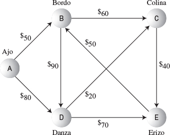</img>
- The edges in Figure are directed. They represent single-track railroad lines, on which (in the interest of safety) travel is permitted in only one direction. For example, you can go directly from Ajo to Bordo, but not from Bordo to Ajo.
- There are several possible routes between any two towns.
- For example, to take the train from Ajo to Erizo, you could go through Danza, or you could go through Bordo and Colina, or through Danza and Colina, or you could take several other routes.
- Actually the shortest path is through Danza and Colina; it will cost you $140 (ADCE 80+20+40)

#### A Directed, Weighted Graph [Weight + Direction]
- 


# ######################
- 
- 
- 
## Perfrmance
- Too many method call add lil overhead
- heap - special kind of tree
- Stack used to help traverse the nodes of a tree - Binary Trees
- Graphs, we'll apply it to searching the vertices of a graph
- Theoretically, an ADT stack doesn't become full

# Algorithm books
- Sedgewick


# Various BIT Twiddling techniques
- #BitManipulation


