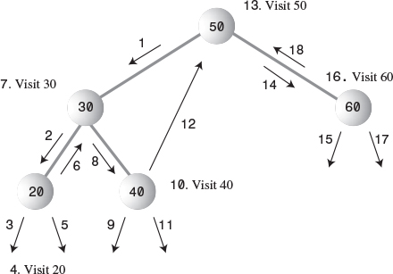

# DATA STRUCTURE & ALGORITHMS (In Java)


## ----------------- Contents ------------------
- [DATA STRUCTURE](#DATASTRUCTURE(DS)&Algorithm(Algo))
## -------------- End Of Contents --------------


<h1 id="DATASTRUCTURE(DS)&Algorithm(Algo)"> DATA STRUCTURE (DS) & Algorithm (Algo) </h1>

- What is a data structure ?
    - It's how your data is structured. It could be structured in a list (List of items) or set (set of records) or map (key -> value)
    - You can think it as a small inmemory structured database

- What is an Algorithm ?
    - How fast we process the "structured data" !!
    - A CRUD operation
    - Create/insert     Retrive/Search      Update      Delete


```
                              Object
                            /       \
                        Arrays  Collections
                                        |
                                    Collection
                                    /   |  \
                                List  Queue Set


List -- ArrayList, LinkedList (LinkedList can do basic queue tasks through peek, pool, offer)
Queue -- PriorityQueue, ArrayDequeue (ArrayDequeue also implements Deque interface)
Set -- HashSet, LinkedHashSet, TreeSet (Similiar structure to Map)

List provides - Vector: just synchronized version

                    
                                 Map
                                /   \
                        HashMap     SortedMap
                            |           |
                    LinkedHashMap   NavigableMap
                                        |
                                    TreeMap

Map provides - HashTable: just synchronized version
```

- A DS can be ordered - by insertion or last access
- A DS can be sorted - i.e. their insertion order doesn't mater - their sorting order does


- Array : Insertion fast, Access(unless idx known) : But deletion is complex
- Stack & Queue : Slow access to other items
- LinkedList: Fast insertion & deletion : But slow search

- Binary tree : Fast search, insertion : But deletion complex (unless tree is balanced)
- Red-black & 2-3-4 : Fast search, insertion & always balanced -> complex
- Hash table : Fast insertion & fast access if key known : But Slow deletion & inefficient memory usage
- Heap : Fast insertion, deletion, access to largest item : But Slow access to other item
- Graph: Some algo are slow & complex


## Array DS
- For "A" Searching takes an average of N/2 steps
- For Insertion takes 1step
- For deletion, there is no holes allowed - occupied cells must be arranged contiguously: no holes
- A deletion requires searching through an average of N/2 elements & then moving the remaining elements (an average of N/2 moves) to fill up the resulting hole => Total N steps in all

- Array can be used to handle both primitive & objects mainly 

- The Duplicates Issue
    - Searching : with Duplicates N steps - without Duplicates N/2 steps
    - Insertion : with Duplicates 1 steps - Without duplicates Search N steps But 1 Steps
    - Deletion : with Duplicates N step comparisons, more than N/2 moves - Without duplication N/2 comparisons, N/2 moves


- OOP -&- DS

- Also think of scinario, when you query a idx from one thread & deleted another element from another thread !! how bad that would be !!

- Binary search in an ordered collection

- Being ordered insertion took times but search / deletion was fast
So useful for a scianrio where search is more frequent

Although Deletions are slow in both ordered and unordered arrays because items must be moved down to fill the hole left by the deleted item.


```
In a Binary search of a ordered collection the equation devides "HALF"
For 128 numbers it devides like - 128 64 32 16 8 4 2 1 which ranges from 2^7 .. 2^6 ...... 2^0
which is a function of - 2
    so for 128 the equation is 2^7
Or in the reverse way
    the equarion is log-base2-(128) = 6.sth = 7

________________________________________________________,
log-base(a)of(b) = log-base(c)of(b) / log-base(c)of(a)  |
________________________________________________________|

```

```
-----------------------
The "Big O" notation
-----------------------
A rough measure of algorithms performance
Comparison of algorithms that tells how an algorithm's speed is related to the number of items
As you seen for 64 items it took 6 steps for double it's items i.e. 128 items it just took 1 more step


BIG N - Denotes number of items
BIG T - Times it take


For unsorted array
No matter how big the "N" is (the number of items)
The time taken "T" to iNsErT an item is always constant K


For a Linear SeArCh, Of "N" items it takes N/2 steps at an average
The TIME will be T = K * N / 2      \\k is the constant time for 1 item


However for a binary SeArCh, Of "N" items it takes log2(N) steps at an average
considering the below formula
________________________________________________________,
log-base(a)of(b) = log-base(c)of(b) / log-base(c)of(a)  |
________________________________________________________|
Considering c = 10, We can take log-base2-(10) = 3.322 [the divisor] as constant K
The TIME will be T = K * log2(N)         \\k is the constant time for 1 item & multiplied by 3.322


Big O notation just dispenses the constant K
Just we want to compare is how T changes for different values of N

Big O - Order of


For linear search into an un/ordered array takes O(N) time
For binary search into an ordered array takes O(log N) time


For Insertion into an unordered array takes O(1) time
For Insertion into an ordered array takes O(N) time

Deletion in unordered array O(N) time - searching is N/2 an average & moving is N/2 an average
Deletion in ordered array O(N) time


O(1) is excellent
O(log N) is good
O(N) is fair
O(N2) is poor (Bubble sort)
```


## Simple Sorting
- Sorting is So essential (for example in binary search) there exists a lots of algorithms
    - Bubble Sort
    - Selection Sort
    - Insertion Sort

The insertion sort, is preferable to quicksort for small files & for almost-sorted files
In fact, an insertion sort is commonly used as a part of a quicksort implementation

### Bubble Sort
- Taking two (A, B) at a time : return value is : -ve 0 +ve
    -ve : A < B
    0 : A = B
    +ve : A > B
Keep doing this to push the largest one to extreme right : you made N-1 comparisions & around N-1 swaps
once done this

```
    in - index 0
    nElems - no of elements
    out - nElems-1

    -------------------------------------------------------------------
    BubbleSort.java
    -------------------------------------------------------------------
    public class HelloWorld {
        public static int a[] = {3,4,2,1};

        public static void main(String []args) {
            bubbleSort();
            for (int b : a)
                System.out.println(b);
        }

        public static void bubbleSort() {
            for(int lengthAsIdx = a.length - 1; lengthAsIdx > 0;lengthAsIdx--) // 3 2 1
                for(int in=0; in<lengthAsIdx; in++)  // MAX-2   MIN-1   (lengthAsIdx)
                    if(a[in] > a[in+1])      // SWAP 2 - 3
                        swap(in, in+1);
        }

        private static void swap(int one, int two) {
            long temp = a[one];
            a[one] = a[two];
            a[two] = (int)temp;
        }
    }

    THINKING IT REVERSE
    We are swapping -- swap(in, in+1); <-- Hence we must make 1 short so we can do in+1 operation
    We have to Preserve the RightMost(1st)/NextRight(subsequent) elements for each iteration
    Bcz the RightMost(1st)/NextRight(subsequent) are very sorted

    THE KEY POINT IN THIS ALGORITHM IS - swap(in, in+1);
    /** swapping index & index+1 basedon comparision & Preserving the Right side */


    `````````````````````````````````````````````
    `   // @TODO - To report erreta on book     `
    `````````````````````````````````````````````


    -------------------------------------------
    The bubbleSort() method
    -------------------------------------------
    Considering 4 elements
    For outer Loop out=3
    The inner Loop in=0->1->2
    Seeing swap(in, in+1); --> the final


```

-  There are conditions that remain unchanged as the algorithm proceeds. These conditions are called invariants
- you can repeatedly check that the invariant is true, and signal an error if it isn't

- Thus, the algorithm makes about
```
(N-1) + (N-2) + (N-3) + ... + 1 = N*(N-1)/2
N*(N-1)/2
N2/2 comparisons
```
- There are fewer swaps than there are comparisons because two numbers are swapped only if they need to be
- If the data is random, a swap is necessary about half the time, so there will be about N^2/4
- Both swaps and comparisons are proportional to N2. Because constants don't count in Big O notation, we can ignore the 2 and the 4 and say that the bubble sort runs in O(N2) time

- The outer loop executes N times, and the inner loop executes N => N*N = N^2

### Selection Sort
- The selection sort improves on the bubble sort by reducing the number of swaps necessary from O(N2) to O(N). Unfortunately, the number of comparisons remains O(N2). However, the selection sort can still offer a significant improvement for large records that must be physically moved around in memory

- The Shrtest will be remembered & moves to the extreme left (Not 2 at a time will be compared)
```
public void selectionSort() {
    int out, in, min;
    for(out=0; out<nElems-1; out++) { // outer loop
        min = out;                     // minimum
        for(in=out+1; in<nElems; in++) // inner loop
            if(a[in] < a[min])  min = in;
        swap(out, min);
    }
}
```

### Insertion Sort
- Works when A collection is "PARTIALLY SORTED" [IMP]
- From the other unsorted list, it finds minimum & try to fill in the partially sorted
- The algorithm starts by ""assuming the very first element (at index 0) is already a sorted"" sub-list on its own
- On the first pass/item, it compares a maximum of one item (with 0th idx item)
- On the second pass, it's a maximum of two items (with 0th & 1st idx) & so on, up to a maximum of N-1 comparisons on the last pass

- What it does
- Let's say it founds a item towds right & it shifts to left before the marker (,)
- What empty space created, It push the items to fill the empty items
- Before ||,||||
- After  ||,||_| & temp=|
- After  ||_,||| & temp=|
- After  |||,||| NO temp

- To move this small item to its proper place on the left, all the intervening items (between the place where it is and where it should be) must be shifted one space right
- This step takes close to N copies, just for one item.
- Not all the items must be moved a full N spaces, But the average item must be moved N/2 spaces
- Which takes N times N/2 shifts for a total of N^2/2 copies
- Performance = O(N^2)

```
1 + 2 + 3 + ... + N-1 = N*(N-1)/2
```
However, because on each pass an average of only half of the maximum number of items are actually compared before the insertion point is found, we can divide by 2, which gives
```
N*(N-1)/4
```

- The number of copies is approximately the same as the number of comparisons. However, a copy isn't as time-consuming as a swap, so for random data this algorithm runs twice as fast as the bubble sort and faster than the selection sort
- O(N^2) time for random data
- Space Complexity: O(1) - It's an in-place sorting algorithm, meaning it requires only a constant amount of extra memory space 

```
public static void sort(int[] arr) {
    int n = arr.length;
    // Start from the second element (index 1)
    // The first element (index 0) is considered the initial sorted subarray
    for (int i = 1; i < n; ++i) {
        int key = arr[i]; // The element to be inserted into the sorted portion
        int j = i - 1;    // Index of the last element in the sorted portion

        /* Move elements of arr[0..i-1] that are greater than key,
            one position ahead of their current position */
        while (j >= 0 && arr[j] > key) {
            arr[j + 1] = arr[j]; // Shift the larger element to the right
            j = j - 1;          // Move to the previous element
        }
        // Place the key (original arr[i]) in its correct sorted position
        arr[j + 1] = key;
    }
}
```


- Stability
- A sorting algorithms retain the preveous sorting order are said to be stable.


## Stacks & Queue & Priority Queue

### Stacks
- Only one item can be read or removed at a given time (unless you cheat)
- Methods : push() pop() peek() [readonly]
- The push/pop is efficient = constant O(1) time
- Using stack wrapper - make certain type of algorithms (LIFO) less error prone

### Queues
- Methods: put or add       delete or get       peek    remove()
- Circular Queue - As queue removed from 1st & added from last, there are "spaces around the front"
    - The Front & Rear arrows wrap around to the beginning of the array
    - The result is a circular queue (sometimes called a ring buffer)
    - In a circular Queue for a scinario - the front & rear at the same idx i.e. 0 => empty / full @ same time
    - This problem can be solved by making the array one cell larger than the maximum number of items that will be placed in it
    - So even if rear @ 0th idx the front is sm where @ 9th idx
- The efficiency of Queue is still O(1) time

### Deques
- Insert items at either end & delete them from either end
- insertLeft()/insertRight() & removeLeft()/removeRight()
- THis is a more versatile data structure than either a stack or a queue and is sometimes used in container class libraries to serve both purposes.
- However, it's not used as often as stacks and queues


### Priority Queues
- items are ordered by key value so that the item with the lowest key (or in some implementations the highest key) is always at the front
- ues case: preemptive multitasking operating system
- priority queues are, as we noted earlier, often implemented with a data structure called a heap
- In an underlying array implement,
    - The [minimum] value is always at [front] & [largest] item is always at reaer [index-0]
    - When you put a value in between the item will be shifted to make room for the current value
    - The rear arrow always at 0 idx,, items at front are removed only
    - Here insertion is costly but the deletion is not (deletion reqd search & then fill the empty space)
- For larger numbers of items, or when speed is critical, the heap is a better choice, then array
- insertion runs in O(N) (devided by 2!!) time, while deletion takes O(1) time


## Linked Lists
- LinkedList most commonly used after array
- LL is more preferred over an array unless you need frequent random access to individual items using an index
- [Philosophy]
    - When you do an implementation with help of array, its quite fantastic
    - But, when you arrange items without an array
    - The best approach would be to have one object holds address of another !
    - Unlike array you can't directly go to 6th or 7th index, rather you would start from 1st element
    - & from there you will make progress till 6th or 7th

### [Approach-1-Unsorted] (You can insert links anywhere in the list)
- A Link object contains a reference to the next link in the list
    ```
        class Link {
            public int iData;
            public double dData;
            public Link next;
        }
    ```
    - When you search it looks for the "LINK" scanning one by one
    - When you try to Delete, It tries to find the LINK, once link found it deletes that link
    - & connects the arrow from the previous link straight across to the following link


#### A Simple Linked List
    - insertFirst()     deleteFirst()   displayList()
    - find() : checks in every item starting from the first
    - delete() : is similar to find() in the way it searches for the link to be deleted
    - insertAfter() : finds a link with a specified key value & insert a new link following it

#### Double-Ended Lists (FirstLastList)
- The 1st element has link to 2nd & the last element
- With having reference to the last link
- You can insert a new link directly at the end of the list as well as at the beginning of the list
- Repeated insertions at the front of the list reverse the order of the items, while repeated insertions at the end preserve the order
- This have a new method : insertLast()

```

    class FirstLastList {
        private Link first;
        private Link last;
    }

    new FirstLastList().insertFirst()
    Or
    new FirstLastList().insertLast()

```

- The insertion & deletion routines are similar to those in a single-ended list
- However, both insertion routines must watch out for the special case
- When the list is empty prior to the insertion - If isEmpty() is true
    - Then insertFirst() must set [last] to the new link
    - The insertLast() must set [first] to the new link
    - Deleting from the start of the list is also a special case if it's the last item on the list: last must be set to point to null in this case
- Insertion and deletion at the beginning of a linked list are very fast O(1)
- Finding, deleting, or inserting next to a specific item requires searching through, on the average, half the items in the list. This requires O(N)
- One advantages over array is that, There is [NO SIZE LIMITATION]

```
!!!
- Unfortunately, making a list double-ended doesn't help you to delete the last link because there is still no reference to the next-to-last link, whose next field would need to be changed to null if the last link were deleted. To conveniently delete the last link, you would need a doubly linked list
```

#### Abstract Data Types (ADTs)
- You can implement a STACK / QUEUE with linkedlist (instead of an array)
- ADT are data types - that hides actual implementation from user of it & only exposes the API

- By decoupling the specification of the ADT from the implementation details, you can simplify the design process
- once the ADT has been designed, the underlying data structure must be carefully chosen to make the specified operations as efficient as possible. If you need random access to element N, for example, the linked-list representation isn't so good because random access isn't an efficient operation for a linked list. You'd be better off with an array
- If u r designing an ADT u should be clear what should be a basic data structure or which would be an ADT


### [Approach-2-Sorted-Lists]
- In a sorted list, the items are arranged in sorted order by key value
- Deletion is often limited to the smallest (or the largest) item in the list, which is at the start of the list
- although sometimes find() & delete() methods, which search through the list for specified links, are used as well
- The advantages of a sorted list over a sorted array are speed of insertion (because elements don't need to be moved)
- A sorted list can also be used to implement a priority queue, although a heap
- Insertion
    - Keep checking with while loop
    - Till the link currently being examined (current.dData) is no longer smaller than the key of the link being inserted (key)
    - while loop also terminates if current is null
    - or the list may be empty;  previous will be null; so we set first to the new link
- Delete
    - Removal always from the front (The lowest one)

- Efficiency
    - Insertion and deletion of arbitrary items in the sorted linked list require O(N) comparisons (N/2 on the average)
    - The minimum value can be found, or deleted, in O(1) time

- If an application frequently accesses the "minimum item" & fast insertion isn't critical, then a sorted linked list is an effective choice
- A priority queue might be implemented by a sorted linked list, for example


- List Insertion Sort
    - To sort an array of unsorted data items you can use Sorted list - first addd to sorted list & then remove from it
    - This type of sort turns out to be substantially more efficient than the more usual insertion sort within an array, described in Chapter 3, "Simple Sorting," because fewer copies are necessary. It's still an O(N2) process because inserting each item into the sorted list involves comparing a new item with an average of half the items already in the list, and there are N items to insert, resulting in about N2/4 comparisons. However, each item is copied only twice: once from the array to the list and once from the list to the array. N*2 copies compares favorably with the insertion sort within an array, where there are about N2 copies
    - The downside of the list insertion sort, compared with an array-based insertion sort, is that it takes somewhat more than twice as much memory: The array and linked list must be in memory at the same time

### Doubly Linked Lists
- NOT TO BE CONFUSED WITH,  double-ended list
- A potential problem with ordinary linked lists is that it's difficult to traverse backward along the list (Always NEXT)

 - Doubly Linked List as Basis for Deques :: In a deque you can insert/delete at either end, & the doubly linked list provides this capability


## Iterators
- ommonly called iterators or sometimes, as in certain Java classes, enumerators
- Its a separate object , than Link
- It points to Link
- There can be multiple iterator on same List
```
class ListIterator() {
   private LinkList ourList;   // reference to "parent" list

   private Link current;
   private Link previous;

   public void nextLink() {
    previous = current;
    current = current.next;
   }
}

LinkList theList = new LinkList();
ListIterator iter1 = theList.getIterator();
```

- reset() - Sets the iterator to the start of the list
- nextLink() - Moves the iterator to the next link
- getCurrent() - Returns the link at the iterator
- atEnd() - Returns true if the iterator is at the end of the list
- insertAfter() - Inserts a new link after the iterator
- insertBefore() - Inserts a new link before the iterator
- deleteCurrent() - Deletes the link at the iterator

- Deciding which tasks should be carried out by an iterator and which by the list itself is not always easy
- An insertBefore() method works best in the iterator, but an insertFirst() routine that always inserts at the beginning of the list might be more appropriate in the list class


## Recursion
### Triangular Numbers
- 1, 3, 6, 10, 15, 21...... i.e. (+1, +2, +3, +4, +5 ......)
- @3rd Position => 3 + 2 + 1
- @5th Position => 5 + 4 + 3 + 2 + 1
- @nth Position => n + n-1 + ...

- total += n;   n--;
- Or you can apply recursion
- Or nth triangular number = (n^2+n)/2

- Calling a method involves certain overhead. Control must be transferred from the location of the call to the beginning of the method
- In addition, the arguments to the method and the address to which the method should return must be pushed onto an internal stack so that the method can access the argument values and know where to return

- Another inefficiency is that memory is used to store all the intermediate arguments and return values on the system's internal stack. This may cause problems if there is a large amount of data, leading to stack overflow.
- Recursion is usually used because it simplifies a problem conceptually, not because it’s inherently more efficient.
- mathematical induction
```
tri(n) = 1                 if n = 1
tri(n) = n + tri(n-1)      if n > 1
```
### Factorials
- Factorials are similar in concept to triangular numbers, except that multiplication is used instead of addition
- 5*4*3*2*1
- The factorial of 0 is defined to be 1.
- if(n==0) return 1;
- arious other numerological entities lend themselves to calculation using recursion in a similar way, such as finding the greatest common denominator of two numbers (which is used to reduce a fraction to lowest terms), raising a number to a power, and so on.
- Again, while these calculations are interesting for demonstrating recursion, they probably wouldn't be used in practice because a loop-based approach is more efficient.
### Anagrams
- A permutation is an arrangement of things in a definite order
- cat => cat cta atc act tca tac
- For 3 letters there are 6 possible words;
- for 4 letters there are 24 words;
- for 5 letters, 120; and so on
- One way of thinking : keep the first letter & rotate next 2
- For more than 3 lettter ? doing a horizeontal recurssion helps !!

```

@TODO

```

### A Recursive Binary Search
-

```
public int find(long searchKey)
   {
   int lowerBound = 0;
   int upperBound = nElems-1;
   int curIn;

   while(true)
      {
      curIn = (lowerBound + upperBound ) / 2;
      if(a[curIn]==searchKey)
         return curIn;              // found it
      else if(lowerBound > upperBound)
         return nElems;             // can't find it
      else                          // divide range
         {
         if(a[curIn] < searchKey)
            lowerBound = curIn + 1; // it's in upper half
         else
            upperBound = curIn - 1; // it's in lower half
         }  // end else divide range
      }  // end while
   }  // end find()
```

- Recursive approach
```
  private int recFind(long searchKey, int lowerBound, int upperBound) {
   int curIn;

   curIn = (lowerBound + upperBound ) / 2;
   if(a[curIn]==searchKey)
      return curIn;              // found it
   else if(lowerBound > upperBound)
      return nElems;             // can't find it
   else                          // divide range
      {
      if(a[curIn] < searchKey)   // it's in upper half
         return recFind(searchKey, curIn+1, upperBound);
      else                       // it's in lower half
         return recFind(searchKey, lowerBound, curIn-1);
      }  // end else divide range
   }
```

### Divide-and-Conquer Algorithms
- binary search is an example of the divide-and-conquer approach
- Just that its not solved with concurrent approach


### The Towers of Hanoi
- All the disks start out on column A. The object of the puzzle is to transfer all the disks from column A to column C. Only one disk can be moved at a time, and no disk can be placed on a disk that’s smaller than itself.
- Thinking from the opposite/i.e. from reverse
- Imagine you have only one largest disk at Source tree & all other are in Intermediate tree
- So now you can move from Source to destination & then folowed by all the subsequent disks
```
public static void main(String[] args) {
    doTowers(nDisks, 'A', 'B', 'C');
}

public static void doTowers(int topN, char from, char inter, char to) {
    if(topN==1)
        System.out.println("Disk 1 from " + from + " to "+ to);
    else {
        doTowers(topN-1, from, to, inter);  // from-->inter
        System.out.println("Disk " + topN + " from " + from + " to "+ to);
        doTowers(topN-1, inter, from, to);  // inter-->to
    }
}

S - Source (A)
I - Intermediate (B)
D - Destination (C)

Enter (3 disks): s=A, i=B, d=C
   Enter (2 disks): s=A, i=C, d=B
      Enter (1 disk): s=A, i=B, d=C
         Base case: move disk 1 from A to C
      Return (1 disk)
      Move bottom disk 2 from A to B
      Enter (1 disk): s=C, i=A, d=B
         Base case: move disk 1 from C to B
      Return (1 disk)
   Return (2 disks)
   Move bottom disk 3 from A to C
   Enter (2 disks): s=B, i=A, d=C
      Enter (1 disk): s=B, i=C, d=A
         Base case: move disk 1 from B to A
      Return (1 disk)
      Move bottom disk 2 from B to C
      Enter (1 disk): s=A, i=B, d=C
         Base case: move disk 1 from A to C
      Return (1 disk)
   Return (2 disks)
Return (3 disks)

```

### mergesort
- The heart of the mergesort algorithm is the merging of two already-sorted arrays
- It requires an additional array in memory (Downside)
- However, if you have enough space, it's a good choice
- If you have a array of size 8 devide it 4A - 4B
    - For 4A devide it to 2AA & 2AA & while devide insrt it in order    => 4AA
    - Do the same Process for 4B - 2BB & 2BB                            => 4BB
    - Then comapre the 0th idx from 4AA & oth idx from 4BB & merge them into a destination arrray 4DD
- Speed/Time mergesort is O(N*logN)

- There are 24 copies necessary to sort 8 items [2+2+4] & [2+2+4] & merging them => + 8 = 24
- The log-base(2)of(8) = 3
- So 8*log-base(2)-of-8 = 24
- 
- & multiplying *2 bcz they are also getting copied back to origional array
- 
- 
- 
- As we break the array into subarray of 2 it becomes the function of 2 (i.e *2 => ^2)
- I.e. For 2 items 4 (2^2) copies reqd
- For 4 items 8 (2^3) copies reqd
- For 8 items 24 (2^4) copies reqd

- It's conceptually easier than quicksort and the Shell short


### Eliminating Recursion
- Sometimes recursive triangle() & factorial() methods can be implemented more efficiently using a simple loop
- However, various divide-and-conquer algorithms, such as mergesort, work very well as recursive routines

```

## @TODO - Eliminating Recursion

```

### The Knapsack Problem
- For example, suppose you want your knapsack to weigh exactly 20 pounds
- And you have five items, with weights of 11, 8, 7, 6, and 5 pounds
- A solution can be 8+7+5

    - Start by selecting the first item
    - Try, one by one, each of the possible combinations of the remaining items.
    - If none of the combinations work, discard the first item, and start the whole process again with the second item.

### Combinations: Picking a Team
- combination is a selection of things in which their order doesn't matter
- A, B, C, D, E


## Advanced Sorting
- We discussed simple sorts : "bubble", "selection" & "insertion" sorts,, They are easy to implement but are rather slow
-  The "mergesort" runs much faster than the simple sorts but requires twice as much space as the original array
- 
- 
- The "Shellsort" in about O(N*(logN)2) time & "quicksort" in O(N*logN) time
- Neither of these sorts requires a large amount of extra space
- 
- The "Shellsort" is almost as easy to implement as mergesort
- While "quicksort" [partitioning] is the fastest of all the 'general-purpose' sorts
- 
- The "Radix sort", an unusual and interesting approach to sorting
- 

### Shellsort
- This is good for medium-sized arrays, perhaps up to a few thousand items
- Some experts (see Sedgewick) recommend starting with a Shellsort for almost any sorting project & changing to a more advanced sort, like quicksort, only if Shellsort proves too slow in practice
- 
- 
- In the INSERTION SORT
- To move this small item to its proper place on the left, all the intervening items (between the place where it is and where it should be) must be shifted one space right
- This step takes close to N copies, just for one item.
- Not all the items must be moved a full N spaces, But the average item must be moved N/2 spaces
- Which takes N times N/2 shifts for a total of N^2/2 copies
- Thus, the performance of insertion sort is O(N^2)
- 
- 
- This performance could be improved if we could somehow move a smaller item many spaces to the left "without shifting all the intermediate items individually"
- 
- 
##### How it works
```
If you have 10 unsorted items, it breaks from half (5-sort)
If you have 11 unsorted items, it breaks from half (5-sort)
it sawp 5-0, 6-1 ... 9-4, [10-5 & 5-0]

It first does 5 then for each 5 it does 2 & for each 2 it does 1

[Check ShellSortWithInterval.java]
```


##### N-Sorting
- The Shellsort achieves these large shifts by insertion-sorting widely spaced elements
- After they are sorted, it sorts somewhat less widely spaced elements & so on
- The spacing between elements for these sorts is called the increment
- and is traditionally represented by the letter "h"
- 
- For example we can take "4-Sorting"
- In 1st index we will take [0, 4 & 8]          =>  (0,4,8)
- In next iteration we will take [1, 5 & 9]     =>  (1,5,9)
- process continues until all the elements have been 4-sorted
- Then the item will be sorted like - (0,4,8) (1,5,9) (2,6) & (3,7)
- So array being "almost" sorted
- Now we can do Insertion sort - i.e. Shell sort of "1-Sorting"
- 
- This Diminishing Gaps for larger array should be effectively managed
- For instance, an array of 1,000 items might be
- 364-sorted, then 121-sorted, then 40-sorted, then 13-sorted, then 4-sorted & finally 1-sorted
- Knuth's Interval Sequence
```
The h=h*3+1 applied to generate sequence 1, 4, 13, 40, 121, 364 ...

For a 1,000-element array, the seventh number in the sequence, 1,093, is too large
Thus, we begin the sorting process with the sixth-largest number - i.e. creating a 364-sort


Then, each time through the outer loop of the sorting routine,
we "reduce the interval" using the inverse of the formula previously given:
h = (h-1) / 3


    h = 3*h+1     (h-1)/3
    1     4
    4     13      1
    13    40      4
    40    121     13
    121   364     40
    364   1093    121

```

```
    -----------------------------------------------------------------
    Java code
    -----------------------------------------------------------------
    public void shellSort() {
        int inner, outer;
        long temp;
        int h = 1;                                      /** find initial value of h */
        while(h <= nElems/3)
            h = h*3 + 1;                                /** (1, 4, 13, 40, 121, ...) */
            while(h>0) {                                /** decreasing h, until h=1 */
                for(outer=h; outer<nElems; outer++) {   /** H-sort */
                    temp = theArray[outer];
                    inner = outer;                      /** one subpass (eg 0, 4, 8) */
                    while(inner > h-1 && theArray[inner-h] >=  temp) {
                        theArray[inner] = theArray[inner-h];
                        inner -= h;
                    }
                    theArray[inner] = temp;
                }
                h = (h-1) / 3;                          /** decrease h */
            }
    }

    A=20 89 6 42 55 59 41 69 75 66
    A=6 20 41 42 55 59 66 69 75 89
```
- Shellsort so much faster than the insertion sort because
- When h is large, the number of items per pass is small, and items move long distances
- This is very efficient. As h grows smaller, the number of items per pass increases, but the items are already closer to their final sorted positions, which is more efficient for the insertion sort
- 
- 
- Notice that later sorts (small values of h) don't undo the work of earlier sorts (large values of h)
- An array that has been 40-sorted remains 40-sorted after a 13-sort, for example. If this wasn't so, the Shellsort couldn't work
- It might seem more obvious for the algorithm to 4-sort each complete subarray first-(0,4), (0,4,8), (1,5), (1,5,9), (2,6), (3,7)-but the algorithm handles the array indices more efficiently using the first scheme.

- The Shellsort is actually NOT very efficient with only 10 items, making almost as many swaps and comparisons as the insertion sort. However, with 100 bars the improvement becomes significant.


- Picking an interval sequence is a bit of a black art. Our discussion so far used the formula h=h*3+1 to generate the interval sequence, but other interval sequences have been used with varying degrees of success. The only absolute requirement is that the diminishing sequence ends with 1, so the last pass is a normal insertion sort.

- In Shell's original paper, he suggested an initial gap of N/2, which was simply divided in half for each pass. Thus, the descending sequence for N=100 is 50, 25, 12, 6, 3, 1. This approach has the advantage that you don't need to calculate the sequence before the sort begins to find the initial gap; you just divide N by 2. However, this turns out not to be the best sequence. Although it's still better than the insertion sort for most data, it sometimes degenerates to O(N2) running time, which is no better than the insertion sort.
- A variation of this approach is to divide each interval by 2.2 instead of 2. For n=100 this leads to 45, 20, 9, 4, 1. This is considerably better than dividing by 2, as it avoids some worst-case circumstances that lead to O(N2) behavior. Some extra code is needed to ensure that the last value in the sequence is 1, no matter what N is. This gives results comparable to Knuth's sequence shown in the listing.

- Another possibility for a descending sequence (from Flamig;)
It's generally considered important that the numbers in the interval sequence are relatively prime; that is, they have no common divisors except 1. This constraint makes it more likely that each pass will intermingle all the items sorted on the previous pass. The inefficiency of Shell's original N/2 sequence is due to its failure to adhere to this rule.
- You may be able to invent a gap sequence of your own that does just as well (or possibly even better) than those shown. Whatever it is, it should be quick to calculate so as not to slow down the algorithm
```
if(h < 5)
   h = 1;
else
   h = (5*h-1) / 11;
```
- 
- 
- Efficiency of the Shellsort
No one so far has been able to analyze the Shellsort's efficiency theoretically, except in special cases. Based on experiments, there are various estimates, which range from 0(N3/2) down to O(N7/6).


- shows some of these estimated O() values, compared with the slower insertion sort and the faster quicksort. The theoretical times corresponding to various values of N are shown. Note that Nx/y means the yth root of N raised to the x power. Thus, if N is 100, N3/2 is the square root of 1003, which is 1,000. Also, (logN)2 means the log of N, squared. This is often written log2N, but that’s easy to confuse with log2N, the logarithm to the base 2 of N.

```
Estimates of Shellsort Running Time

O() Value       Type of Sort        10 Items        100 Items       1,000 Items     10,000 Items
--------------------------------------------------------------------------------------------------
N^2             Insertion, etc.     100             10,000          1,000,000       100,000,000
N^3/2           Shellsort           32              1,000           32,000          1,000,000
N*(logN)2       Shellsort           10              400             9,000           160,000
N5/4            Shellsort           18              316             5,600           100,000
N7/6            Shellsort           14              215             3,200           46,000
N*logN          Quicksort, etc.     10              200             3,000           40,000

- For most data, the higher estimates, such as N3/2, are probably more realistic.

```
-  ...........................
- | TO KNOW MORE REFER BOOK   |
-  ...........................

### Partitioning
- Partitioning is the underlying mechanism of quicksort
- It takes an approximate/average/pivot point & number that are <= fall in Left & > fall in Right
- You can wisely choose any value you want for the pivot value

- The two pointers start at opposite ends of the array and move toward each other at a more or less constant rate, stopping and swapping as they go. When they meet, the partition is complete.

    - When leftPtr encounters a data item smaller than the pivot value, it keeps going because that item is already on the correct side of the array. However, when it encounters an item larger than the pivot value, it stops.

    - Similarly, when rightPtr encounters an item larger than the pivot, it keeps going, but when it finds a smaller item, it also stops.
```
public int partitionIt(int left, int right, long pivot) {
    int leftPtr = left - 1;           // right of first elem
    int rightPtr = right + 1;         // left of pivot
    
    while(true) {
        while(leftPtr < right && [[[[theArray[++leftPtr] < pivot]]]] )
                ;  // find bigger item (nop - no operation)
        while(rightPtr > left && [[[[theArray[--rightPtr] > pivot]]]] )
                ; // find smaller item (nop)


        if(leftPtr >= rightPtr)        // if pointers cross,
            break;                      //    partition done        - Break INFINITY
        else                           // not crossed, so
            swap(leftPtr, rightPtr);    //    swap elements
    }  // end while(true)

    return leftPtr;                   // return partition
}

---

main() {
    long pivot = 99;              // pivot value - choose wisely !!
    System.out.print("Pivot is " + pivot);
    int size = arr.size();      // partition array
    int partDex = arr.partitionIt(0, size-1, pivot);
}

```
- EDGE CASES
    - 

- Efficiency of the Partition Algorithm
    - Running time is proportional to N     ->      O(N) time
    - More specifically, for each partition there will be N+1 or N+2 comparisons
    - the pointers overshoot each other before they find out they've "crossed" or gone beyond each other, so there are one or two extra comparisons before the partition is complete.
    - The number of swaps, however, does depend on how the data is arranged. (MAX ~ N/2 swaps)


- Lomuto Partition Scheme
    - This scheme maintains an index i that points to the end of the "less than pivot" section. It iterates through the subarray, and whenever it encounters an element less than or equal to the pivot, it swaps that element with the element at index i and increments i. Finally, it swaps the pivot with the element at index i.
- Hoare Partition Scheme
    - This scheme uses two pointers, one starting from the left and one from the right of the subarray. The left pointer moves right until it finds an element greater than or equal to the pivot, and the right pointer moves left until it finds an element less than or equal to the pivot. These two elements are then swapped. The process continues until the pointers cross.


- Also see, Partitioning in Data Mining & Machine Learning 
    - Clustering Algorithms (K-Means)
    - Data Preprocessing


### quicksort
- A simple steps
```
public void recQuickSort(int left, int right) {
   if(right-left <= 0)        // if size is 1,
       return;                //    it's already sorted
   else {                       // size is 2 or larger partition range
      int partition = partitionIt(left, right);
      recQuickSort(left, partition-1);   // sort left side
      recQuickSort(partition+1, right);  // sort right side
    }
}
```
- A pivot value partition the array into 2 sub-array
- Which results     [subarray-1    --  The pivot value     -- subarray-2]
    - subarray-1: 0 to partition-1
    - subarray-2: partition+1 to right
- the pivot value is allready sorted
- The other 2 subarray calls themselves reccursively to sort
- It often choose from the rightmost element & try to fit starting from left
(Provided no smaller element not onto the right)

- to sort 100 inversely sorted bars, you'll see that the algorithm runs much more slowly
- problem is in the selection of the pivot. Ideally, the pivot should be the median of the items being sorted. That is, half the items should be larger than the pivot, and half smaller
- The worst situation results when a subarray with N elements is divided into one subarray with 1 element and the other with N-1 elements.
- If this 1 and N-1 division happens with every partition, then every element requires a separate partition step. This is in fact what takes place with inversely sorted data: In all the subarrays, the pivot is the smallest item, so every partition results in N-1 elements in one subarray and only the pivot in the other.
- performance of the algorithm degenerates to O(N^2)
- 
- Median-of-Three Partitioning
    - To find a good pivot, we used to find the median of the first, last, and middle elements of the array, and use this for the pivot. Picking the median of the first, last, and middle elements is called the median-of-three approach
    - The number 3 in this case is called a cutoff point
- Another option for dealing with small partitions is to use the "insertion sort"
    - When you do this, you aren't restricted to a cutoff of 3. You can set the cutoff to 10, 20, or any other number
    - Knuth recommends a cutoff of 9
    - However, the optimum number depends on your computer, operating system, compiler (or interpreter), and so on.


- Insertion Sort Following Quicksort
    - When quicksort is finished, the array will be almost sorted.
    - You then apply the insertion sort to the entire array.
    - The insertion sort is supposed to operate efficiently on almost-sorted arrays,
    - Also note, The insertion sort appears to be happier doing a lot of small sorts than one big one

- Removing Recursion
    - Another embellishment recommended by many writers is removing recursion from the quicksort algorithm.
    - This involves rewriting the algorithm to store deferred subarray bounds (left and right) on a stack, and using a loop instead
    - The idea in doing this is to speed up the program by removing method calls.
    - However, this idea arose with older compilers and computer architectures, which imposed a large time penalty for each method call.
    - It's not clear that removing recursion is much of an improvement for modern systems, which handle method calls more efficiently.


- Efficiency of Quicksort
    - quicksort operates in the divide-and-conquer algorithms, in which a recursive method divides a range of items into two groups and then calls itself to handle each group
    - n this situation the logarithm actually has a base of 2: The running time is proportional to N*log(2)N
    - Swaps fewer than N/2*log(2)N


### Radix Sort
- Ten 10 is the radix of the decimal system
- Two 2 is the radix of the binary system
- Radix Sort is a non-comparative integer sorting algorithm
- It works by processing digits of each number from least significant to most significant.


- The sort involves examining each digit of the key separately, starting with the 1s (least significant) digit
    - All the data items are divided into 10 groups, according to the value of their 1s digit.
    - These 10 groups are then reassembled: All the keys ending with 0 go first, followed by all the keys ending in 1, and so on up to 9. We'll call these steps a sub-sort.
    - In the second sub-sort, all data is divided into 10 groups again, but this time according to the value of their 10s digit. This must be done without changing the order of the previous sort. That is, within each of the 10 groups, the ordering of the items remains the same as it was after step 2; the sub-sorts must be stable.
    - Again the 10 groups are recombined, those with a 10s digit of 0 first, then those with a 10s digit of 1, and so on up to 9
    - This process is repeated for the remaining digits. If some keys have fewer digits than others, their higher-order digits are considered to be 0.


```
It have 10 buckets
For every pass - it arranges unit digit, ten digit, 100th digit & so on...
0th bucket-
1 bucket-
2 bucket-
3 bucket-
.
.
.
8th bucket-
9th bucket-

In first pass it only consider the unit digit
Preserve the order
In Second pass it only consider the 10th digit
preserve the order
& so on..

```

- Efficiency of the Radix Sort
    - In Radix sort, All you do is copy the original data from the array to the lists & back again
    - If there are 10 data items, this is 20 copies
    - You repeat this procedure once for each digit
    - If you assume, say, """""5-digit""""" numbers, then you'll have 20*5 equals 100 copies
    - If you have 100 data items, there are 200*5 equals 1,000 copies
    - The number of copies is proportional to the number of data items, which is O(N) [most efficient]
    - 
    - 
    - Unfortunately, it's generally true that if you have more data items, you'll need longer keys.
    - If you have 10 times as much data, you may need to add another digit to the key
    - The number of copies is proportional to the number of data items **tim*es** the number of """"digits"""" in the key
    - The number of digits is the log of the key values, so in most situations we’re back to O(N*logN) efficiency, the same as quicksort

    - 
    - 
    - 
    - There are no comparisons, although it takes time to extract each digit from the number
    - It may be, however, that a given computer can do the digit-extraction in binary more quickly than it can do a comparison
    - like mergesort, the radix sort uses about twice as much memory as quicksort


## Binary Trees
- Combines advantages of 2 other structures: (i) An ordered array (ii) A linked list
    - You can search a tree quickly, as you can an "ordered array"
        - An ordered array is a good choice for search, bcz elements are ordered,
        It does search for the half if not found, it search for 2nd half & so on O(logN)
        - Insertion is bad, bcz if you have to insert an item smome where, You need to move rest of the element towards Right
    - you can also insert & delete items quickly, as you can with a "linked list"
        - insert & delete is just mater of O(1) time, just have to cahnge link
        - But search is average of N/2 item which is slow - requireing O(N) time
        - There's no way to access a given element without following the chain

- A "Tree" consists of "NODES" (Entity, Object, Student, Employee, Car) connected by "EDGES" (lines) (link or reference or Has-A)
- Trees have been studied extensively as abstract mathematical entities
- A tree is actually an instance of a more general category called a graph
- The only way to get from node to node is to follow a path along the lines.
- Generally, you are restricted to going in "one direction" along edges: from the root downward.
- 
- A tree can have more than 2 child is reffered as 'multiway trees'
- A binary tree have 2 child & a node have 1 immidiate parent
- A node that has no children is called a leaf node or simply a leaf
- A node is visited when program control arrives at the node
- Merely passing over a node on the path from one node to another is not considered to be visiting the node.
- But carrying out some operation on the node, such as checking the value of one of its data fields or displaying it is considered
- Traversing means to visit all the nodes in some specified order.
- The Lavel starts at 0 zero (From ROOT node)
- Key value is used to search for the item or perform other operations on it
- Two children of each node in a binary tree are called: left child & right child

### binary search tree
- A node's left child must have a key less than its parent, and a node's right child must have a key greater than or equal to its parent
- Example: hierarchical file structure in a computer system (Not Exactly Similiar)
- It diifers In a way, That the file structure, subdirectories contain no data; they contain only references to other subdirectories or to files. Only files contain data. In a tree, every node contains data

```
Folder
/   \
    Folder & Files
        |
    Folder & Files
```

- subtrees may also be unbalanced, they have most of their nodes on one side of the root or the other
- Trees become unbalanced because of the order in which the data items are inserted. If these key values are inserted randomly, the tree will be more or less balanced. However, if an ascending sequence (like 11, 18, 33, 42, 65, and so on) or a descending sequence is generated, all the values will be right children (if ascending) or left children (if descending) and the tree will be unbalanced.
- When this happens, tree efficiency can be seriously degraded


- 
- 
- The Node Class
```
class Node {
    int iData;          /** used as key value */
    double fData;       /** other data */
    node leftChild;
    node rightChild;

    public void displayNode() {}
}
Some programmers also include a reference to the node’s parent. This simplifies some operations but complicates others
```
- 
- The Tree Class
```
class Tree {
    private Node root;
    public void find(int key) { }
    public void insert(int id, double dd) { }
    public void delete(int id) { }
}
```
- Finding a Node
```
public Node find(int key) {
    Node current = root;
    while(current.iData != key) {
        if(key < current.iData)          /** go left? */
            current = current.leftChild;
        else
            current = current.rightChild; /** or go right? */
        if(current == null)              /** if no child - reached dead end */
            return null;
    }
    return current; /** return node so you can access any of the node's data */
}
```


- The time required to find a node depends on how many levels down it is situated.
- In the above there can be up to 31 nodes, but no more than five levels
- So you can find any node using a maximum of only five comparisons. This is O(log2N) time
- 
- Inserting a Node
    - We start from the root node then reach the node whose left/right is [[[null]]]
    - We add the value there
- 
- Traversing the Tree
    - visiting each node in a specified order
    - Three simple ways to traverse a tree: "preorder", "inorder" & "postorder"
    - The most commonly used for binary search trees is "inorder"
    - Inorder Traversal
        

        - Will visit the nodes in ascending order, based on their key values
        - If you want to create a sorted list of the data in a binary tree, this is one way to do it
        - A recursive method to traverse the entire tree is called with a node as an argument
            - Call itself to traverse the node's left subtree
            - Visit the node
            - Call itself to traverse the node's right subtree

            ```
            private void inOrder(node localRoot) {
                if(localRoot != null) {
                    inOrder(localRoot.leftChild);
                    System.out.print(localRoot.iData + " ");
                    inOrder(localRoot.rightChild);
                }
            }
            ```
    - Preorder & Postorder Traversals
        - A binary tree (NOT a binary search tree) can be used to represent an algebraic expression that involves the binary arithmetic operators +, -, /, *.
        - The root node holds an operator,and the other nodes hold either a variable name (like A, B, or C), or another operator.
        
        - preorder (prefix notation) would generate the expression
        - Starting on the left, each operator is applied to the next two things in the expression
        - postorder, contains the three steps   "ABC+*"
            - Call itself to traverse the node's left subtree
            - Call itself to traverse the node's right subtree
            - Visit the node
        - apply the last operator in the expression, *, to the first and second things.” The first thing is A, and the second thing is BC+
        - Result "*A+BC"
        - Which then converted to (B+C)
        - Which then converted to A*(B+C)
- Finding Maximum and Minimum Values
    - Max = Rightmost child
    - Min = Left most child or if doesn't have a left child then the last node itself
    ```
    public Node minimum()     // returns node with minimum key value {
        Node current, last;
        current = root;                   // start at root
        while(current != null) {        // until the bottom,
            last = current;                // remember node
            current = current.leftChild;   // go to left child
        }
        return last;
    }

    For Max: Go to right child
        current = current.rightChild;
    ```


- Deleting a Node
    - various cases
        - 1. The node to be deleted is a leaf (has no children)
        - 2. The node to be deleted has one child
        - 3. The node to be deleted has two children
        - 
    - 1. The node to be deleted is a leaf (has no children)
        - simply change the appropriate child field in the node's parent to point to null
        ```
        public boolean delete(int key) { // delete node with given key (assumes non-empty list)
            Node current = root;
            Node parent = root;
            boolean isLeftChild = true;
            while(current.iData != key) {        // search for node
                parent = current;
                if(key < current.iData) { // go left?
                    isLeftChild = true;
                    current = current.leftChild;
                } else {    // or go right?
                    isLeftChild = false;
                    current = current.rightChild;
                }
                if(current == null)             // end of the line, didn't find it
                    return false;
            }  // end while

            if(current.leftChild==null && current.rightChild==null) { // found node to delete
                if(current == root)             // if root,
                    root = null;                 // tree is empty
                else if(isLeftChild)
                    parent.leftChild = null;     // disconnect from parent
                else
                    parent.rightChild = null;
            }
        }
        ```
    - 2. The node to be deleted has one child
        - The one child of the node, to be deleted,, may be either a left or right child
        - There is also a specialized situation: the node to be deleted may be the root, in which case it has no parent and is simply replaced by the appropriate subtree.

        

        ```
        // if no right child, replace with left subtree
        else if(current.rightChild==null)
            if(current == root)
                root = current.leftChild;
            else if(isLeftChild)           // left child of parent
                parent.leftChild = current.leftChild;
            else                           // right child of parent
                parent.rightChild = current.leftChild;
                
            // if no left child, replace with right subtree
        else if(current.leftChild==null)
            if(current == root)
                root = current.rightChild;
            else if(isLeftChild)           // left child of parent
                parent.leftChild = current.rightChild;
            else                           // right child of parent
                parent.rightChild = current.rightChild;
        ```
        - [IMPORTANT] you don't need to worry about moving them individually. In fact, they "move" only in the sense of being conceptually in different positions relative to the other nodes. As far as the program is concerned, only the reference to the root of the subtree has changed.
    - 3. The node to be deleted has two children
        - In the below picture we will try to delete 25
        
        - replace the node with its inorder successor
        
    - Finding the Successor
        - First, the program goes to the original node's right child, which must have a key larger than the node
        - Then it goes to this right child's left child (if it has one), and to this left child's left child, and so on, following down the path of left children
        - The last left child in this path is the successor of the original node
        
        - Because, you can find the minimum value in a subtree by following the path down all the left children
        - Thus, this algorithm finds the minimum value that is greater than the original node; this is what we mean by its successor
        - If the right child of the original node has no left children, this right child is itself the successor
        

        ```
        private node getSuccessor(node delNode) {
            Node successorParent = delNode;
            Node successor = delNode;
            Node current = delNode.rightChild;
            while(current != null) { // go to right child until no more left children,
                successorParent = successor;
                successor = current;
                current = current.leftChild; // go to left child
            }
            if(successor != delNode.rightChild) { // if successor not right child, make connections
                successorParent.leftChild = successor.rightChild;
                successor.rightChild = delNode.rightChild;
            }
            return successor;
        }
        ```

        ```
        else { // two children, so replace with inorder successor
            // get successor of node to delete (current)
            Node successor = getSuccessor(current);
            
            // connect parent of current to successor instead
            if(current == root)
                root = successor;
            else if(isLeftChild)
                parent.leftChild = successor;
            else
                parent.rightChild = successor;
            // connect successor to current's left child
            successor.leftChild = current.leftChild;
        }  // end else two children
        // (successor cannot have a left child)
        return true;
        ```
        - The code handles the below special cases
        - The successor can be current's ["right child"], or it can be one of this ["right child's"] """left descendants"""
        - Successor Is Right Child of delNode
            - Things are simplified somewhat because we can simply move the subtree of which successor is the root & plug it in where the deleted node was
            - Unplug current from the rightChild field of its parent
            - Unplug current's left child from current, and plug it into the leftChild field of successor
            ```
            parent.rightChild = successor;
            successor.leftChild = current.leftChild;
            ```
            
            -  Step 1: If the node to be deleted, current, is the root, it has no parent so we merely set the root to the successor. Otherwise, the node to be deleted can be either a left or right child (Figure 8.19 shows it as a right child), so we set the appropriate field in its parent to point to successor. When delete() returns and current goes out of scope, the node referred to by current will have no references to it, so it will be discarded during Java's next garbage collection.
            - Step 2: We set the left child of successor to point to current's left child.
            What happens if the successor has children of its own? First of all, a successor node is guaranteed not to have a left child. This is true whether the successor is the right child of the node to be deleted or one of this right child's left children. How do we know this?

            - Well, remember that the algorithm we use to determine the successor goes to the right child first and then to any left children of that right child. It stops when it gets to a node with no left child, so the algorithm itself determines that the successor can't have any left children. If it did, that left child would be the successor instead.
            - You can check this out. No matter how many trees you make, you'll never find a situation in which a node's successor has a left child (assuming the original node has two children, which is the situation that leads to all this trouble in the first place).
            - On the other hand, the successor may very well have a right child. This isn't much of a problem when the successor is the right child of the node to be deleted. When we move the successor, its right subtree simply follows along with it. There's no conflict with the right child of the node being deleted because the successor is this right child.

        - Successor Is Left Descendant of Right Child of delNode
            - 1. Plug the right child of successor into the leftChild field of the successor's parent
            - 2. Plug the right child of the node to be deleted into the rightChild field of successor
            - 3. Unplug current from the rightChild field of its parent, and set this field to point to successor
            - 4. Unplug current's left child from current, and plug it into the leftChild field of successor.
            
            - Steps 1 and 2 are handled in the getSuccessor() routine, while 3 and 4 are carried out in delete().
            ```
            1. successorParent.leftChild = successor.rightChild;
            2. successor.rightChild = delNode.rightChild;
            3. parent.rightChild = successor;
            4. successor.leftChild = current.leftChild;
            ```
            - (Step 3 could also refer to the left child of its parent.) The numbers in Figure show the connections affected by the four steps. Step 1 in effect replaces the successor with its right subtree. Step 2 keeps the right child of the deleted node in its proper place (this happens automatically when the successor is the right child of the deleted node). Steps 1 and 2 are carried out in the if statement that ends the getSuccessor() method shown earlier.
            ```
            if(successor != delNode.rightChild) { // if successor not right child, make connections
                successorParent.leftChild = successor.rightChild;
                successor.rightChild = delNode.rightChild;
            }
            ```
            - These steps are more convenient to perform here than in delete(), because in getSuccessor() we can easily figure out where the successor's parent is while we're descending the tree to find the successor.
            - Steps 3 and 4 we've seen already; they're the same as steps 1 and 2 in the case where the successor is the right child of the node to be deleted, and the code is in the if statement at the end of delete()

- Is Deletion Necessary?
- Some programmers try to sidestep it altogether. They add a new Boolean field to the node class, called something like isDeleted. To delete a node, they simply set this field to true.
- This approach is a bit of a cop-out, but it may be appropriate where there won't be many deletions in a tree.

- The Efficiency of Binary Trees
    - In a full tree, about half the nodes are on the bottom level.
    - Thus, about half of all searches or insertions or deletions require finding a node on the lowest level.
    - During a search we need to visit one node on each level
    ```
    Number of Nodes         Number of Levels
        1                           1
        3                           2
        7                           3
        15                          4
        31                          5
        ...                         ...
        1,023                       10
        ...                         ...
        32,767                      15
        1,048,575                   20
        33,554,432                  25
        1,073,741,824               30
    ```
    - The number of comparisons for a binary search was approximately equal to the base 2 logarithm of the number of cells in the array
    - if we call the number of nodes in the first column N,
    - and the number of levels in the second column L,
    - we can say that N is 1 less than 2 raised to the power L, or N = 2^L - 1
    - Adding 1 to both sides of the equation, we have N + 1 = 2^L
    - This is equivalent to L = log(base 2)of(N + 1)
    - In Big O notation we say such operations take O(logN) time.
    - Thus, a tree provides high efficiency for all the common data storage operations.
    - Traversing is not as fast as the other operations. However, traversals are probably not very commonly carried out in a typical large database. They're more appropriate when a tree is used as an aid to parsing algebraic or similar expressions, which are probably not too long anyway.

### Trees Represented as Arrays
- In the array approach, the nodes are stored in an array and are not linked by references. The position of the node in the array corresponds to its position in the tree. The node at index 0 is the root, the node at index 1 is the root's left child, and so on,
- Progressing from left to right along each level of the tree
- Every position in the tree, whether it represents an existing node or not, corresponds to a cell in the array. Adding a node at a given position in the tree means inserting the node into the equivalent cell in the array. Cells representing tree positions with no nodes are filled with 0 or null.
- With this scheme, a node's children and parent can be found by applying some simple arithmetic to the node's index number in the array.
- If a node's index number is index, this node's left child is
2*index + 1

its right child is
2*index + 2

and its parent is
(index-1) / 2
- In most situations, representing a tree with an array isn’t very efficient. Unfilled nodes and deleted nodes leave holes in the array, wasting memory. Even worse, when deletion of a node involves moving subtrees, every node in the subtree must be moved to its new location in the array, which is time-consuming in large trees.
- However, if deletions aren't allowed, the array representation may be useful, especially if obtaining memory for each node dynamically is, for some reason, too time-consuming. The array rep


### Duplicate Keys
- a node with a duplicate key will be inserted as the right child of its twin
- The problem is that the find() routine will find only the first of two (or more) duplicate nodes. The find() routine could be modified to check an additional data item, to distinguish data items even when the keys were the same, but this would be (at least somewhat) time-consuming.
- One option is to simply forbid duplicate keys. When duplicate keys are excluded by the nature of the data (employee ID numbers, for example), there’s no problem. Otherwise, you need to modify the insert() routine to check for equality during the insertion process, and abort the insertion if a duplicate is found.


### The Huffman Code
- algorithm that uses a binary tree in a surprising way to compress data
- There are several approaches to compressing data. For text, the most common approach is to reduce the number of bits that represent the most-used characters. In English, E is often the most common letter, so it seems reasonable to use as few bits as possible to encode it. On the other hand, Z is seldom used, so using a large number of bits is not so bad.
- Suppose we use just two bits for E, say 01. We can't encode every letter of the alphabet in two bits because there are only four 2-bit combinations: 00, 01, 10, and 11. Can we use these four combinations for the four most-used characters? Unfortunately not. We must be careful that no character is represented by the same bit combination that appears at the beginning of a longer code used for some other character. For example, if E is 01, and X is 01011000, then anyone decoding 01011000 wouldn't know if the initial 01 represented an E or the beginning of an X.
- This leads to a rule: No code can be the prefix of any other code.


## Perfrmance
- Too many method call add lil overhead
- heap - special kind of tree
- Stack used to help traverse the nodes of a tree - Binary Trees
- Graphs, we'll apply it to searching the vertices of a graph
- Theoretically, an ADT stack doesn't become full

# Algorith books
- Sedgewick
