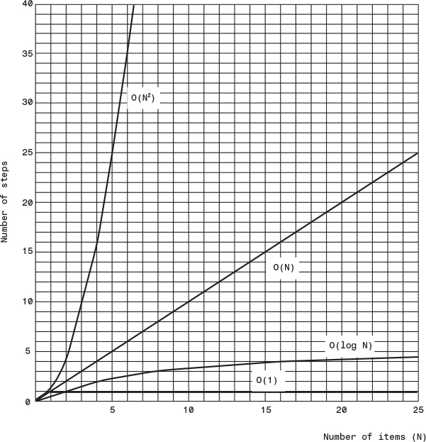

# DATA STRUCTURE & ALGORITHMS (In Java)

- What is a data structure ?
    - It's how your data is structured.. It could be structured in a list (List of items) or set (set of records) or map (key -> value)

- What is an Algorithm ?
    - How fast we process the "structured data" !!
    - A CRUD operation
    - Create/insert     Retrive/Search      Update      Delete


## DATA STRUCTURE (DS)


```
                              Object
                            /       \
                        Arrays  Collections
                                        |
                                    Collection
                                    /   |  \
                                List  Queue Set


List -- ArrayList, LinkedList (LinkedList can do basic queue tasks through peek, pool, offer)
Queue -- PriorityQueue, ArrayDequeue (ArrayDequeue also implements Deque interface)
Set -- HashSet, LinkedHashSet, TreeSet (Similiar structure to Map)

List provides - Vector: just synchronized version

                    
                                 Map
                                /   \
                        HashMap     SortedMap
                            |           |
                    LinkedHashMap   NavigableMap
                                        |
                                    TreeMap

Map provides - HashTable: just synchronized version
```

- A DS can be ordered - by insertion or last access
- A DS can be sorted - i.e. their insertion order doesn't mater - their sorting order does


- Abstract Data Types (ADTs)
- Array : Insertion fast, Access(unless idx known) : But deletion is complex
- Stack & Queue : Slow access to other items
- LinkedList: Fast insertion & deletion : But slow search

- Binary tree : Fast search, insertion : But deletion complex (unless tree is balanced)
- Red-black & 2-3-4 : Fast search, insertion & always balanced -> complex
- Hash table : Fast insertion & fast access if key known : But Slow deletion & inefficient memory usage
- Heap : Fast insertion, deletion, access to largest item : But Slow access to other item
- Graph: Some algo are slow & complex


### Array
- For "A" Searching takes an average of N/2 steps
- For Insertion takes 1step
- For deletion, there is no holes allowed - occupied cells must be arranged contiguously: no holes
- A deletion requires searching through an average of N/2 elements & then moving the remaining elements (an average of N/2 moves) to fill up the resulting hole => Total N steps in all

- Array can be used to handle both primitive & objects mainly 

- The Duplicates Issue
    - Searching : with Duplicates N steps - without Duplicates N/2 steps
    - Insertion : with Duplicates 1 steps - Without duplicates Search N steps But 1 Steps
    - Deletion : with Duplicates N step comparisons, more than N/2 moves - Without duplication N/2 comparisons, N/2 moves


- OOP -&- DS

- Also think of scinario, when you query a idx from one thread & deleted another element from another thread !! how bad that would be !!

- Binary search in an ordered collection

- Being ordered insertion took times but search / deletion was fast
So useful for a scianrio where search is more frequent

Although Deletions are slow in both ordered and unordered arrays because items must be moved down to fill the hole left by the deleted item.


```
In a Binary search of a ordered collection the equation devides "HALF"
For 128 numbers it devides like - 128 64 32 16 8 4 2 1 which ranges from 2^7 .. 2^6 ...... 2^0
which is a function of - 2
    so for 128 the equation is 2^7
Or in the reverse way
    the equarion is log-base2-(128) = 6.sth = 7

________________________________________________________,
log-base(a)of(b) = log-base(c)of(b) / log-base(c)of(a)  |
________________________________________________________|

```

```
-----------------------
The "Big O" notation
-----------------------
A rough measure of algorithms performance
Comparison of algorithms that tells how an algorithm's speed is related to the number of items
As you seen for 64 items it took 6 steps for double it's items i.e. 128 items it just took 1 more step


BIG N - Denotes number of items
BIG T - Times it take


For unsorted array
No matter how big the "N" is (the number of items)
The time taken "T" to iNsErT an item is always constant K


For a Linear SeArCh, Of "N" items it takes N/2 steps at an average
The TIME will be T = K * N / 2      \\k is the constant time for 1 item


However for a binary SeArCh, Of "N" items it takes log2(N) steps at an average
considering the below formula
________________________________________________________,
log-base(a)of(b) = log-base(c)of(b) / log-base(c)of(a)  |
________________________________________________________|
Considering c = 10, We can take log-base2-(10) = 3.322 [the divisor] as constant K
The TIME will be T = K * log2(N)         \\k is the constant time for 1 item & multiplied by 3.322


Big O notation just dispenses the constant K
Just we want to compare is how T changes for different values of N

Big O - Order of


For linear search into an un/ordered array takes O(N) time
For binary search into an ordered array takes O(log N) time


For Insertion into an unordered array takes O(1) time
For Insertion into an ordered array takes O(N) time

Deletion in unordered array O(N) time - searching is N/2 an average & moving is N/2 an average
Deletion in ordered array O(N) time


O(1) is excellent
O(log N) is good
O(N) is fair
O(N2) is poor (Bubble sort)
```




## Algorithm (Algo)
- Simple Sorting, Advanced Sorting, Recursion

- String -to- Interger -to- int -to- Interger -to- String conversion


